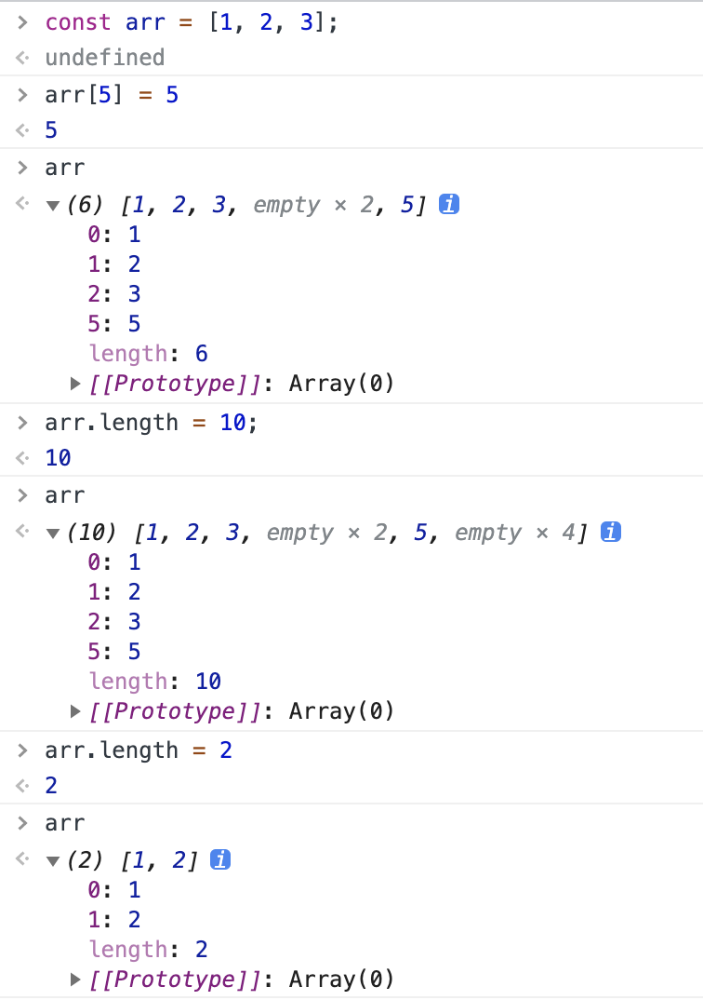
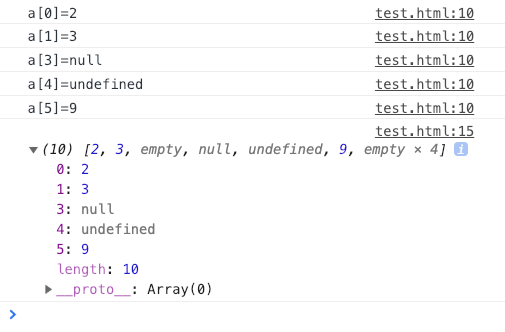
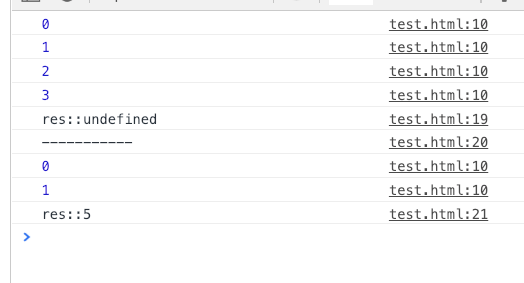

# 全面认识Array

首先是对JavaScript中Array的理解：JavaScript中函数是一等公民，写在代码中的 `Array/Object/String/Number/Function`其实都是一个构造函数，是用来生成相应的数据类型的变量的。

数组描述：数组是一种类列表对象，JS数组的长度和元素类型都是非固定的。因为数组的长度可随时改变，并且其数据在内存中也可以不连续，所以JavaScript数组不一定是密集型的，这取决于它的使用方式。

只能用整数作为数组元素的索引，而不能使用字符串。使用非整数并通过方括号或点号来访问或设置数组元素时，所操作的并不是数组列表中的元素，而是数组对象的属性集合上的变量。

数组对象的属性和数组元素列表是分开存储的，并且数组的遍历和修改操作也不能作用于这些命名属性。

## 几点注意事项

1. 虽然数组可以看做是数组对象的属性，但是不能用点号引用数组元素，因为在JavaScript中，以*数字开头*的属性不能用点号引用，必须用方括号。

```javascript
	const years = [2001, 2002, 2003]
	console.log(years.0); // 报错
	console.log(years[0]); // 正确

	// 假如render对象中有一个名为3d的属性
	const render = { 3d: 12 } // 报错： Uncaught SyntaxError: Invalid or unexpected token
	const render = { '3d': 12 } // 成功

	render.3d // 报错
	render['3d'] // 12，正确，引号是必须的

```

2. `arr[2]`这样的可以写成`arr['2']`。`arr[2]`中的2会被JavaScript解释器通过调用`toString`隐式地转换成字符串。所以`arr['2']`和`arr['02']`在arr中引用的可能不是同一个位置上的元素，而`arr[2]`和`arr[02]`访问的是同一个位置上的元素。下面是一个示例图：


3. 使用一个合法的下标为数组元素赋值，如果该下标超出了当前数组的大小，解释器会同时修改length的值。可以手动为length赋值，赋值小于当前数组元素个数的时候会删除一部分元素。



## 属性

构造函数`Array`自身的属性
### 1、length

length是Array的实例属性。返回或设置一个数组中的元素个数。该值是一个无符号32-bit整数（0到2^32-1），并且总是大于数组最高项的下标。

### 2、prototype

Array.protoType属性是Array的原型对象。

Array实例继承自Array.prototype。与所有构造函数一样，我们可以更改构造函数的原型对象，以对所有Array实例进行更改。

## 方法

构造函数`Array`自身的属性方法，可以通过`Array.fn`直接访问。

### 1、from

从一个类似数组或可迭代对象中创建一个新的数组实例。

```javascript
	
	Array.from(arrayLike[,mapFn,[,thisArg]]);

	//参数
	arrayLike // 想要转换成数组的伪数组对象或可迭代对象。
	// 伪数组对象：拥有一个length属性和若干索引属性的任意对象
	// 可迭代对象：可以获取对象中的元素，如Map和Set等

	mapFn // 如果指定了该参数，新数组中的每个元素会执行一遍该回调函数
	thisArg // 执行回调函数mapFn时this对象

	//返回值：一个新的数组实例

```

**示例：**

```javascript
	// 可迭代对象
	Array.from('foo'); //['f', 'o', 'o']

	Array.from(new Set(['foo', window])); // ['foo', window]

	Array.from(new Map([[1, 2], [2, 4], [4, 8]])); // [[1,2],[2,4],[4,8]]

	// 伪数组对象
	function f(){
		console.log(Array.isArray(arguments));  // false

		return Array.from(arguments, function(val, index){
			console.log(val); // 1,2,3
			console.log(index); // 0,1,2
			return val++
		});
	}

	f(1,2,3); // 2,3,4

```

::: tip
Array.from()本身是浅拷贝，如果数组的某个元素是对象或数组等，拷贝过去的是一个指向。
:::

### 2、isArray

用于判断传递的值是否是一个Array。

```javascript

	Array.isArray(obj);
	// 参数
	obj // 需要检测的值

	// 返回值：如果对象是数组，则为true；否则为false
	 
	// 当检测Array实例时, Array.isArray 优于 instanceof,因为Array.isArray能检测iframes数组

	let iframe = document.createElement('iframe');
	document.body.appendChild(iframe);
	xArray = window.frames[window.frames.length-1].Array;
	var arr = new xArray(1,2,3); // [1,2,3]

	Array.isArray(arr); // true
	arr instanceof Array; // false

```

### 3、of

创建一个具有可变数量参数的新数组实例，而不考虑参数的数量和类型。

```javascript
	Array.of(element0[, element1[, ...[, elementN]]])

	// 参数
	elementN //任意个参数，将按顺序成为返回数组中的元素
	// 返回值：新的Array实例
	
	Array.of(7); // [7]
	Array.of(1, 2, 3); // [1,2,3]

	Array(7); // [,,,,,,]
	Array(1, 2, 3); //[1,2,3]

```

## 原型方法

`Array.prototype`对象上的方法，假设一个方法是fn，则可以通过`Array.prototype.fn`直接访问，实例访问该方法直接`arr.fn`即可。

这些方法可以直接在数组实例上使用，故整理为几个大类（自建，无任何官方说明）。

### 第一类：增删改查

```js

push/pop/shift/unshift/splice/slice/concat/copyWithin/fill

```

#### 1.push

将一个或多个元素添加到数组的末尾，并返回该数组的新长度。

```javascript

	arr.push(element1,...,elementN);

	// 参数
	elementN // 被添加到数组末尾的元素

	// 返回值：当调用该方法时，新的length属性值将被返回

```

push方法具有通用性。该方法和call()或apply()一起使用时，可应用在类似数组的对象上。

push方法根据length属性来决定从哪里开始插入给定的值。如果length不能被转成一个数值，则插入的元素索引为0，包括length不存在时。当length不存在时，将会创建它。

**合并两个数组**

```javascript

	let arr = [1, 2];
	let arr1 = [3, 4];

	Array.prototype.push.apply(arr, arr1); // 相当于：arr.push(3,4);

	console.log(arr); // [1,2,3,4]

	// 注意第二个数组太大时不要使用该方法，应为一个函数能够接受的参数个数是有限制的。

```

**像数组一样使用对象**

```javascript

	let obj = {
		length: 0,
		addElem: function addElem(elem) {
			[].push.call(this, elem);
		}
	};

	obj.addElem({});
	obj.addElem({});
	console.log(obj);
	// 尽管 obj 不是数组，但是 push 方法成功地使 obj 的 length 属性增长了，就像我们处理一个实际的数组一样
```


#### 2.unshift

将一个或多个元素添加到数组的开头，并返回该数组的新长度。

```javascript

	arr.unshift(element1,...,elementN);

	// 参数
	elementN //要添加到数组开头的元素

	// 返回值：当一个对象调用该方法时，返回其length属性值。

```

unshift 特意被设计成具有通用性；这个方法能够通过 call 或 apply 方法作用于类数组对象上。不过对于没有 length 属性（代表从0开始的一系列连续的数字属性的最后一个）的对象，调用该方法可能没有任何意义。

上面push的示例一和示例二都适用于unshift，只是参数放在数组前插入。

#### 3.shift

从数组中删除第一个元素，并返回该元素的值。

```javascript

	arr.shift();

	// 返回值:从数组中删除的元素；如果数组为空则返回undefined。

```

shift方法移除索引为0的元素（即第一个元素），并返回被移除的元素，其他元素的索引值随之减一。如果length属性的值为0（长度为0），则返回undefined。

shift方法并不局限于数组：这个方法能够通过call或apply方法作用于类似数组的对象上。但是对于没有length属性（从0开始的一系列连续的数字属性的最后一个）的对象，调用该方法可能没有任何意义。

#### 4.pop

删除数组中的最后一个元素，并返回该元素的值。

```javascript

	arr.pop();

	// 返回值：从数组中删除的元素（当数组为空时返回undefined）。

```

pop 方法从一个数组中删除并返回最后一个元素。

pop 方法有意具有通用性。该方法和call()或apply()一起使用时，可应用在类似数组的对象上。

pop方法根据length属性来确定最后一个元素的位置。如果不包含length属性或length属性不能被转成一个数值，会将length置为0，并返回undefined。

#### 5.slice

返回一个新的数组对象，这个对象是一个由begin和end（不包含end）决定的原数组的浅拷贝。原始数组不会被改变。

```javascript

	arr.slice(begin, end);

	// 参数
	begin // 可选，如果省略begin，则从0开始提取。如果该参数为负数，则表示从原数组中的倒数第几个元素开始提取。

	end // 可选，如果省略end，则slice会一直提取到原数组末尾。如果该参数为负数，则它表示在原数组中的倒数第几个元素结束抽取。

	// 返回值：一个含有提取元素的新数组

```

slice不修改原数组，只会返回一个浅复制了原数组中的元素的一个新数组。原数组的元素会按照下述规则拷贝（即浅拷贝）：

- 如果该元素是个对象引用（不是实际的对象），slice会拷贝这个对象引用到新的数组里。两个对象引用都引用了同一个对象。如果被引用的对象发生改变，则新的和原来的数组中的这个元素也会发生改变。
- 对于字符串、数字及布尔值来说（不是String、Number或者Boolean对象），slice会拷贝这些值到新的数组里。在别的数组里修改这些字符串或数字或是布尔值，将不会影响另一个数组。

**返回现有数组的一部分**

```javascript

	let fruits = ['Banana', 'Orange', 'Lemon', 'Apple', 'Mango'];

	let citrus = fruits.slice(1, 3);

	console.log(citrus); // ['Orange','Lemon']
	console.log(fruits); // ['Banana','Orange','Lemon','Apple','Mango']

```

**类数组对象**

```javascript

	function list(){
		return Array.prototype.slice.call(arguments, 0, 2);
	}
	let list1 = list(1, 2, 3);
	console.log(list1); // [1,2]

```

#### 6.splice

方法通过删除现有元素或添加新元素来修改数组，并以数组返回原数组中被修改的内容。

```javascript

	array.splice(start,[,deleteCount[,item1[,item2[,...]]]]);

	// 参数
	start //指定修改的开始位置（从0计数），删除的时候包含该下标元素。
			// ① 如果超出了数组的长度，则从数组末尾开始添加内容
			// ② 如果是负值，则表示从数组末位开始的第几位（从-1计数）
			// ③ 如果负数的绝对值大于数组的长度，则表示开始位置为第0位
	
	deleteCount //可选，整数，表示要移除的数组元素的个数。
					// ① 如果deleteCount是0或者负数，则不移除元素。这中情况下，至少应该添加一个元素
					// ② 如果deleteCount大于start之后的元素的总数，则从start后面的元素都将被删除（含第start位）
					// ③ 如果deleteCount被省略，则其相当于(arr.length-start)
	
	item1,item2,... //可选，要添加进数组的元素，从start位置开始。如果不指定，则splice()将只删除数组元素。

	// splice方法使用deleteCount参数来控制是删除还是添加：
	// start参数是必须的，表示开始的位置（从0计数），如：start=0从第一个开始；start>=array.length-1表示从最后一个开始。
	// ① 从start位置开始删除[start,end]的元素
	arr.splice(start);
	// ② 从start位置开始删除[start,count]的元素
	arr.splice(start,deleteCount);
	// ③ 从start位置开始添加item1,item2,...元素
	arr.splice(start,0,item1,item2,...);

	// 返回值：由被删除的元素组成的一个数组。如果只删除了一个元素，则返回只包含一个元素的数组。如果没有删除元素，则返回空数组。
	// 如果添加进数组的元素个数不等于被删除的元素个数，数组的长度会发生相应的改变。

```

**示例**

```javascript

	let myFish = ['angel','clown','mandarin','surgeon'];
	let removed = myFish.splice(2,0,'drum');
	console.log(myFish); // ["angel", "clown", "drum", "mandarin", "surgeon"]
	console.log(removed); // []

	let replaced = myFish.splice(2,1,'hahha');
	console.log(myFish); // ["angel", "clown", "hahha", "mandarin", "surgeon"]
	console.log(replaced); // ["drum"]

	let deleted = myFish.splice(-1,1); // 相当于 myFish.splice(myFish.length-1,1);
	console.log(myFish); // ["angel", "clown", "hahha", "mandarin"]
	console.log(deleted); // ["surgeon"]

	let one = myFish.splice(1);
	console.log(myFish); // ["angel"]，可以看出下标为1的元素也被删除
	console.log(one); // ["clown", "hahha", "mandarin"]

```

#### 7.concat

方法用于合并两个或多个数组。此方法不会改变现有数组，而是返回一个新数组。

```javascript

	let new_array = old_array.concat(value1[,value2[,value3[,...[,valueN]]]]);

	// 参数
	valueN // 将数组和/或值连接成新数组。

	// 返回值：新的Array实例

```

concat方法创建一个新的数组，它由被调用的对象中的元素组成，每个参数的顺序依次是该参数的元素或元素本身。它不会递归到嵌套数组参数中。

concat方法不会改变this或任何作为参数提供的数组，而是返回一个浅拷贝（参考slice中的描述）。

**示例：**

```javascript

	let num1= [1, 2, 3],
		num2= ['a', 'b', 'c'];
	let nums = num1.concat('hah', num2);
	console.log(num1); // [1, 2, 3]
	console.log(num2); // ["a", "b", "c"]
	console.log(nums); // [1, 2, 3, "hah", "a", "b", "c"]

	let num3 = ['yao', ['peng', 'kun']];

	let res = num1.concat(num2, num3);
	console.log(num3); // ["yao", ["peng","kun"]]，标记一
	console.log(res); // [1, 2, 3, "a", "b", "c", "yao", ["peng","kun"]]

	res[7][0] = "666";
	console.log(num3); // ["yao", ["666","kun"]]
	console.log(res); // [1, 2, 3, "a", "b", "c", "yao", ["666","kun"]]

	// 这里有个奇怪的现象，当我们没有写res[7][0]="666";的时候，“标记一”处显示的是["yao",Array(2)];点开array(2)里面是["peng","kun"]，而如果我们在后面修改了，再次点开“标记一”处console出的Array(2)显示的是["666","kun"]。
	// 个人猜测：控制台中打印的东西，如果需要通过点击再显示出来的，会在点击的时刻去内存中获取，所以指向型的数据，后面修改会影响上面的打印结果。（可以通过转为string避免这样的地址指向即时获取，如：console.log(JSON.stringify(num3))）

```

#### 8.copyWithin

方法浅复制数组的一部分到同一数组中的另一个位置，并返回它，而不修改其大小。

```javascript

	arr.copyWithin(target[,start[,end]]);

	// 参数
	target //0为基底的索引，复制序列到该位置。如果是负数，target将从末尾开始计算。
	// 如果target大于等于arr.length，将会不发生拷贝。如果target在start之后，复制的序列将被修改以符合arr.length。
	
	start //0为基底的索引，开始复制元素的起始位置。如果是负数，start将从末尾开始计算。
	// 如果start被忽略，copyWithin将会从0开始复制
	
	end // 0为基底的索引，开始复制元素的结束位置。copyWithin将会拷贝到该位置，但不包括end这个位置的元素。如果是负数，end将从末尾开始计算。
	// 如果end被忽略，copyWithin将会复制到arr.length。
	
	//返回值：改变了的数组   

```

参数target,start,end必须为正数。

copyWithin方法不要求其this值必须是一个数组对象；除此之外，copyWithin是一个可变方法，它可以改变this对象本身，并且返回它，而不仅仅是它的拷贝。

copyWithin函数的设计为通用的，其不要求其this值必须是一个数组对象。

**示例：**

```javascript

	[1,2,3,4,5].copyWithin(-2); // [1,2,3,1,2]
	[1,2,3,4,5].copyWithin(0,3); // [4,5,3,4,5]
	[1,2,3,4,5].copyWithin(0,3,4); / /[4,2,3,4,5]
	[1,2,3,4,5].copyWithin(-2,-3,-1); // [1,2,3,3,4]
	[].copyWithin.call({length:5,3:1},0,3); // {0:1,3:1,length:5}

```

#### 9.fill

方法用一个固定值填充一个数组中从起始索引到终止索引内的全部元素。不包括终止索引。

```javascript

	arr.fill(value[,start[,end]]);

	// 参数
	value // 用来填充数组元素的值，为对象时填充的是对象的引用

	start // 可选，起始索引，默认值为0

	end //可选，终止索引，默认值为this.length

	//start和end都可以是负数，计算方法均为：length+start/end

	// 返回值：修改后的数组

```

fill方法故意设计为通用方法，该方法不要求this是数组对象

**示例：**

```javascript

	[1,2,3].fill(4); // [4,4,4]
	[1,2,3].fill(4,1); // [1,4,4]
	[1,2,3].fill(4,1,2); // [1,4,3]
	[1,2,3].fill(4,1,1);//[1,2,3]
	[1, 2, 3].fill(4, 3, 3);// [1, 2, 3]
	[1, 2, 3].fill(4, -3, -2);// [4, 2, 3]
	[1, 2, 3].fill(4, NaN, NaN); // [1, 2, 3]
	[1, 2, 3].fill(4, 3, 5);// [1, 2, 3]
	Array(3).fill(4);// [4, 4, 4]
	Array(3).fill(4,1);// [empty, 4, 4]
	[].fill.call({ length: 3 }, 4);  // {0: 4, 1: 4, 2: 4, length: 3}
	[].fill.call({ length: 3 }, 4,1);  // {1: 4, 2: 4, length: 3}

	let obj = {};
	let arr = Array(3).fill(obj);
	arr[0].hi='hi';
	console.log(arr);//[{hi:'hi'},{hi:'hi'},{hi:'hi'}]

```

### 第二类：遍历数组

- forEach
- map
- filter
- every
- some
- find
- findIndex

```javascript
	//fn表示“forEach/map/filter/every/some/find/findIndex”中的任意一个
	arr.fn(function callback(currentValue[,index[,array]]){
		//执行一些操作，并返回一个值
	}[,thisArg]);

	// 参数
	callback // 生成新数组元素的函数，使用三个参数:
		currentValue // 数组中正在处理的当前元素的值
		index // 可选，数组中正在处理的当前元素的索引
		array // 可选，fn方法被调用的数组
	thisArg //可选，执行callback函数时使用的this值
		// 如果 thisArg 参数有值，则每次 callback 函数被调用的时候，this 都会指向 thisArg 参数上的这个对象。
		// 如果省略了 thisArg 参数,或者赋值为 null 或 undefined，则 this 指向全局对象 。
		// callback 函数最终可观察到 this 值，这取决于函数观察到 this 的常用规则。
		// 如果callback是箭头函数，则thisArg参数无效

```

**下面是几点需要格外注意的点：**

- ① 这七个方法不修改调用它的原数组本身（当然可以在callback执行时改变原数组）。
- ② 使用这七个方法处理数组时，数组元素的范围是在callback方法第一次调用之前就已经确定了。在方法执行的过程中：原数组中新增加的元素将不会被 callback 访问到；若已经存在的元素被改变或删除了，则它们的传递到 callback 的值是方法遍历到它们的那一时刻的值；如果已访问的元素在迭代时被删除了（例如使用 shift()），某个元素将被跳过。即这些方法不会在调用之前创建数组的副本。
- ③ `forEach/map/filter/every/some`在执行过程中，那些已删除或者未初始化的项将被跳过（例如在稀疏数组上），而`find/findIndex`在执行过程中会调用每个索引，而不仅仅是那些被赋值的索引，这意味着对于稀疏数组来说，这两个方法的效率要低。
- ④ `forEach/map/filter/every/some`对于被删除的元素将不会被访问到，而`find/findIndex`仍旧会被访问到被删除的元素

#### forEach

按升序为数组中含有有效值的每一项执行一次callback函数。

forEach()，没有办法终止或者跳出循环，除非抛出一个异常（这种使用方法明显是错误的）。如果需要提前终止循环可以使用：简单循环、`for...of`、`every`、`some`、`find`、`findIndex`。

**示例：**

```javascript

	function logArrayElements(element, index, array){
		console.log('a['+index+']='+element);
	}
	let arr=[2, 3, , null, undefined, 9];
	arr.length=10;
	arr.forEach(logArrayElements);
	console.log(arr);

```



结果：可以看到索引2被跳过了，`null/undefined`还是会被遍历，多余的`empty`也不会被遍历


**使用`thisArg`**

```javascript

	function Counter(){
		this.sum = 0;
		this.count = 0;
	}

	Counter.prototype.add = function(array) {
		array.forEach(function(entry) {
			this.sum += entry;
			++this.count;
		}, this);
	}

	let obj = new Counter();
	obj.add([1, 3, 5, 6]);

	console.log(obj.count); // 4
	console.log(obj.sum); // 15

```

**对象复制函数**

```javascript

	//创建一个给定对象的副本
	function copy(obj){
		let copy = Object.create(Object.getPrototypeOf(obj));
		let propNames = Object.getOwnPropertyNames(obj);

		propNames.forEach(function(name){
			let desc = Object.getOwnPropertyDescriptor(obj, name);
			Object.defineProperty(copy, name, desc);
		});
		return copy;
	}
	let obj1 = { a:1, b:2};
	let obj2 = copy(obj1);
	console.log(obj1); //{a: 1, b: 2}
	console.log(obj2); //{a: 1, b: 2}

```

**如果数组在迭代时被修改了，则其他元素会被跳过**

```javascript

	let words = ['one','two','three','four'];

	words.forEach(function(word){
		console.log(word);
		if(word === 'two'){
			words.shift();
		}
	});
	// one 、 tow 、 four

	// 上面的代码输出one/two/four。当到达包含two的项时，数组的第一个项被移除了，这导致所有剩下的项上移一个位置。因为元素four现在在数组更前的位置，three会被跳过。
```

#### map

创建一个新数组，其结果是该数组中的每个元素都调用一个提供的函数后返回的结果。

返回一个新数组，每个元素都是回调函数的结果。

**示例：**

```javascript

	let numbers = [1, 4, 9];
	let roots = numbers.map(Math.sqrt); // Math.sqrt只接受一个参数，会自动忽略map传递的后两个参数
	console.log(numbers); // [1, 4, 9]
	console.log(roots); // [1, 2, 3]

	// String上使用map放会获取每一个字符
	let res = Array.prototype.map.call('Hello World',function(x){
		console.log(x);
		return x.charCodeAt(0);//返回字符对应的ASCII码
	});
	// H e l l 0   W o r l d
	console.log(res); // [72, 101, 108, 108, 111, 32, 87, 111, 114, 108, 100]

	// 注意：map的回调函数会接受三个参数，在调用中需注意接受多个参数的函数，如parseInt
	
	// map中经常使用箭头函数 
	[].map((value, index, arr)=>{}); // 适用多种形式，此时thisArg参数无效，箭头函数没有this

```

#### filter

创建一个新数组，其包含通过所提供函数实现的测试的所有元素。

filter为数组中的每个元素调用一次callback函数，并利用所有使得callback返回true或等价于true的值的元素创建一个新数组。
返回一个新的通过测试的元素的集合的数组，如果没有通过测试则返回空数组

**示例：**

```javascript

	// 实现一个简单的搜索
	let fruits = ['apple', 'banana', 'grapes', 'mango', 'orange'];

	function filterItems(query){
		return fruits.filter(function(el){
			return el.toLowerCase().indexOf(query.toLowerCase())>-1;
		})
	}

	console.log(filterItems('ap')); // ["apple", "grapes"]
	console.log(filterItems('an')); // ["banana", "mango", "orange"]
	console.log(fruits); // ["apple", "banana", "grapes", "mango", "orange"]

```

#### every

测试数组的所有元素是否都通过了指定函数的测试。

every方法为数组中的每个元素执行一次callback函数，直到它找到一个使callback返回false（表示可转换为布尔值false的值）的元素。如果发现了一个这样的元素，every方法将会立即返回false。否则，callback为每一个元素返回true，every就会返回true。

every和数学中的“所有”类似，当所有的元素都符合条件才返回true。另外，空数组也是返回true。（空数组中所有元素都符合给定的条件，注：因为空数组没有元素）。

**示例：**

```javascript

	function isBigEnough(element, index, array) {
		console.log(element); // 12 、 130 、5
		return (element >= 10);
	}

	let passed = [12, 130, 5, 8, 44].every(isBigEnough);
	console.log(passed); // false

```

#### some

测试是否至少有一个元素通过提供的函数实现的测试。

`some()`为数组中的每一个元素执行一次callback函数，直到找到一个使得callback返回一个真值。如果找到了这样一个值，some()将会立即返回true。否则some()返回false。

**示例：**

```javascript

	function isBigEnough(element, index, array){
			console.log(element); // 5 、 8 、12
			return (element >= 10);
		}

		let passed = [5, 8, 12, 3, 130, 44].some(isBigEnough);
		console.log(passed); // true

```

#### find：对数组中的每一项元素执行一次callback函数，直至有一个callback返回true。当找到了这样一个元素后，该方法会立即返回这个元素的值，否则返回undefined。

**查找数组中的质数**

```javascript

	function isPrime(element, index, array){
		console.log(index);
		let start = 2;
		while(start <= Math.sqrt(element)){
			if(element % start++ < 1){
				return false
			}
		}
		return element > 1;
	}
	console.log('res::'+[4, 6, 8, 12].find(isPrime));
	console.log('-----------')
	console.log('res::'+[4, 5, 8, 12].find(isPrime));

```



结果：可以看到当找到一个质数（5）后，便结束执行。

**当在回调中删除数组中的一个值时，当访问到这个位置时，其传入的值为`undefined`**

```javascript

	let a=[0,1,,,,5,6];

	a.find(function(value,index){
		console.log('index::'+index+'& value::'+value);
	});

	console.log('----删除后面的某个元素-----')

	a.find(function(value,index){
		if(index == 0){
			console.log('del a[5]=='+a[5]);
			delete a[5];
		}
		console.log('index=='+index+'& value == ' + value);
	});

	console.log('----删除前面的某个元素----')

	let arr=[0,1,2,3,4,5]
	arr.find(function(value,index){
		console.log('index=='+index+'& value == ' + value)
		if(index == 2){
			arr.shift();
		}
	});

```


结果：可以看到，无论未初始化的还是之后被删除的都遍历，值都为undefined。而在执行过程中删除元素，find还是会按照原来的索引去找当前的索引对应的值（索引3对应成了4），即使数组长度已经不够，也会访问到初始化时的最后一个索引（索引5对应成了undefined）。


#### findIndex

对数组中的每个数组索引`0~length-1`执行一次callback函数，知道找到一个callback函数返回真值。如果找到这样的元素findIndex会立即返回该元素的索引。如果回调不返回真值，或者数组的length为0，则findIndex返回-1。

执行规则基本与find相同，只是find返回的是值，而findIndex返回的是索引。

---

#### 2. `reduce/reduceRight`

```javascript
	// fn代替reduce/reduceRight
	arr.fn(callback[,initialValue]);
	// 参数
	callback //执行数组中每个值的函数，包含四个参数：
		accumulator // 累计器，累计回调的返回值；它是上一次调用回调时返回的累积值，或initialValue（第一次）
		currentValue // 数组中正在处理的元素
		currentIndex // 可选，数组中正在处理的当前元素的索引。如果提供了initialValue，则起始索引号为0，否则为1。
		array // 可选，调用reduce()的数组
	initialValue //可选，作为第一次调用callback函数时的第一个参数的值。如果没有提供初始值，则将使用数组中的第一个元素。在没有初始值的空数组上调用reduce将报错。

	// 返回值：函数累计处理的结果

```

**几点注意事项：**

- ① 回调函数第一次执行时，accumulator和currentValue的取值有两种情况：如果调用时提供了initialValue，accumulator取值为initialValue，currentValue取数组中的第一个值；如果没有提供initialValue，那么accumulator取数组中的第一个值，currentValue取数组中的第二个值。

- ② 如果数组为空且没有提供initialValue，会抛出TypeError。如果数组仅有一个元素（无论位置如何）并且没有提供initialValue，或者有提供initialValue但是数组为空，那么此唯一值将被返回并且callback不会被执行。

- ③ 提供初始值通常更安全。

- ④ 数组中被删除或从未被赋值的元素不会被执行。

#### reduce

对数组中的每个元素升序执行提供的reducer函数(callback)，将结果汇总为单个返回值。

**执行过程中删除第一个元素**

```javascript

	let arr = [0, 1, 2, 3, 4];
	let sum = arr.reduce(function(accumulator, currentValue, currentIndex){
		console.log('currentIndex::' + currentIndex + '&currentValue::'+ currentValue);
		if(currentIndex == 2){
			arr.shift();
		}
		return accumulator + currentValue;
	},0);
	console.log('sum::' + sum);

```


结果：可以看到当删除第一个，值3被跳过，执行索引3时对应的值为4

**未初始化和执行中被删除的值**

```javascript

	let arr = [0, 1, , 3, 4, 5];
	let sum = arr.reduce(function(accumulator,currentValue,currentIndex){
		console.log('currentIndex::' + currentIndex + '&currentValue::'+ currentValue);
		if(currentIndex == 1){
			delete arr[4];
		}
		return accumulator + currentValue;
	},0);
	console.log('sum::' + sum);

```


结果：可以看到索引2和索引4都被跳过

结合上面两个示例，可以看到在遍历执行上reduce与`forEach/map/filter/some/every`规则相同。

**将二维数组转化为一维**

```javascript

	let flattened = [[0, 1], [2, 3], [4, 5]].reduce(function(a,b){
		return a.concat(b);
	},[])

	console.log(flattened); // [0, 1, 2, 3, 4, 5]

```

**计算数组中每个元素出现的次数**

```javascript

	let names = ['Alice', 'Bob', 'Tiff', 'Bruce', 'Alice'];

	let countedNames = names.reduce(function(allNames, name) {
		if(name in allNames) {
			allNames[name]++;
		} else {
			allNames[name] = 1;
		}
		return allNames;
	}, {});

	console.log(countedNames); // {Alice: 2, Bob: 1, Tiff: 1, Bruce: 1}

```

**数组去重**

```javascript

	let arr=[1, 2, 1, 2, 1, 2, 1, 1, 1, 2, 2, 2, 1];

	let result = arr.sort().reduce((init, current)=>{
		if(init.length === 0 || init[init.length-1] !== current){
			init.push(current);
		}
		return init;
	}, [])

	console.log(result); // [1,2]

```

**按顺序执行Promise**

```javascript

	function runPromiseInSequence(arr, input){
		return arr.reduce(
			(promiseChain, currentFunction) => {
				promiseChain.then(currentFunction)
				Promise.resolve(input)
			}
		);
	}

	function p1(a) {
		return new Promise((resolve, reject) => {
			resolve(a * 5);
		});
	}

	function p2(a) {
		return new Promise((resolve, reject) => {
			resolve(a * 2);
		});
	}
	//这里f3也能正确触发后面的p4，因为f3可以被.then()封装，所以只要reduce的第二个参数inititalValue是一个promise对象，则后面的函数都可以按顺序执行
	function f3(a) {
	 	return a * 3;
	}

	function p4(a) {
	  	return new Promise((resolve, reject) => {
	    	resolve(a * 4);
	  	});
	}

	const promiseArr = [p1, p2, f3, p4];
	runPromiseInSequence(promiseArr, 10).then(console.log);   // 1200
```

#### reduceRight

接受一个函数作为累加器(accumulator)和数组的每个值（从右到左）将其减少为单个值。

reduceRight运行规则与reduce基本相同，只是遍历的方向不同。

**将二维数组转为一维数组**

```javascript

	let flattened = [[0, 1], [2, 3], [4, 5]].reduceRight(function(a, b) {
	    return a.concat(b);
	}, []);

	console.log(flattened); //[4, 5, 2, 3, 0, 1]

```

**reduce与reduceRight之间的区别**

```javascript

	let a=['1', '2', '3', '4', '5'];

	let left = a.reduce(function(prev,cur){ return prev + cur;});

	let right = a.reduceRight(function(prev,cur){return prev+cur;});

	console.log(left); // '12345'
	console.log(right); // '54321'

```

---

### 第三类：获取键值

`entries/keys/values`

#### entries

返回一个新的Array Iterator对象，该对象包含数组中每个索引的键/值对。

语法： `arr.entries()`

返回值：一个新的Array迭代器对象。

**示例：**

```javascript

	let arr = ['a', 'b', 'c'];
	let iterator = arr.entries();
	console.log(iterator);
	console.log('----------------')
	console.log(iterator.next());
	console.log(iterator.next());
	console.log(iterator.next());
	console.log(iterator.next());
	console.log('----------------')
	for( let e of iterator){
		console.log(e); // 什么也没打印
	}
	console.log('----------------')
	let iterator1 = arr.entries();
	for(let e of iterator1){
		console.log(e); // 有打印输出
	}
	console.log(iterator1.next());

```


::: tip
此处注意迭代器的next()方法
:::
#### keys

返回一个包含数组中每个索引键的Array Iterator对象。

语法：`arr.keys()`。

返回值：一个新的Array迭代器对象。

**迭代器对象会包含那些没有对应元素的索引**

```javascript

	let arr = ['a', ,'c'];
	let sparseKeys = Object.keys(arr);
	let denseKeys = [ ...arr.keys()];

	console.log(sparseKeys); //["0", "2"]
	console.log(denseKeys); //[0, 1, 2]

```

#### values

返回一个新的Array Iterator对象，该对象包含数组每个索引的值。

语法：`arr.values()`。基本与keys()相同，参照使用。

---

### 第四类：查找元素

`indexOf/lastIndexOf/includes`

这三个方法的语法类似：

```javascript
	// fn代替indexOf/lastIndexOf/includes
	arr.fn(searchElement,fromIndex);

	// 参数
	searchElement // 需要查找的元素值。

	fromIndex // 可选，开始查找的位置。由于indexOf和includes是从左到右查找，而lastIndexOf是从右到左查找，所以这个参数的规则有所不同
		// indexOf/includes: 默认值为0，从左到右正向查找。
			// 如果该索引值大于或等于数组长度，意味着不会在数组里查找，返回-1,includes返回false；
			// 如果参数中提供的索引值是一个负值，则将其作为数组末尾的一个抵消，即表示从length-|fromIndex|开始查找;
			// 如果参数中提供的索引值是一个负值，并不改变其查找顺序，查找顺序仍然是从前向后查询数组。
			// 如果抵消后的索引值仍小于0，则整个数组都将会被查询。
		// lastIndexOf: 默认值为数组的长度减1，从右到做逆向查找。
			// 如果该值为负时，其绝对值大于数组长度，则方法返回-1，即数组不会被查找。
			// 如果为负值，将其视为从数组末尾向前的偏移（length-|fromIndex|）。
			// 即使该值为负，数组仍然会被从后向前查找。
			// 如果该值大于或等于数组的长度，则整个数组会被查找。

```

它们三个判断均使用严格相等（===）进行比较，区分大小写。

#### indexOf

返回在数组中可以找到一个给定元素的第一个索引，如果不存在，则返回-1。

返回首个被找到的元素在数组中的索引位置；若没有找到则返回-1。

**找出指定元素出现的所有位置**

```javascript

	let includes=[];
	let arr=['a', 'b', 'a', 'c', 'a', 'd'];
	let element = 'a';
	let idx = arr.indexOf(element);
	while(idx!=-1){
		includes.push(idx);
		idx = arr.indexOf(element,idx+1);
	}
	console.log(includes); //[0, 2, 4]

```

#### lastIndexOf

返回指定元素（也即有效的JavaScript值或变量）在数组中的最后一个的索引，如果不存在则返回-1。

返回数组中最后一个元素的索引，如果未找到返回-1。

用法规则参照indexOf。

#### includes

用来判断一个数组是否包含一个指定的值，根据情况，如果包含则返回true，否则返回false。

**`includes()`方法有意设计为通用方法。它不要求this值是数组对象，所以它可以被用于其它类型的对象（比如类数组对象）。**

```javascript

	(function() {
	  console.log([].includes.call(arguments, 'a')); // true
	  console.log([].includes.call(arguments, 'd')); // false
	})('a','b','c');

```

---

### 第五类：转换为String

`join/toString/toLocaleString`

#### join

将一个数组（或一个类数组对象）的所有元素连接成一个字符串并返回这个字符串。

join()方法不会改变数组本身。

如果元素是undefined或者null，则会转化成空字符串。

```javascript

	let str = arr.join(separator);

	// 参数 
	separator // 指定一个字符串来分隔数组的每个元素。
		// 如果需要(separator)，将分隔符转换为字符串。
		// 如果省略()，数组元素用逗号分隔。默认为“，”。
		// 如果separator是空字符串('')，则所有元素之间都没有任何字符。

	// 返回值：一个所有数组元素连接的字符串。如果arr.length为0，则返回空字符串。

```

**示例：**

```javascript

	let arr = [1, 2, '', undefined, null, true, false];
	let str = arr.join();
	console.log(str); // 1,2,,,,true,false
	console.log(arr); // [1, 2, "", undefined, null, true, false]

	arr.length = 0;
	console.log(arr); // [];

```

**应用于类数组对象**

```javascript

	function fn(a,b,c){
		let s = Array.prototype.join.call(arguments);
		console.log('fn::',s);
	}
	fn(1, 'a', 'undefined');

	function ff(a,b,c){
		arguments.length = 0;
		console.log('ff>arguments::',arguments);

		let s = Array.prototype.join.call(arguments);
		console.log('ff::',s);
	}
	ff(1,'a','undefined');

```


::: tip 结果
可以看到，数组设置length为0后数组相当于被删除，而类数组对象的length设置为0后属性还在，但是输出的同样是一个空字符串，所以length属性对join影响很大。（可以测试，将arguments的length设置为1，则只有索引为0的元素被转化返回了）
:::

#### toString

返回一个字符串，表示指定的数组及其元素。

语法：`arr.toString()`；

返回值：一个表示指定的数组及其元素的字符串。

Array对象覆盖了Object的toString方法。对于数组对象，toString方法连接数组并返回一个字符串，其中包含用逗号分隔的每个数组元素。

**示例：当一个数组被作为文本值或者进行字符串连接操作时，将会自动调用其toString方法**

```javascript

	console.log('a'+[1, 2, 3, 4]); //a1,2,3,4

	console.log('a'+[1, 2, 3, 4].toString()); //a1,2,3,4

```

#### toLocaleString

返回一个字符串表示数组中的元素。数组中的元素将使用各自的toLocaleString方法转成字符串，这些字符串将使用一个特定的语言环境的字符串（例如一个逗号）隔开。

```javascript

	arr.toLocaleString([locales[,options]]);

	// 参数
	locales //可选，带有BCP 47语言标记的字符串或字符串数组，关于locales参数的形式与解释:https://developer.mozilla.org/zh-CN/docs/Web/JavaScript/Reference/Global_Objects/Intl

	options //可选，一个可配置属性的对象，对于数字Number.prototype.toLocaleString()，对于日期Date.prototype.toLocaleString()。

	// 返回值：表示数组元素的字符串

```
::: warning 
这块参数方面还很懵逼，有时间回头要好好看看！[切记回看](https://developer.mozilla.org/zh-CN/docs/Web/JavaScript/Reference/Global_Objects/Array/toLocaleString)
:::

---

### 第六类：数组排序

`sort/reverse`

#### sort

方法用原地算法对数组的元素进行排序，并返回数组。

由于它取决于具体实现，因此无法保证排序的时间和空间复杂性。

```javascript

	arr.sort([compareFunction]);

	// 参数
	compareFunction //可选，用来指定按某种顺序进行排列的函数。如果省略，元素按照转换为的字符串的各个字符的Unicode位点进行排序。
		firstEL // 第一个用于比较的元素
		secondEL // 第二个用于比较的元素

	// 返回值：排序后的数组。注意：数组已原地排序，并且不进行复制。

```

- 如果没有指明`compareFunction`，那么元素会按照转换为的字符串的诸个字符的Unicode位点进行排序。
- 如果指明了`compareFunction`，那么数组会按照调用该函数的返回值排序。
- 如果`compareFunction(a, b)`小于 0，那么a会被排列到b之前
- 如果`compareFunction(a, b)`等于 0，a和b的相对位置不变。备注： ECMAScript标准并不保证这一行为，而且也不是所有浏览器都会遵守（例如 Mozilla 在 2003 年之前的版本）；
- 如果`compareFunction(a, b)`大于 0，b会被排列到a之前。
- `compareFunction(a, b)` 必须总是对相同的输入返回相同的比较结果，否则排序的结果将是不确定的。

**可以看到数组本身会被修改**

```javascript

	let arr1=['cherry', 'Banana'];
	console.log(arr1.sort()); // ["Banana", "cherry"]
	console.log(arr1); // ["Banana", "cherry"]
	
	// 比较的数字会先被转换为字符串，所以在Unicode顺序上 "80" 要比 "9" 要靠前
	let arr2 = [9, 80, 23, 53, 7, 3];
	console.log(arr2.sort()); // [23, 3, 53, 7, 80, 9]
	console.log(arr2); // [23, 3, 53, 7, 80, 9]

```

#### reverse

将数组中的元素位置颠倒。第一个数组元素成为最后一个数组元素，最后一个数组元素成为第一个。

语法：`arr.reverse();`。

reverse方法颠倒数组中元素的位置，并返回该数组的引用。

**示例：**

```javascript

	let myArr = ['one', 'two', 'three'];
	let copyArr = myArr.reverse();
	console.log(myArr); // ["three", "two", "one"]
	console.log(copyArr); // ["three", "two", "one"]
	console.log(copyArr === myArr); // true

```
---

> 参考:[MDN javascript标准库 Array](https://developer.mozilla.org/zh-CN/docs/Web/JavaScript/Reference/Global_Objects/Array)


