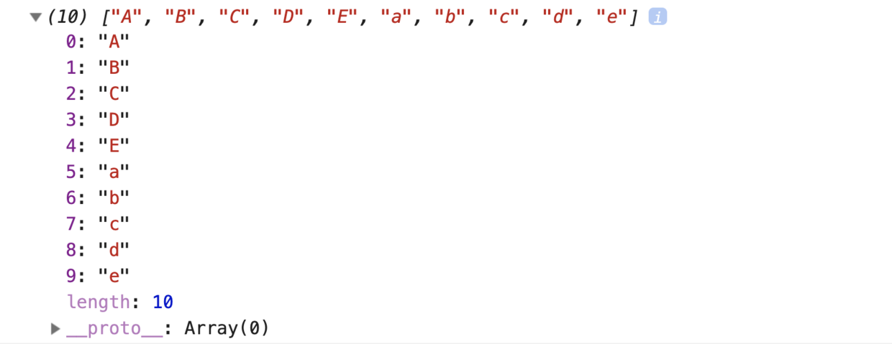
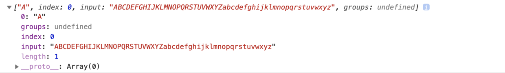
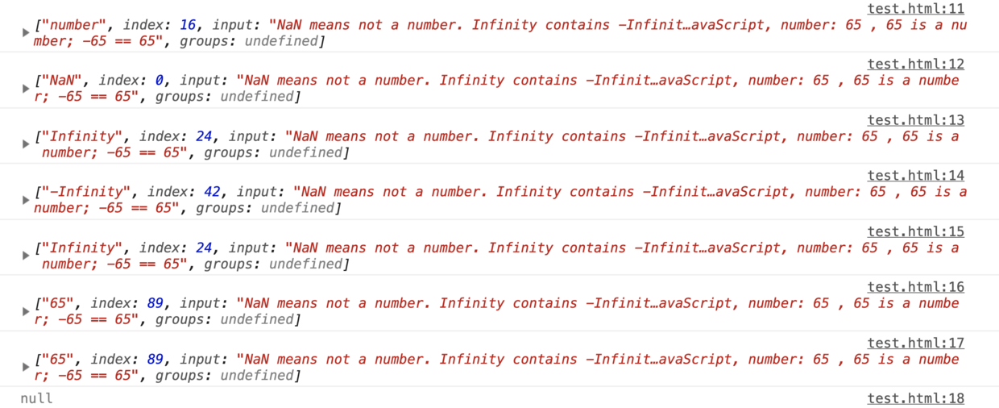
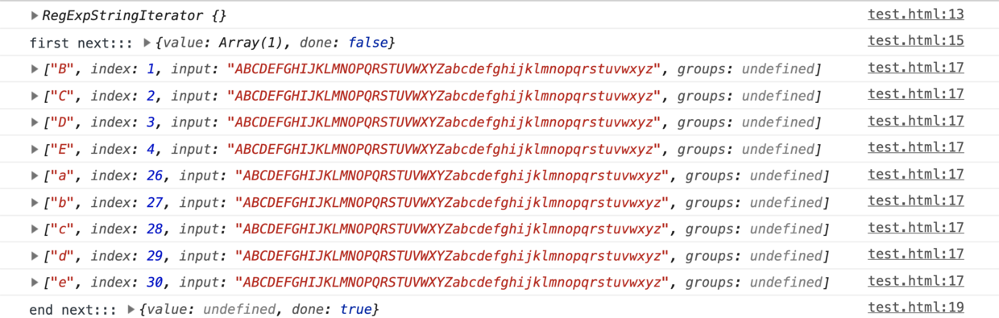
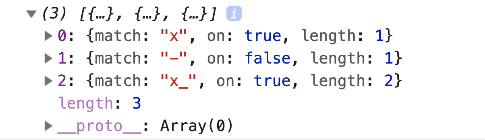

# 全面认识String

String是一个用于字符串或一个字符串序列的构造函数。


```javascript

	// 字符串字面量形式
	'string text' / "中文、汉语"

	// String函数转换或生成
	String(thing);
	new String(thing);

	// 参数
	thing // 任何可以被转换成字符串的值。

	// 从ECMAScript 2015开始，字符串字面量也可以称为模板字面量
	`hello world` `hello ${who}`;

```

**有特殊功能的字符可以通过转义字符的形式放入字符串中：**

|code|output|
|:-:|:-:|
|`\0`|空字符|
|`\'`|单引号|
|`\"`|双引号|
|`\\`|反斜杠|
|`\n`|换行|
|`\r`|回车|
|`\v`|垂直制表符|
|`\t`|水平制表符|
|`\b`|退格|
|`\f`|换页|
|`\uXXXX`|unicode码|
|`\xXX`|Latin-1字符(x小写)|

和其他语言不同，JavaScript的字符串不区分单引号和双引号。

对于长字符串，为了避免一行无限延长或者被编辑器折叠，可以写成多行。

```javascript

	//使用+运算符将多个字符串连接起来
	let longString = "This is a very long string which needs " +
                "to wrap across multiple lines because " +
                "otherwise my code is unreadable.";
  //可以在每行末尾使用反斜杠字符("\")，以指示字符串将在下一行继续。确保反斜杠后面没有空格或任何除换行符之外的字符或缩进；否则反斜杠将不会工作。
  let longString1 = "This is a very long string which needs \
								to wrap across multiple lines because \
								otherwise my code is unreadable.";

	console.log(longString === longString1); // true

```

**基本字符串和字符串对象的区别**

字符串字面量（通过单引号或双引号定义）和直接调用String方法（没有通过new生成字符串对象示例）的字符串都是基本字符串。

当基本字符串需要调用一个字符串对象才有的方法或者查询值的时候（基本字符串是没有这些方法的），JavaScript会自动将基本字符串转化为字符串对象并调用相应的方法或者执行查询。

```javascript

	let str = 'abc';
	let str_string = String('abc');
	let str_obj = new String('abc');

	console.log(str); // abc
	console.log(str_string); // abc
	console.log(str_obj);
	/*String{'abc'} 
	0:'a'
	1:'b'
	2:'c'
	length:3
	__proto__:String
	[[PrimitiveValue]]: "abc"*/

	console.log(str === str_obj); // false
	console.log(str === str_string); // true
	console.log(str == str_obj); // true

```

当使用eval时，基本字符串和字符串对象也会产生不同的结果。eval会将基本字符串作为源代码处理；而字符串对象则被看作对象处理，返回对象。

```javascript

	let s1 = '2+2';
	let s2 = new String('2+2');

	console.log(eval(s1)); // 4
	console.log(eval(s2));
	/*String {"2+2"}
	0: "2"
	1: "+"
	2: "2"
	length: 3
	__proto__: String
	[[PrimitiveValue]]: "2+2"*/

```

利用valueOf方法可以将字符串对象转换为其对应的基本字符串。

---

## 属性

构造函数里的属性，可理解为私有属性，只能通过`String.属性名`访问

### prototype

该属性表示String原型对象。

prototype的属性特性：

|String.prototype属性的属性特性||
|:-:|:-:|
|writable|false|
|enumerable|false|
|configurable|false|

所有的String实例都继承自String.prototype。

---

### 方法

构造函数里的方法，可理解为私有方法，只能通过`String.方法名`访问

### fromCharCode

返回使用指定的Unicode值序列创建的字符串。

```javascript

	String.fromCharCode(num1, ..., numN);

	// 参数
	num1, ..., numN; // 一组序列数字，表示Unicode值。

	// 返回值：一个字符串而不是一个String对象

```

由于该方法是String的静态方法，所以应该像这样使用：`String.formCharCode()`，而不是作为创建的String对象实例的方法。

```javascript

	console.log(String.fromCharCode(65, 66, 67)); // ABC

```

尽管绝大部分常用的Unicode值可以用一个16-bit数字表示（正如JavaScript标准化过程早期），并且对于绝大部分值`fromCharCode()`返回一个字符（即对于绝大部分字符UCS-2值是UTF-16的子集），但是为了处理所有的Unicode值（至21bits），只用`fromCharCode()`是不足的。由于高位编码字符是用两个低位编码表示形成的一个字符，因此`String.fromCodePoint()`被用来返回这样一对低位编码，从而可以完成表示这些高位编码字符。

### fromCodePoint

返回使用指定的代码点序列创建的字符串，此方法也是一个静态方法。

```javascript

	String.fromCodePoint(num1[, ...[, numN]]);

	// 参数
	num1, ..., numN // 一串Unicode编码位置，即“代码点”

	// 返回值：使用指定的Unicode编码位置创建的字符串，不是一个String对象

```

如果传入无效的Unicode编码，将会抛出一个RangeError。

**示例：**

```javascript

	console.log(String.fromCodePoint(65, 66, 67)); // ABC
	console.log(String.fromCodePoint(42)); // *
	console.log(String.fromCodePoint(0x404)); // Є
	console.log(String.fromCodePoint(0x1D306, 0x61, 0x1D307)); // 𝌆a𝌇		
	console.log(String.fromCodePoint(0x2F804)); // 你
	console.log(String.fromCodePoint('-')); // Uncaught RangeError: Invalid code point NaN

```

### raw

是一个模板字符串的标签函数，它的作用类似于Python中的字符串前缀r和C#中的字符串前缀@，是用来获取一个模板字符串的原始字面量值的。

```javascript

	String.raw(callSite, ...substitutions);
	String.raw`templateString`;

	// 参数
	callSite // 一个模板字符串的“调用点对象”。类似{raw:['foo','bar','baz']}

	...substitutions // 任意个可选的参数，表示任意个内插表达式对应的值。

	templateString //模板字符串

	// 返回值：给定模板字符串的原始字面量值。

```

如果第一个参数没有传入一个格式良好的调用点对象，则会抛出TypeError对象。

像所有的标签函数一样，通常不需要把它看成一个普通函数，只需要把它放在模板字符串前面就可以了，而不是在它后面加个括号和一堆参数来调用它，引擎会去调用它。

`String.raw() `是唯一一个内置的模板字符串标签函数，因为它太常用了。不过它并没有什么特殊能力，你自己也可以实现一个和它功能一模一样的标签函数。

**示例：**

```javascript

	console.log(`Hi\n!`); // Hi [换行] ！
	console.log(String.raw `Hi\n!`); // Hi\n!
	console.log(`Hi\u000A!`); // Hi [换行] ！
	console.log(String.raw `Hi\u000A!`); //Hi\u000A!
	// 任何类型的转义形式都会失效，保留原样输出

	let name = 'Bob';
	console.log(`Hi\n${name}!`);// Hi [换行] Bob!
	console.log(String.raw `Hi\n${name}!`);//Hi\nBob!
	// 内插表达式还可以正常运行

	console.log(String.raw({raw: "test"}, 0, 1, 2)); //t0e1s2t，不理解，应该也没什么用

```

## 原型属性

原型对象上的属性，即位于`String.prototype`上的属性
### constructor

用于创造对象的原型对象的特定的函数。

```javascript

	let str = 'abc';
	console.dir(str.constructor); // String()

```

### length

表示一个字符串的长度。

该属性返回字符串中字符编码单元的数量。JavaScript使用UTF-16编码，该编码使用一个16比特的编码单元来表示大部分常见的字符，使用两个代码单元表示不常用的字符。因此length返回值可能与字符串中实际的字符数量不相同。

空字符串的length为0

静态属性String.length返回1。

### N

用于访问第N个位置的字符，其中N是小于length和0之间的正整数。这些属性都是“只读”性质，不能编辑。

```javascript

	let str = 'abc';
	console.dir(str[0]); // a

```

---

## 原型方法

原型对象上的方法，即`String.prototype`上的方法。

这里的方法其实是比较常用的，将他们按照功能或操作分成以下几类，分别整理

### 1、返回指定位置的字符

- charAt
- charCodeAt
- codePointAt

#### charAt

从一个字符串中返回指定的字符。

```javascript

	str.charAt(index);

	// 参数
	index // 一个介于0和字符串长度减1之间的整数。（0~length-1)，如果没有提供索引，charAt()将使用0

	// 如果指定的index值超出了该范围，则返回一个空字符串

```

#### charCodeAt

返回0到65535之间的整数，表示给定索引处的UTF-16代码单元

```javascript

	str.charCodeAt(index);

	// 参数
	index // 一个大于等于0，小于字符串长度的整数。如果不是一个数值，则默认为0

	// 返回值 是一表示给定索引处字符的UTF-16代码单元值的数字；如果索引超出范围，则返回NaN
	// 如果指定的 index 小于 0 或不小于字符串的长度，则 charCodeAt 返回 NaN。

```

#### codePointAt

返回一个Unicode编码点值的非负整数。

```javascript

	str.codePointAt(pos);

	// 参数
	pos // 这个字符串中需要转码的元素的位置

	// 返回值是在字符串中的给定索引的编码单元体现的数字，如果在索引处没找到元素则返回undefined。

```

*由于上面3个涉及到Unicode编码，这里不做深入了解，故先只展示基本概念和用法：*

```javascript

	// charAt
	let str = "ABC";

	console.log(str.charAt(1)); // B
	console.log(str.charAt(-1)); // 空
	console.log(str.charAt(4)); // 空

	console.log(str.charCodeAt(1)); // 66
	console.log(str.charCodeAt(-1)); // NaN
	console.log(str.charCodeAt(4)); // NaN

	console.log(str.codePointAt(1)); // 66
	console.log(str.codePointAt(-1)); // undefined
	console.log(str.codePointAt(4)); // undefined
	
```

### 2、截取字符串

- slice
- substr
- substring

#### slice

提取一个字符串的一部分，并返回一新的字符串，并不改变原来字符串。

```javascript

	str.slice(beginSlice[, endSlice]);

	// 参数
	beginSlice // 从该索引（以0为基数）处开始提取原字符串中的字符。
	endSlice // 可选，在该索引（以0为基数）处结束提取字符串。如果省略该参数，slice会一直提取到字符串末尾。

	// 如果上面两个参数为负数，则被看作是sourceLength + endSlice，这里的sourceLength就是字符串的长度（例如，如果endSlice是-3，则数字为：sourceLength-3）
	
	// 返回值：一个从原字符串中提取出来的新字符串

```

::: tip
slice提取的新字符串包括beginSlice不包括endSlice。
:::

#### substr

返回一个字符串中从指定位置开始到指定字符数的字符。

::: warning 注意：
尽管`String.prototype.substr(...)`没有严格被废弃，但它被认作是遗留的函数并且可以的话应该避免使用。它并非JavaScript核心语言的一部分，未来将可能会被移除掉。如果可以的话，使用`subString()`替代它。
:::

```javascript

	str.substr(start[, length]);

	// 参数
	start // 开始提取字符的位置。如果为正且大于或等于字符串的长度，则substr返回一个空字符串。

	// 如果start为负值，则substr把它作为字符串从末尾开始的字符字符索引。如果此时start的绝对值大于字符串的长度，则substr使用0作为开始提取的索引。
	
	length //可选，提取的字符数。

	// 如果length为0或负值，则substr返回一个空字符串。如果忽略length，则substr提取字符，直到字符串末尾

```

#### substring

方法返回一个字符串在开始索引到结束索引之间的一个子集，或从开始索引直到字符串的末尾的一个子集。

```javascript

	str.substring(indexStart[, indexEnd]);

	// 参数
	indexStart // 需要截取的第一个字符的索引，该字符作为返回的字符串的首字母。

	indexEnd // 可选，一个0到字符串长度之间的整数，以该数字为索引的字符不包含在截取的字符串内

	// 返回值：包含给定字符串的指定部分的新字符串

```

substring提取从indexStart到indexEnd（不包括）之间的字符。特别地：

- 如果indexStart等于indexEnd，substring返回一个空字符串
- 如果省略indexEnd，substring提取字符一直到字符串末尾
- 如果任一参数小于0或为NaN，则被当做0
- 如果任一参数大于stringName.length，则被当做stringName.length
- 如果indexStart大于indexEnd，则substring的执行效果就像两个参数调换了一样。

上面3个返回都是返回字符串中某段字符串，且不修改字符串本身。

**示例：**

```javascript
	let str = 'The morning is upon us.';

	console.log(str.substring(0, 3)); // The
	console.log(str.substring(3, 0)); // The
	console.log(str.substring(3, -3)); // The，负数被当做0
	console.log(str.substring(3, NaN)); // The， NaN被当做0
	console.log(str.substring(3, 3)); // 开始结束一样则为空
	console.log(str.substring(3)); // morning is upon us.
	console.log(str.substring(3, 100)); // morning is upon us.

	console.log(str.slice(0, 3)); // The
	console.log(str.slice(3, 0)); // 空
	console.log(str.slice(3, -3)); // morning is upon ，3到length-3
	console.log(str.slice(3, NaN)); // 空
	console.log(str.slice(3, 3)); // 开始结束一样则为空
	console.log(str.slice(3)); // morning is upon us.
	console.log(str.slice(3, 100)); // morning is upon us.

	console.log(str.substr(0, 3)); // The
	console.log(str.substr(3, 0)); // 空
	console.log(str.substr(3, -3)); // 空
	console.log(str.substr(3, NaN)); // 空
	console.log(str.substr(3, 3)); // mo ， 后面的3表示长度
	console.log(str.substr(3)); // morning is upon us.
	console.log(str.substr(3, 100)); // morning is upon us.

	console.log(str); // The morning is upon us.

```

---

### 3.根据字符或字符串返回位置

- indexOf
- lastIndexOf
  
```javascript
	// fn可为：indexOf lastIndexOf
	str.fn(searchValue[, fromIndex]);

	// 参数
	searchValue // 一个字符串表示被查找的值
	fromIndex // 可选，表示调用该方法的字符串中开始查找的位置。
	// 对于indexOf:
	// 可以是任意整数。默认值为0
	// 如果fromIndex<0则查找整个字符串（如同传入了0）。
	// 如果fromIndex >= str.length，则方法返回-1。
	// 当被查找的字符串是一个空字符串，fromIndex <= 0时返回0，0 < fromIndex <= str.length时返回fromIndex，fromIndex > str.length时返回str.length
	// 对于lastIndexOf:
	// 可以指任意整数。默认值为str.length。
	// 如果为负值，则被看作0。
	// 如果fromIndex > str.length则fromIndex被看作str.length
	 
	// 返回值：指定值的第一次出现的索引；如果没有找到则返回-1
	
```
#### indexOf

返回调用String对象中第一次出现的指定值的索引，开始在`fromIndex`进行搜索。

#### lastIndexOf

返回指定值在调用该方法的字符串中最后出现的位置，如果没有找到则返回-1。从该字符串的后面向前查找，从`fromIndex`处开始。

*`indexOf`和`lastIndexOf`区分大小写。*

```javascript

	let str = 'The morning is upon us.';

	console.log(str.indexOf('o')); // 5
	console.log(str.indexOf('o', 10)); // 17
	console.log(str.lastIndexOf('o')); // 17
	console.log(str.lastIndexOf('o', 10)); // 5
	console.log(str.indexOf('morning')); //4 
	console.log(str.lastIndexOf('morning')); // 4

```

---

### 4.判断子字符串

- includes用于判断一个字符串是否包含在另一个字符串中

- startsWidth用来判断一个字符串是否以另一个给定的自字符串开头

- endsWidth用来判断一个字符串是否以另一个给定的自字符串结尾

```javascript
	// fn 可以为 includes/startsWith/endWith
	str.fn(searchString[, position]);

	// 参数
	searchString // 要在此字符串中搜索的字符串
	position // 可选，从当前字符串的哪个索引位置开始搜索子字符串，默认为0.

	// includes返回值：如果当前字符串包含被搜索的字符串，就返回true；否则返回false.
	// startsWidth返回值：如果当前字符串在被搜索的开始，就返回true；否则返回false.
	// endsWidth返回值：如果当前字符串在被搜索的结尾，就返回true；否则返回false.

```

**示例：**

```javascript

	let str = 'The morning is upon us.';

	console.log(str.includes('o')); // true
	console.log(str.includes('upon')); // true
	console.log(str.includes('upon', -1)); // true
	console.log(str.includes('upon', 100)); // false

	console.log(str.startsWith('upon')); // false
	console.log(str.startsWith('upon', 15)); // true

	console.log(str.endsWith('upon'));// false
	console.log(str.endsWith('upon', 19));// true

```

### 5.填充字符串

- `repeat()`构造并返回一个新字符串，该字符串包含被连接在一起的指定数量的字符串的副本。
  
- `padEnd()`会用一个字符串填充当前字符串（如果需要的话则重复填充），返回填充后达到指定长度的字符串。从当前字符串的末尾开始填充。

- `padStart()`用一个字符串填充当前字符串（重复，如果需要的话），以便产生的字符串达到给定的长度。填充从当前字符串的开始应用。

```javascript

	str.repeat(count);

	// 参数
	count // 介于0和正无穷大之间的整数：[0,+∞）。表示在新构造的字符串中重复了多少遍原字符串。

	// 返回值：包含指定字符串的指定数量副本的新字符串

```

```javascript

	str.fn(targetLength[, padString]);

	// 参数
	targetLength // 当前字符串需要填充到的目标长度。如果这个数值小于当前字符串的长度，则返回当前字符串本身。

	padString // 可选，填充字符串。如果字符串太长，使用填充后的字符串长度超过了目标长度，则只保留最左侧的部分，其他部分会被截断。此参数的缺省值为" "(空串);

	// 返回值：在原字符串开头/末尾填充指定的填充字符串直到目标长度所形成的新字符串。

```

**填充后不改变原字符串：**

```javascript

	let str = 'abc';

	console.log(str.repeat(3)); // abcabcabc
	console.log(str.padEnd(4)); // abc空 ，此参数的缺省值为" "
	console.log(str.padEnd(4, '123')); // abc1
	console.log(str.padStart(4)); //  空abc
	console.log(str.padStart(4, '123')); // 1abc

	console.log(str); // abc

```

### 6.大小写转换

- `toLowerCase`将调用该方法的字符串值转为小写形式，并返回。

- `toUpperCase`将调用该方法的字符串值转换为大写形式，并返回。

- `toLocaleLowerCase`和`toLocaleUpperCase`方法与`toLowerCase`和`toUpperCase`返回基本相同，但是在某些本地环境中，比如土耳其语，它的大小写映射并不遵循在Unicode中的默认的大小写映射，因此会有一个不同的结果。

*字符串属于基本类型的一种，一般对字符串的操作都不会修改本身，而是返回一个新的字符串。*

```javascript

	let str = 'abcDEF';

	console.log(str.toLowerCase()); // abcdef
	console.log(str.toLocaleLowerCase()); // abcdef
	console.log(str.toUpperCase()); // ABCDEF
	console.log(str.toLocaleUpperCase()); // ABCDEF

	console.log(str); // abcDEF

```

### 7.去字符串空格

- `trim()`方法从一个字符串的两端删除空白字符。

- `trimStart()`方法从字符串的开头（左端）删除空格。`trimLeft()`是此方法的别名

- `trimEnd()`方法从字符串的结束（右端）删除空格。`trimRight()`是此方法的别名

*此三个方法都不会修改原字符串本身，而是返回一个新的字符串。*

**示例：**

```javascript

	let str = "   foo   ";
	console.log(str.length); // 9

	let t_str = str.trim();

	let r_str = str.trimRight();

	let e_str = str.trimEnd();

	let l_str = str.trimLeft();

	let s_str = str.trimStart();


	// # 表示一个空格
	console.log(t_str, t_str.length); // foo 3
	console.log(r_str, r_str.length); // ###foo 6
	console.log(e_str, e_str.length); // ###foo 6
	console.log(l_str, l_str.length); // foo### 6
	console.log(s_str, e_str.length); // foo### 6
	console.log(str, str.length);// ###foo### 9

	console.log(String.prototype.trimRight.name); // trimEnd
	console.log(String.prototype.trimLeft.name); // trimStart

```

### 8.与正则相关方法

`match/matchAll/replace/search`

当想要知道字符串中是否存在某个模式时可使用`search()`，类似于正则表达式的`test()`方法。当要了解更多匹配信息时，可使用`match()`（但会更慢一些），该方法类似于正则表达式的`exec()`方法。

#### `match()`方法检索并返回一个字符串匹配正则表达式的结果。

```javascript

	str.match(regexp);

	// 参数
	regexp // 一个正则表达式对象。如果传入一个非正则表达式对象，则会隐式地使用`new RegExp(obj)`将其转换为一个RegExp。如果没有给出任何参数并直接使用match()方法，将会得到一个包含空字符串的Array:['']。

	// 返回值：一个数组

```

**使用g标志，将返回与完成正则表达式匹配的所有结果（Array），但不会返回捕获数组或者未匹配null。**

```javascript

	let str = 'ABCDEFGHIJKLMNOPQRSTUVWXYZabcdefghijklmnopqrstuvwxyz';

	let regexp = /[A-E]/gi;
	let matches_array = str.match(regexp);

	console.log(matches_array);

```



**如果未使用g标志，则仅返回第一个完整匹配及其相关的捕获组。在这种情况下，返回的项目将具有如下所诉的其他属性，或者未匹配null。**

如上所述，匹配的结果包含如下所诉的附加特性：

- groups: 一个捕获数组或undefined(如果没有定义命名捕获组)
- index: 匹配的结果的开始位置
- input: 搜索的字符串

```javascript

	let str = 'ABCDEFGHIJKLMNOPQRSTUVWXYZabcdefghijklmnopqrstuvwxyz';

	let regexp = /[A-E]/i;
	let matches_array = str.match(regexp);

	console.log(matches_array);

```



**一个非正则表达式对象作为参数**

当参数是一个字符串或一个数字，它会使用new RegExp(obj)来隐式转换成一个RegExp。如果它是一个由正号的正数，RegExp()方法将忽略正号。

```js

	const str1 = 'NaN means not a number. Infinity contains -Infinity and +Infinity in JavaScript.';
	const	str2 = 'My grandfather is 65 years old and My grandmother is 63 years old.';
	const	str3 = 'The contract was declared null and void.';

	str1.match('number');
	str1.match('NaN);
	str1.match(Infinity);
	str1.match(-Infinity);
	str1.match(+Infinity);
	str2.match(65);
	str2.match(+65);
	str3.match(null);

```



#### matchAll

返回一个包含所有匹配正则表达式及分组捕获结果的迭代器。

```javascript

	str.matchAll(regexp);

	// 参数
	regexp // 正则表达式对象。如果所传参数不是正则，则会隐式地转换为一个RegExp

	// 返回值：一个迭代器（不可重用，结果耗尽需要再次调用方法，获取一个新的迭代器）

```

**示例：**

```javascript

	let str = 'ABCDEFGHIJKLMNOPQRSTUVWXYZabcdefghijklmnopqrstuvwxyz';

	let regexp = /[A-E]/i;
	let matches_array = str.matchAll(regexp);
	console.log(matches_array);

	console.log('first next:::', matches_array.next());
	for (const match of matches_array) {
		console.log(match);
	}
	console.log('end next:::', matches_array.next()); // 已经用尽，返回一个undefined

```

*在全局模式下matchAll比match多获取到一些属性*




#### replace

返回一个由替换值替换或所有匹配的模式后的新字符串。

模式可以是一个字符串或者一个正则表达式，替换值可以是一个字符串或者一个每次匹配都要调用的回调函数。

```javascript

	str.replace(regexp|substr, newSubStr|function);

	// 参数：
	regexp(pattern) // 一个RegExp对象或者其字面量。该正则所匹配的内容会被第二个参数的返回值替换掉。
	substr(pattern) // 一个将被newSubStr替换的字符串。其被视为一整个字符串，而不是一个正则表达式。仅第一个匹配项会被替换。
	newSubStr(erplacement) // 用于替换掉第一个参数在原字符串中的匹配部分的字符串。该字符串中可以内插一些特殊的变量名。
	function(replacement) // 一个用来创建新子字符串的函数，该函数的返回值将替换掉第一个参数匹配到的结果。

	// 返回值：一个部分或全部匹配由替代模式所取代的新的字符串

```

该方法不改变调用它的字符串本身，而是返回一个新的字符串。进行全局的搜索替换时，正则表达式需要包含g标志。

**示例：**

```javascript

	let str = 'Apples are round, and apples are juicy.';

	let newStr_i = str.replace(/apples/i, 'Christmas'); // 忽略大小写
	let newStr_gi = str.replace(/apples/gi, 'Christmas'); // 全局替换

	console.log(newStr_i); // Christmas are round, and apples are juicy.
	console.log(newStr_gi); // Christmas are round, and Christmas are juicy.

```

使用字符串作为参数：替换字符串可以插入下面的特殊变量名

|变量名|代表的值|
|:-:|:-:|
|`$$`|一个"$"|
|`$&`|匹配的子串|
|<code>$`</code>|当前匹配的子串左边的内容|
|`$'`|当前匹配的子串右边的内容|
|`$n`|假如第一个参数是RegExp对象，并且n是个小于100的非负数，那么代表第n个括号匹配的字符串。注：索引从1开始|

**示例：交换字符串中的两个单词**

```javascript

	let str = 'John Ms Smith';

	console.log(str.replace('Ms', "$',$&,$`")); // John  Smith,Ms,John  Smith

	console.log(str.replace('Ms', '$')); // John $ Smith
	console.log(str.replace('Ms', '$$')) // John $ Smith

	console.log(str.replace(/(\w+)\s(\w+)/, '$2 $1')); // Ms John Smith

```

**指定一个函数作为参数**

可以指定一个函数作为第二个参数，在这种情况下，当匹配执行后，该函数就会执行。函数的返回值作为替换字符串。如果第一个参数是正则表达式，并且其为全局匹配模式，那么这个方法将被多次调用，每次匹配都会被调用。下面是该函数的参数：

|变量名|代表的值|
|:-:|:-:|
|`match`|匹配的子串。|
|`p1,p2,...`|假如replace()方法的第一个参数是一个RegExp对象，则代表第n个括号匹配的字符串。例如，如果是用`/(\a+)(\b+)/`这个来匹配的话，p1就是匹配的`\a+`，p2就是匹配的`\b+`|
|`offset`|匹配到的子字符串在原字符串中的偏移量。比如，如果原字符串是'abcd'，匹配到的子字符串是'bc'，那么这个参数将会是1|
|`string`|被匹配的原字符串|

**示例：使用行内函数来修改匹配到的字符**

```javascript

	let str = 'abc12345#$*%';

	let newStr = str.replace(/([^\d]*)(\d*)([^\w]*)/, function(match, p1, p2, p3, offset, string) {
		console.log(match); // abc12345#$*%
		console.log(p1); // abc
		console.log(p2); // 12345
		console.log(p3);// #$*%
		console.log(offset); // 0 必须写足够的p，否则offset会被当做括号对应的参数
		console.log(string); // abc12345#$*%

		return [p1, p2, p3].join(' - ');
	});

	console.log( newStr ); // abc - 12345 - #$*%

```

**示例：使用行内函数和正则来避免循环**

```javascript

	let str = 'x-x_';

	let retArr = [];

	str.replace(/(x_*)|(-)/g, function(match, p1, p2){
		if (p1) retArr.push({ match: match, on: true, length: p1.length });
		if (p2) retArr.push({ match: match, on: false, length: 1 });
	})

	console.log(retArr);

```



#### search

执行正则表达式和String对象之间的一个搜索匹配。

```javascript

	str.search(regexp);

	// 参数
	regexp // 一个正则表达式对象。如果传入一个非正则表达式对象obj，则会使用new RegExp(obj)隐式地将其转换为正则表达式对象。

	// 返回值：如果匹配成功，则search()返回正则表达式在字符串中首次匹配项的索引；否则，返回-1

```

**示例： **

```javascript

	let str = 'hey JudE';

	console.log(str.search(/[A-Z]/g)); // 4
	console.log(str.search(/[.]/g)); // -1

```

### 9.通用方法

- toSource
- toString
- valueOf

#### toSource

返回一个代表对象的源代码

对于内建对象String，`toSource()`返回以下值说明源码不可用：

```javascript

	function String() {
	  [native code]
	}

```

对于实例String或者字符串，`toSource()`返回一个字符串表示源码。

::: warning
	chrome浏览器不支持该方法，会报错，该特性非标准特性，尽量不要使用。
:::
#### toString

返回指定对象的字符串形式。

**示例： **

```javascript

	let x = new String('hello world');

	console.log(x.toString()); // hello world

	console.log(String.toString()); // function String() { [native code] }

```

#### valueOf

返回一个String对象的原始值。

String对象的`valueOf`方法返回一个String对象的原始值。该值等同于`String.prototype.toString()`。

**示例：**

```javascript

	let x = new String('hello world');

	console.log(x.valueOf()); // hello world

	console.log(String.valueOf()); // ƒ String() { [native code] }

```

### 10.其他

- split
- localeCompare
- normalize

#### split

使用指定的分隔符字符串将一个String对象分割成字符串数组，以将字符串分割为子字符串，以确定每个拆分的位置。

```javascript

	str.split([separator[, limit]]);

	// 参数
	separator // 指定表示每个拆分应发生的点的字符串。separator可以是一个字符串或正则表达式。
	// 如果纯文本分隔符包含多个字符，则必须找到整个字符串来表示分割点。
	// 如果在str中省略或不出现分隔符，则返回的数组包含一个由整个字符串组成的元素。
	// 如果分隔符为空字符串，则将str原字符串中每个字符的数组形式返回。
	 
	limit // 一个整数，限定返回的分割片段数量。
	// 当提供此参数时，split方法会在指定分隔符的每次出现时分割该字符串，但在限制条目已放入数组时停止。如果在达到指定限制前达到字符串的末尾，它可能仍然包含少于限制的条目。新数组中不返回剩下的文本
	
	// 返回值：源字符串以分隔符出现位置分隔而成的一个数组

```

**示例：**

```javascript

	let str = 'Harry Trump ;Fred Barney; Helen Rugby ; Bill Abel ;Chris Hand';
	let re = /\s*(?:;|$)\s/;

	console.log(str.split(re)); // ["Harry Trump ;Fred Barney", "Helen Rugby", "Bill Abel ;Chris Hand"]

	// 参数为空
	console.log(str.split()); // ["Harry Trump ;Fred Barney; Helen Rugby ; Bill Abel ;Chris Hand"]

	// 参数为空字符串
	console.log(str.split('')); // ["H", "a", "r", "r", "y", " ", "T", "r", "u", "m", "p", " ", ";", "F", "r", "e", "d", " ", "B", "a", "r", "n", "e", "y", ";", " ", "H", "e", "l", "e", "n", " ", "R", "i", "g", "b", "y", " ", ";", " ", "B", "i", "l", "l", " ", "A", "b", "e", "l", " ", ";", "C", "h", "r", "i", "s", " ", "H", "a", "n", "d"]

	// 参数为空格
	console.log(str.split(' ')); // ["Harry", "Trump", ";Fred", "Barney;", "Helen", "Rugby", ";", "Bill", "Abel", ";Chris", "Hand"]

	// 参数为字符串本身或相同
	console.log(str.split(str)); // ["", ""]

	// 参数在字符串中不存在
	console.log(str.split('.')); // ["Harry Trump ;Fred Barney; Helen Rugby ; Bill Abel ;Chris Hand"]

	// 限制数量
	console.log(str.split(' ', 3)); //  ["Harry", "Trump", ";Fred"]

	// 包含捕获括号
	console.log(str.split(/(\s)/)); // ["Harry", " ", "Trump", " ", ";Fred", " ", "Barney;", " ", "Helen", " ", "Rugby", " ", ";", " ", "Bill", " ", "Abel", " ", ";Chris", " ", "Hand"]

```

#### localeCompare

方法返回一个数字来指示一个参考字符串是否在排序顺序前面或之后或与给定字符串相同。

::: tip
有点复杂，参考文档：[https://developer.mozilla.org/zh-CN/docs/Web/JavaScript/Reference/Global_Objects/String/localeCompare](https://developer.mozilla.org/zh-CN/docs/Web/JavaScript/Reference/Global_Objects/String/localeCompare)
:::
#### normalize

会按照指定的一种Unicode正规形式将当前字符串正规化。

```javascript

	srt.normalize([form]);

	form // 四种 Unicode 正规形式 "NFC", "NFD", "NFKC", 以及 "NFKD" 其中的一个, 默认值为 "NFC".

	// 如果form传入了非法的参数值，则会抛出RangeError异常。

```

**示例：**

```javascript

	let str = '\u1E9B\u0323';

	console.log(str);// ẛ̣

	console.log(str.normalize()); // ẛ̣
	console.log(str.normalize('NFC')); // ẛ̣
	console.log(str.normalize('NFD')); // ẛ̣
	console.log(str.normalize('NFKC'));// ṩ
	console.log(str.normalize('NFKD'));// ṩ

```
::: tip 总结
由于String的特殊性，对它的操作都不修改原字符串，而是返回一个新的字符串。
:::
> 参考文档：[MDN>String](https://developer.mozilla.org/zh-CN/docs/Web/JavaScript/Reference/Global_Objects/String)


