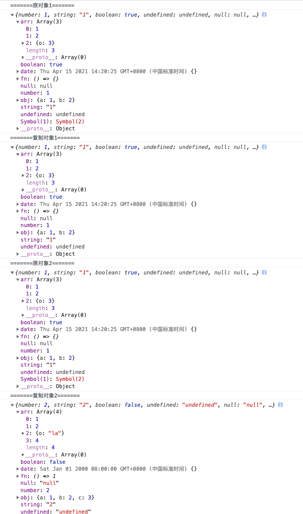

# 深拷贝&浅拷贝

## 含义
 - 浅拷贝：只复制一层对象，当对象的属性是引用类型时，实质复制的是其引用，当引用值发生改变时，也会跟着改变
 - 深拷贝：深拷贝是另外申请了一块内存，内容和原来一样，更改原对象，拷贝对象不会发生改变

## 浅拷贝

### （1）、遍历实现

```javascript

  const shallCopy = obj => {
    const res = {};
    for (const key in obj) {
      // 只复制本身的属性，枚举属性
      if (obj.hasOwnProperty(key)) {
        res[key] = obj[key];
      }
    }
    return res;
  }

```

### （2）、Object.assign(target, source)

```js

  const target = Object.assign({}, obj1, obj2, ...);

```

### （3）、扩展运算符

```js

  const target = {...obj1, ...obj2, ...};

```

## 深拷贝

### （1）JSON.parse(JSON.stringify(obj))

::: danger 注意
部分特殊数据类型无法被处理，如undefined，函数，Symbol，不能被JSON序列化，会丢失
:::

### （2）递归实现

```js

  const deepClone = obj => {
    const targetObj = Array.isArray(obj) ? [] : {};
    if (obj && typeof obj === 'object') {
      const judgeFn = data => Object.prototype.toString.call(data);
      // 普通对象和数组
      if (judgeFn(obj) === '[object Object]' || judgeFn(obj) === '[object Array]') {
        // 普通对象和数组
        for (const key in obj) {
          if (obj.hasOwnProperty(key)) {
            if (obj[key] && typeof obj[key] === 'object') {
              targetObj[key] = deepClone(obj[key]);
            } else {
              targetObj[key] = obj[key];
            }
          }
        }
      } else {
        return obj;
      }
    } else {
      return obj;
    }
    return targetObj
  }

```

#### 示例

```js

  const symbol1= Symbol(1);
  let obj ={
    number: 1,
    string: '1',
    [symbol1]: Symbol(2),
    boolean: true,
    undefined: undefined,
    null: null,
    arr: [1, 2, { o: 3 }],
    obj: { a: 1, b: 2},
    fn: () => {},
    date: new Date()
  }

  let copyObj = deepClone(obj);

  console.log('=======原对象1=======');
  console.log(obj);
  console.log('=======复制对象1=======');
  console.log(copyObj);

  debugger
  copyObj.number=2;
  copyObj.string='2';
  copyObj.boolean=false;
  copyObj.undefined='undefined';
  copyObj.null='null';
  copyObj.arr.push(4);
  copyObj.arr[2].o = 'la';
  copyObj.obj.c = 3;
  copyObj.fn = () => 1;
  copyObj.date = new Date('2000-01-01');
  console.log('=======原对象2=======');
  console.log(obj);
  console.log('=======复制对象2=======');
  console.log(copyObj);

```

#### 结果



#### 结论

- 属性名为Symbol类型的属性，不会被复制
- 对数组和非特殊对象进行重新遍历复制，特殊对象直接赋值
- 日期对象和函数拷贝的是代码不是引用，故直接复制即可，复制对象的改变不会改变原对象
```js
  // 函数
  const fn1 = () => 1;
  let fn2 = fn1;
  fn2 = () => 2;
  console.log('fn1::', fn1); // fn1:: () => 1
  console.log('fn2::', fn2); // fn2:: () => 2
  // 日期
  const d1 = new Date('2020/01/01');
  let d2 = d1;
  d2 = new Date('2000/09/09');
  console.log('d1::', d1); // d1:: Wed Jan 01 2020 00:00:00 GMT+0800 (中国标准时间)
  console.log('d2::', d2); // d2:: Sat Sep 09 2000 00:00:00 GMT+0800 (中国标准时间)

```