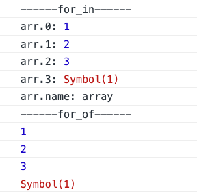
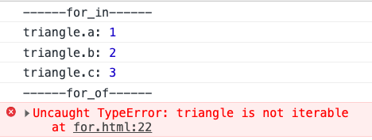
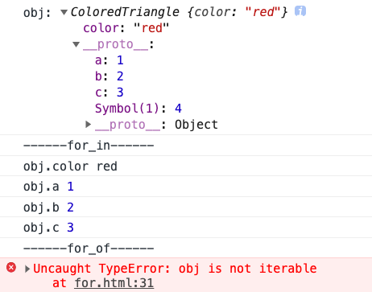

# `for...in`和`for...of`比较

## for...in
`for...in`语句以任意顺序遍历一个对象的除Symbol以外的可枚举属性
  
#### 可枚举属性
- 可枚举属性指那些内部“可枚举”标志设置为true的属性
- 对于通过直接的赋值和属性初始化的属性，该标识默认即为true
- 对于通过Object.defineProperty等定义的属性，该标识默认为false
  
### 语法

```js

  for (variable of object) {
    // ...
  }

```

- `variable`: 在每次迭代中，variable会被赋值为不同的属性名
- `object`: 非Symbol类型的可枚举属性被迭代的对象。

## for...of
在可迭代对象上创建一个迭代循环，调用自定义迭代钩子，并为每个不同属性的值执行语句

- 可迭代对象：`Array, Map, Set, String, argument`等等

### 语法

```js

  for (variable of iterable) {
    // ...
  }

```

- `variable`: 在每次迭代中，将不同属性的值分配给变量
- `iterable`: 被迭代枚举其属性的对象

### 示例

#### Array
```js

  let iterable = [10, 20, 30];

  for (let value of iterable) {
      value += 1;
      console.log(value);
  }
  // 11
  // 21
  // 31

```

#### String

```js

  let iterable = "boo";

  for (let value of iterable) {
    console.log(value);
  }
  // "b"
  // "o"
  // "o"

```

#### Map

```js

  let iterable = new Map([["a", 1], ["b", 2], ["c", 3]]);

  for (let entry of iterable) {
    console.log(entry);
  }
  // ["a", 1]
  // ["b", 2]
  // ["c", 3]

  for (let [key, value] of iterable) {
    console.log(value);
  }
  // 1
  // 2
  // 3

```

#### Set

```js

  let iterable = new Set([1, 1, 2, 2, 3, 3]);

  for (let value of iterable) {
    console.log(value);
  }
  // 1
  // 2
  // 3

```

#### arguments

```js

  (function() {
    for (let argument of arguments) {
      console.log(argument);
    }
  })(1, 2, 3);

  // 1
  // 2
  // 3

```

#### 迭代DOM集合

```js

  let articleParagraphs = document.querySelectorAll("article > p");

  for (let paragraph of articleParagraphs) {
    paragraph.classList.add("read");
  }

```

::: warning 注意
- `for(variable in object)`中的variable是属性名；
- `for(variable of object)`中的variable是属性值
:::

## `for...of`对比`for...in`示例

### 数组

```js

  const sa = Symbol(1);

  const arr = [1, 2, 3, sa];
  arr.name = 'array';

  console.log('------for_in------');
  for (const key in arr) {
    console.log(`arr.${key}:`, arr[key]);
  }
  
  console.log('------for_of------');
  for (const item of arr) {
    console.log(item);
  }

```
#### 输出


::: tip 结论
- for...in 可以输出数组的每项以及数组自身的属性
- for...of 可以输出数组的每项，但不会输出数组自身的属性
:::

### 对象

```js

  const sa = Symbol(1);

  const triangle = { a: 1, b: 2, c: 3, [sa]: 4 };

  console.log('------for_in------');
  for (const key in triangle) {
    console.log(`triangle.${key}:`, triangle[key]);
  }
  console.log('------for_of------');
  for (const item of triangle) {
    console.log(item);
  }

```

#### 结果



::: tip 结论
- for...in 可以遍历对象属性，不包括Symbol作为属性名的属性
- for...of 不可以遍历对象，因为对象不是一个迭代器
:::

### 原型链

```js

  const sa = Symbol(1);

  const triangle = { a: 1, b: 2, c: 3, [sa]: 4 };

  function ColoredTriangle() {
    this.color = 'red';
  }
  ColoredTriangle.prototype = triangle;

  const obj = new ColoredTriangle();

  console.log('obj:', obj);

  console.log('------for_in------');
  for (const prop in obj) {
    console.log(`obj.${prop}`, obj[prop]);
  }
  console.log('------for_of------');
  for (const item of obj) {
    console.log(item);
  }
  
  for (const prop in obj) {
    if (obj.hasOwnProperty(prop)) {
      console.log(`obj.${prop}`, obj[prop]);
    }
  }

```

#### 结果



::: tip 结论
- for...in 会遍历对象原型上的可枚举属性
- 配合hasOwnProperty可以只遍历对象自身属性
- for...of 不会遍历对象，报错
:::


> 参考文档： [https://developer.mozilla.org/zh-CN/docs/Web/JavaScript/Reference/Statements](https://developer.mozilla.org/zh-CN/docs/Web/JavaScript/Reference/Statements)
