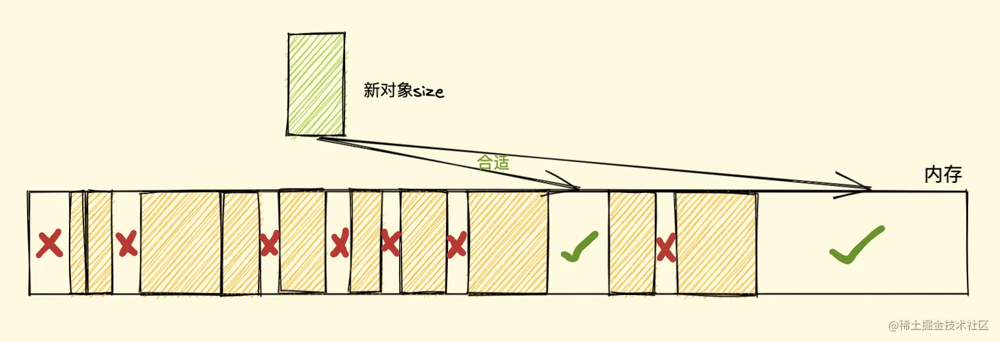

# 内存管理

像C语言这种底层语言一般有底层的内存管理接口，比如`malloc`和`free`。相反，JavaScript是在创建变量时自动进行了内存分配，并在不使用他们时“自动”释放。释放的过程称为垃圾回收。

内存的生命周期：（不管什么语言，内存生命周期都是一致的）

1. 分配你所需要的内存
2. 使用分配到的内存（读、写）
3. 不需要时将其释放/归还

所有语言的第二部分都是明确的。第一和第三部分在底层语言中是明确的，但像在JavaScript这些高级语言中，大部分都是隐含的。

## 内存分配

从各大文章中可以了解到： 基本类型存在栈中，引用类型存在堆中。

不过上面的说法不完全准确，下面比较准确：

- 字符串：存在堆里，栈中为引用地址，如果存在相同字符串，则引用地址相同
- 数字：小整数存在栈中，其他类型存在堆中
- 其他类型：引擎初始化时分配唯一地址，栈中的变量存的是唯一的引用（null/undefined/false/true等）

::: tip
> 引用自一篇文章：[JavaScript中变量存储在堆中还是栈中？](https://www.zhihu.com/question/482433315/answer/2083349992)

文章中有详细的说明，可以仔细阅读一下
:::

## 垃圾回收

GC 即 Garbage Collection，程序工作过程中会产生很多垃圾，这些垃圾是程序不用的内存，或者是以前用过了以后不会再用的内存空间。而GC就是负责回收垃圾的，因为它工作在引擎内部，所以对于我们前端来说，GC的过程相对比较无感，这一套引擎执行而对我们相对无感的操作也就是常说的*垃圾回收机制*了。

### 引用计数

这是最初的垃圾收集算法。此算法把“对象是否不再需要”简化定义为“对象有没有其他对象引用到它”。如果没有引用指向该对象（零引用），对象将被垃圾回收机制回收。

它的策略是跟踪记录每个变量值被使用的次数：

- 当声明了一个变量并且将一个引用类型赋值给该变量的时候这个值的引用次数就为1
- 如果同一个值又被赋给另一个变量，那么引用数加1
- 如果该变量的值被其他的值覆盖了，则引用次数减1
- 当这个值的引用次数变为0的时候，说明没有变量在使用，这个值没法被访问了，回收空间，垃圾回收器会在运行的时候清理掉引用次数为0的值占用的内存

**示例**

```js

var o = {
  a: {
    b: 2
  }
}
// 两个对象被创建，一个作为另一个的属性被引用，另一个被分配给变量o
// 很显然，没有一个可以被垃圾收集

var o2 = o; // o2变量是第二个对“这个对象”的引用

o = 1;      // 现在，“这个对象”只有一个o2变量的引用了，“这个对象”的原始引用o已经没有

var oa = o2.a; // 引用“这个对象”的a属性
              // 现在，“这个对象”有两个引用了，一个是o2，一个是oa

o2 = "yo"; // 虽然最初的对象现在已经是零引用了，可以被垃圾回收了
          // 但是它的属性a的对象还在被oa引用，所以还不能回收

oa = null; // a属性的那个对象现在也是零引用了
          // 它可以被垃圾回收了

```

**限制**

该算法有个限制：无法处理循环引用的实例。在下面对象中，两个对象被创建并相互引用，形成了一个循环。它们被调用之后会离开函数作用域，所以它们已经没有用了，可以被回收了。然而，引用计数算法考虑到它们互相都有至少一次引用，所以它们不会被回收。

```js

function f(){
  var o = {};
  var o2 = {};
  o.a = o2; // o 引用 o2
  o2.a = o; // o2 引用 o

  return;
}

f();

```

**优点**

引用计数算法的优点我们对比标记清除来看就会清晰很多，首先引用计数在引用值为 0 时，也就是在变成垃圾的那一刻就会被回收，所以它可以立即回收垃圾

而标记清除算法需要每隔一段时间进行一次，那在应用程序（JS脚本）运行过程中线程就必须要暂停去执行一段时间的 GC，另外，标记清除算法需要遍历堆里的活动以及非活动对象来清除，而引用计数则只需要在引用时计数就可以了

**缺点**

引用计数的缺点想必大家也都很明朗了，首先它需要一个计数器，而此计数器需要占很大的位置，因为我们也不知道被引用数量的上限，还有就是无法解决循环引用无法回收的问题，这也是最严重的

### 标记清除算法

这个算法把“对象是否不再需要”简化定义为“对象是否可以获得”。

就像它的名字一样，此算法分为*标记*和*清除*两个阶段，标记阶段即为所有活动对象上做标记，清除阶段则把没有标记的对象（非活动对象）做清理。

这个算法假定设置一个叫做根（root）的对象（在Javascript里，根是全局对象）。垃圾回收器将*定期*从根开始，找所有从根开始引用的对象，然后找这些对象引用的对象……

从根开始，垃圾回收器将找到所有可以获得的对象和收集所有不能获得的对象。

这个算法比前一个要好，因为“有零引用的对象”总是不可获得的，但是相反却不一定，参考“循环引用”。

从2012年起，所有现代浏览器都使用了标记-清除垃圾回收算法。所有对JavaScript垃圾回收算法的改进都是基于标记-清除算法的改进，并没有改进标记-清除算法本身和它对“对象是否不再需要”的简化定义。

标记清除整个算法大致过程像下面这样：

- 垃圾收集器在运行时会给内存中的所有变量都加上一个标记，假设内存中所有对象都是垃圾，全标记为0。
- 然后从根对象开始遍历，把不是垃圾的节点改为1
- 清理所有标记为0的垃圾，销毁并回收他们所占用的内存空间
- 最后把所有内存中对象标记修改为0，等待下一轮回收。

**优点**

标记清除算法的优点只有一个，那就是实现比较简单，打标记也无非打与不打两种情况，这使得一位二进制位（0和1）就可以为其标记，非常简单

**缺点**

标记清除算法有一个很大的缺点，就是在清除之后，剩余的对象内存位置是不变的，也会导致空闲内存空间是不连续的，出现了*内存碎片（如下图）*，并且由于剩余空闲内存不是一整块，它是由不同大小内存组成的内存列表，这就牵扯出了内存分配的问题


假设我们新建对象分配内存时需要大小为size，由于空闲内存是间断的、不连续的，则需要对空闲内存列表进行一次单向遍历找出大于等于size的块才能为其分配（如下图）



那如何找到合适的块呢？我们可以采取下面三种分配策略

- `First-fit`：找到大于等于size的块，立即返回
- `Best-fit`：遍历整个空闲列表，返回大于等于size的最小分块
- `Worst-fit`：遍历整个空闲列表，找到最大的分块，然后切成两部分，一部分size大小，并将该部分返回

这三种策略里面`Worst-fit`的空间利用率看起来是最合理，但实际上切分之后会造成更多的小块，形成内存碎片，所以不推荐使用，对于`First-fit`和`Best-fit`来说，考虑到分配的速度和效率`First-fit`是更为明智的选择

*综上所述，标记清除算法或者说策略就有两个很明显的缺点*

- **内存碎片化**，空闲内存块是不连续的，容易出现很多空闲内存块，还可能会出现分配所需内存过大的对象时找不到合适的块
- **分配速度慢**，因为即便是使用`First-fit`策略，其操作仍是一个`O(n)`的操作，最坏情况是每次都要遍历到最后，同时因为碎片化，大对象的分配效率会更慢

归根结底，标记清除算法的缺点在于清除之后剩余的对象位置不变而导致的空闲内存不连续，所以只要解决这一点，两个缺点都可以完美解决了

而**标记整理（Mark-Compact）算法**就可以有效地解决，它的标记阶段和标记清除算法没有什么不同，只是标记结束后，标记整理算法会将活着的对象（即不需要清理的对象）向内存的一端移动，最后清理掉边界的内存（如下图）


## v8内存管理机制

> 参考文档 [「硬核JS」你真的了解垃圾回收机制吗](https://juejin.cn/post/6981588276356317214)