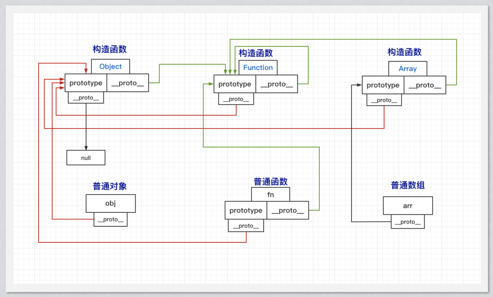
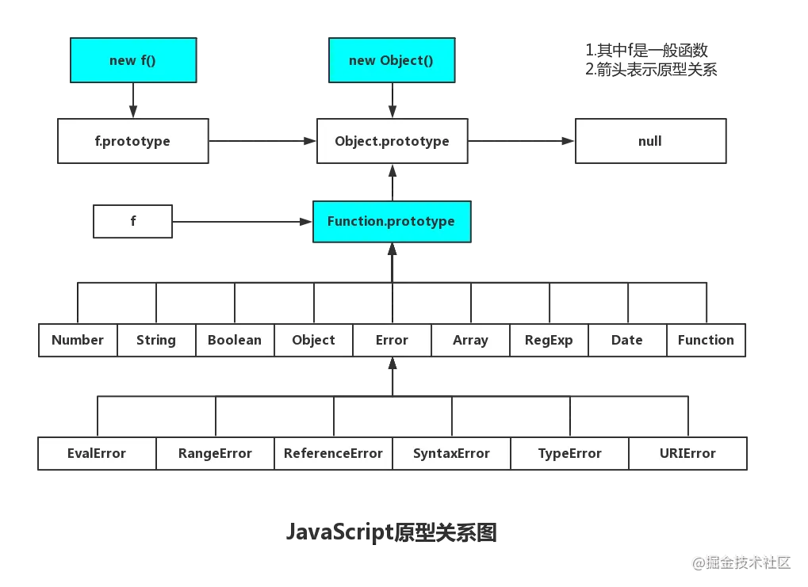

# 原型链

原型链主要是实例对象和构造函数之间的关系，而基本上所有的js对象都有构造函数，而构造函数又是一个特殊的对象。

JavaScript是动态的，并且本身不提供一个class实现。（在ES2015/ES6中引入了class关键字，但那只是语法糖，JavaScript仍然是基于原型的）

当谈到继承时，JavaScript只有一种结构：对象。每个实例对象都有一个私有属性（称之为`__proto__`）指向它的构造函数的原型对象（prototype)。该原型对象也有一个自己的原型对象(`__proto__`) ，层层向上直到一个对象的原型对象为null。

::: tip 什么是构造函数
js中我们定义对象、数组等都是使用了构造函数，然后生成一个实例。

`Object(),Array(),Function(),Number(),String()...`
:::

---

**Object的原型链**

1. `Object.__proto__` => `Function.prototype`
2. `Function.prototype.__proto__` => `Object.prototype`
3. `Object.prototype.__proto__` => `null`

**Function的原型链**

1. `Function.__proto__` => `Function.prototype`
2. `Function.prototype.__proto__` => `Object.prototype`
3. `Object.prototype.__proto__` => `null`

**Array/String/Number以及普通函数的原型链**

*由于他们都类似，示例统一用Fn代替*

1. `Fn.__proto__` => `Function.prototype`
2. `Function.prototype.__proto__` => `Object.prototype`
3. `Object.prototype.__proto__` => `null`

从上面示例可以看出，普通函数和构造函数的原型链基本都要走到上面的过程。

**对象实例obj的原型链**

`obj = {}`

1. `obj.__proto__` => `Object.prototype`
2. `Object.prototype.__proto__` => `null`

**数组实例arr的原型链**

`arr = []`

1. `arr.__proto__` => `Array.prototype`
2. `Array.protoType.__proto__` => `Object.prototype`
3. `Object.prototype.__proto__` => `null`

从上面的示例可以看到，实例都指向它构造函数的prototype，而构造函数的prototype是一个对象，它的原型（__proto__）都指向`Object.prototype`，然后指向null完成整个原型链。

大多数对象的原型（__proto__）都指向它构造函数的prototype，而构造函数的prototype其实就是一个对象，所以构造函数的prototype的原型(__proto__)就又指向了`Object.prototype`。

而构造函数的原型（__proto__）都指向`Function.prototype`，`Function.prototype`的原型(__proto__)又指向`Object.prototype`，所以侧面说明构造函数其实也是对象，特殊的对象。

**通过create方法创建对象的原型链**

```javascript

  const a = { a: 1 };
  const b = Object.create(a);

```

b的原型链：

1. `b.__proto__` => `a`
2. `a.__proto__` => `Object.prototype`
3. `Object.prototype.__proto__` => `null`

::: tip
以上事例均可通过恒等（===）进行校验，如`console.log(Object.__proto__ === Function.prototype // true`
:::

---

**关系图**

主要是这个图，这个懂了，其他就都懂了。



别处发现的一个图，挺清晰明了的

> 来源：[原型图](https://juejin.cn/post/6844903704663949325);



**代码验证：**

```javascript

  const obj = {};
  const arr = [];
  const fn = function() {};

  // 非函数实例对象的__proto__都指向Object(构造函数)的prototype
  console.log(obj.__proto__ === Object.prototype); // true
  console.log(fn.prototype.__proto__ === Object.prototype); // true
  console.log(Function.prototype.__proto__ === Object.prototype); // true
  console.log(Array.prototype.__proto__ === Object.prototype); // true

  // 构造函数也是对象，prototype只是它的一个特殊属性，它也有__proto__属性，切都指向Function(构造函数)的prototype
  console.log(fn.__proto__ === Function.prototype); // true
  console.log(Object.__proto__ === Function.prototype); // true
  console.log(Function.__proto__ === Function.prototype); // true
  console.log(Array.__proto__ === Function.prototype); // true

  // 实例对象的__proto__都指向自己构造函数的prototype
  console.log(arr.__proto__ === Array.prototype); // true
  // Object(构造函数)的prototype的__proto__指向null，原型链终点
  console.log(Object.prototype.__proto__ === null); // true

```

---

总结：

1. 几乎所有 JavaScript 中的对象都是位于原型链顶端的 Object 的实例。
2. js中函数是一等公民，而函数是一个特殊的对象。
3. 大多数对象的原型（`__proto__`）都指向它构造函数的prototype，而构造函数的prototype的原型（`__proto__`）都指向`Object.prototype`，侧面说明构造函数其实也是对象，特殊的对象。
4. 原型链是通过`__proto__`实现继承的，查找属性也是通过`__proto__`一层一层查找的，不是通过`prototype`。
5. 根据定义，null没有原型，并作为这个原型链中的最后一个环节。

::: warning 注意
- 这里只是说明关系，Function/Object都有部分功能是引擎原生的实现
- 原型可以被手动修改，`__proto__`也可以被修改，上面的逻辑基于不直接操作`__proto__`和相关函数的`prototype`
:::

> 参考文档：[MDN：继承与原型链](https://developer.mozilla.org/zh-CN/docs/Web/JavaScript/Inheritance_and_the_prototype_chain)
