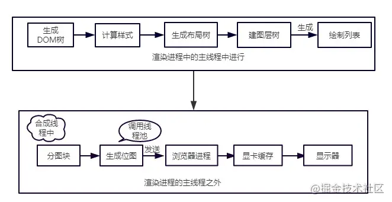
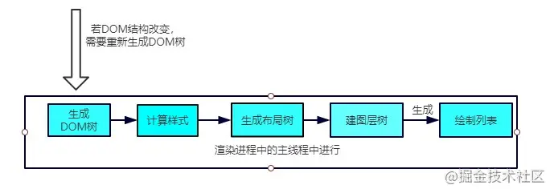

# 重绘和回流

浏览器渲染前端页面的流程：

## 回流

回流也叫重排

**触发条件**

简单来说，就是当我们对DOM结构的修改引发DOM几何尺寸变化的时候，就会发生回流的过程。

具体一点，有以下的操作会触发回流:

- 一个DOM元素的几何属性变化，常见的几何属性有`width、height、padding、margin、left、top、border`等等

- 使DOM节点发生增减或者移动。

- 读写offset族、scroll族和client族属性的时候，浏览器为了获取这些值，需要进行回流操作。

- 调用`window.getComputedStyle`方法。

**回流过程**

依照渲染流水线，触发回流的时候，如果DOM结构发生改变，则重新渲染DOM树，然后将后面的流程(包括主线程之外的任务)全部走一遍。

相当于将解析和合成的过程重新又走了一篇，开销是非常大的。

### 重绘

**触发条件**

当DOM的修改导致了样式的变化，并且没有影响几何属性的时候，会导致重绘(repaint)。

**重绘过程**

由于没有导致DOM几何属性的变化，因此元素的位置信息不需要更新，从而省去布局的过程。流程如下：

跳过了生成布局树和建图层树的阶段，直接生成绘制列表，然后继续进行分块、生成位图等后面一系列操作。

可以看到，重绘不一定导致回流，但回流一定发生了重绘。

### 合成

还有一种情况，是直接合成。

比如利用CSS3的`transform、opacity、filter`这些属性就可以实现合成的效果，也就是常说的**GPU加速**。

**GPU加速的原因**

在合成的情况下，会直接跳过布局和绘制流程，直接进入非主线程处理的部分，即直接交给合成线程处理。交给它处理有两大好处:

1. 能够充分发挥GPU的优势。合成线程生成位图的过程中会调用线程池，并在其中使用GPU进行加速生成，而GPU是擅长处理位图数据的。

2. 没有占用主线程的资源，即使主线程卡住了，效果依然能够流畅地展示。

## 实践意义

知道上面的原理之后，对于开发过程有什么指导意义呢？

- 避免频繁使用style，而是采用修改class的方式。
- 使用createDocumentFragment进行批量的DOM操作。
- 对于resize、scroll等进行防抖/节流处理。
- 添加`will-change: transform`，让渲染引擎为其单独实现一个图层，当这些变换发生时，仅仅只是利用合成线程去处理这些变换，而不牵扯到主线程，大大提高渲染效率。当然这个变化不限于transform，任何可以实现合成效果的CSS属性都能用will-change来声明。这里有一个实际的例子，一行`will-change: transform`拯救一个项目，[点击直达](https://juejin.cn/post/6844903966573068301)。

> 参考文档： [谈谈你对重绘和回流的理解](https://juejin.cn/post/6844904021308735502);