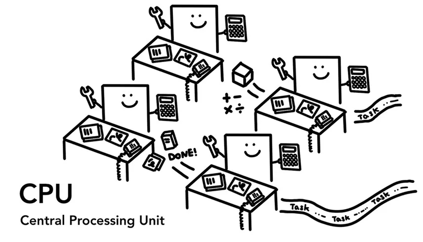
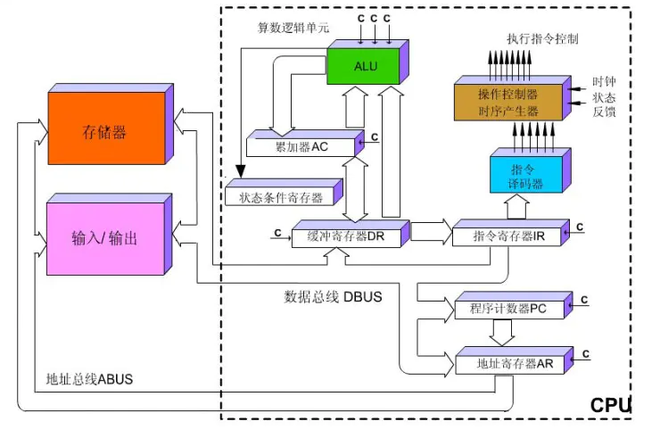
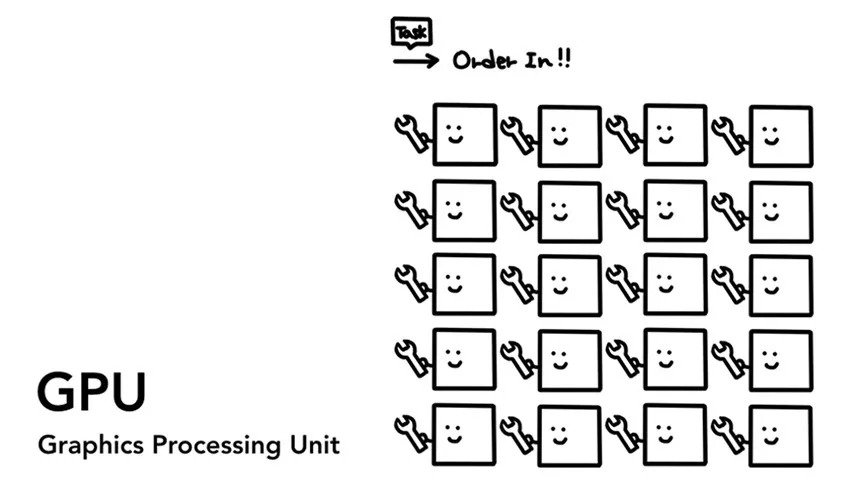
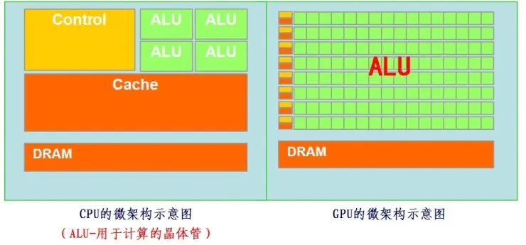
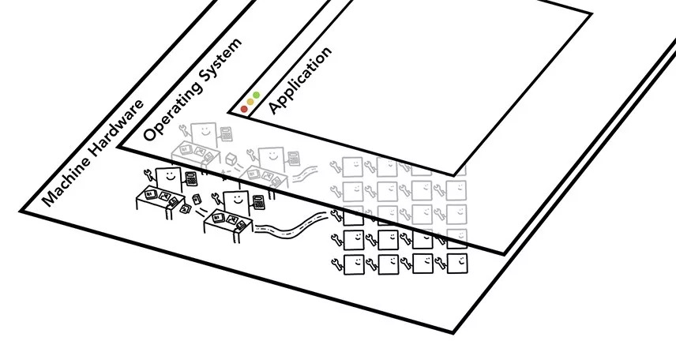
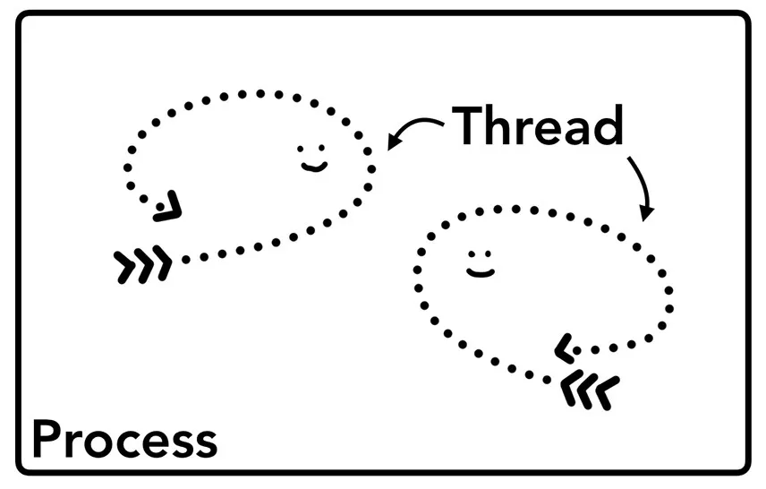
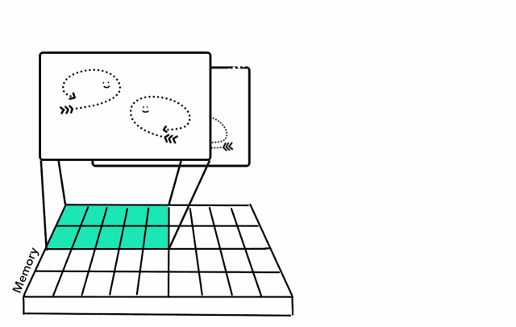
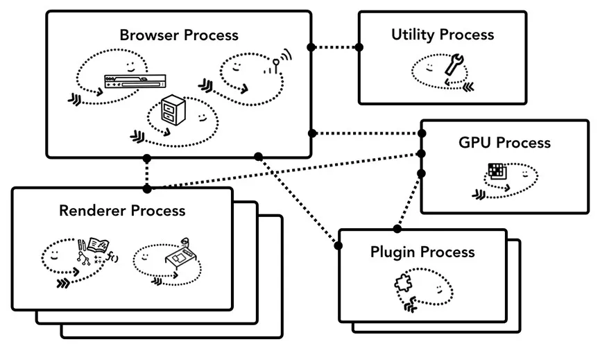
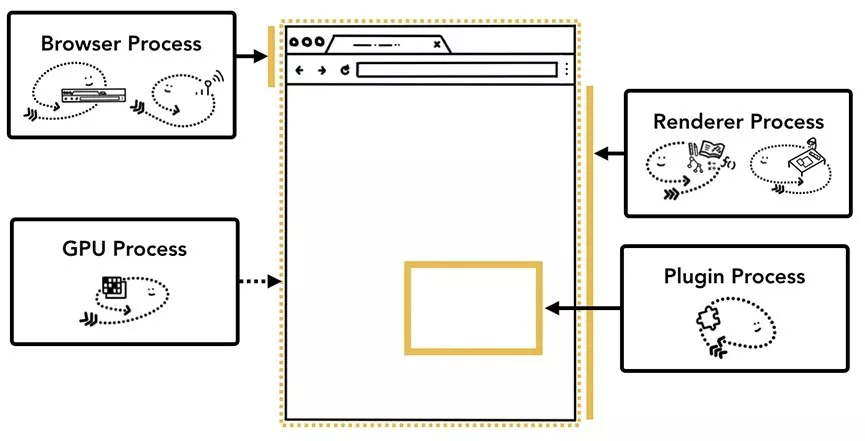

# Chrome架构

## 1、CPU（中央处理器）

CPU(Central Procession Unit)可以被认为是计算机的大脑。CPU核心，就像办公室工作人员，可以逐个处理交代给他们许多不同的任务。曾经大多数CPU都是单核的，但在现代硬件中，通常都是多核CPU了，多核CPU为手机和计算机提供更强的计算能力。

CPU主要由**运算器**和**控制器**两大部分组成

- 控制器的组成和功能：控制器由程序计数器、指令寄存器、指令译码器、时序产生器和操作控制器组成。它是计算机指挥系统，完成计算机的指挥工作。

- 运算器的组成和功能：运算器由算数逻辑单元(ALU)、累加寄存器、数据缓冲寄存器和状态条件寄存器组成，它是数据加工处理部件，完成计算机的各种算数和逻辑运算。相对控制器而言，运算器接受控制器的命令而进行动作，即运算器所进行的全部操作由控制器发出的控制信号来指挥的，所以它是执行部件。

CPU的基本工作原理是执行存储的指令顺序，即程序。程序的执行过程实际上是不断地取出指令、分析指令、执行指令的过程。几乎所有冯·诺依曼型计算机的CPU，其工作都可以分为5个阶段：取指令、指令译码、执行指令、访存数据和结果写回。

## 2、GPU（图形处理单元）

GPU(Graphics Processing Unit)是计算机的另一部分。与CPU不同，GPU更擅长处理简单任务，同时可以跨多个核心。

GPU在最初是用在个人电脑、工作站、游戏机和一些移动设备上运行绘图运算工作的微处理器。因为对于处理器图像数据来说，图像上的每一个像素点都有被处理的需要，这是一个相当大的数据，所以对于运算加速的需求图像处理领域最为强烈，GPU也就应运而生了。

通过CPU与GPU结构上的对比我们可以看出，CPU功能模块很多，能适应复杂运算环境，大部分晶体管主要用于构建控制电路和Cache，只有少部分的晶体管来完成实际的运算工作。而GPU的控制相对简单，且对Cache的需求小，所以大部分晶体管可以组成各类专用电路、多条流水线，使得GPU的计算速度有了突破性的飞跃，拥有了更强大的运算的能力。

CPU的控制器比较复杂，而运算器(ALU)比较少。因此CPU可以做复杂的逻辑运算，但是不擅长数学，尤其是浮点运算。

对于绘制图像，就好比在画一幅画的时候CPU是用一支笔一笔一笔地画（或有限的几支笔），而GPU则是用多支笔对不同的位置同时进行描绘，那自然效率就是突飞猛进的。

::: tip 总结对比
从根本上说CPU和GPU它们的目的不同，且有不同侧重点，也有着不同的性能特性，在某些工作中CPU执行得更快，另一工作中或许GPU能更好。当你需要对大量数据做同样的事情时，GPU更合适，当你需要对同一数据做很多事情时，CPU正好。形象点理解，GPU就像一群蚂蚁，这些蚂蚁都做着同样的事，而CPU就像一只猴子，这只猴子做着各种不同的事。
:::

> 参考文档：[从 CPU、GPU 再到 TPU，Google 的 AI 芯片是如何一步步进化过来的？](https://juejin.cn/post/6844903479102685192)
>
> 参考文档：[CPU和GPU的特点和区别](https://zhuanlan.zhihu.com/p/106385370)

## 3、Process(进程)和Thread(线程)

下图是三层计算机体系结构，硬件位于底部，操作系统位于中间，应用层序则在最上层。通常应用程序使用操作系统提供的机制在CPU和GPU上运行。

进程可以理解是应用程序的执行程序，线程则是存在于进行内部，并执行其进程程序的部分功能。

进程作为线程的边界，而线程就像游动在进程中的鱼。

进程可以通过操作系统，启动另一个进程来执行不同的任务。同时，系统将为新进程分配不同的内存。如果两个进程间需要通信，他们可以利用IPC的方式进行通信。

许多应用程序都是以这种方式执行的，因此如果某个工作进程（例如一个选项卡）无响应，重启它，并不会影响相同应用程序的其他进程。

## 4、 浏览器架构

*关于如何构建Web浏览器没有标准规范，不同浏览器的架构可能完全不同。*

不过我们需要关注的是浏览器进程，如何与负责应用程序不同部分的其他进程协调。对于渲染器进程，将创建多个进程，并将其分配给每个选项卡。直到2018年9月份左右，Chrome才为每个标签提供了一个执行进程，现在它尝试为每个站点提供自己的进程，包括iframe。

如图所示，Chrome的多进程架构，渲染进程会显示多个图层，表示Chrome为每个选项卡运行多个渲染进程。

### 这些进程控制什么

下面介绍了每个Chrome进程以及其控制的范围

- 浏览器(Browser)：控制“Chrome”应用程序，包括地址栏、书签、后退和前进按钮等。还需要处理Web浏览器的权限管理，例如网络请求和文件访问。
- 渲染器(Renderer)：控制选项卡内，网站里显示的所有内容。
- 插件(Plugin)：控制网站使用的插件，如：Flash
- GPU: 独立于其他进程，专用于处理GPU任务，它被分成不同的进程，因为GPU会处理来着多个进程的请求，并将他们绘制在相同的Surface中。

不同的进程，用于处理Chrome的不同部分。

