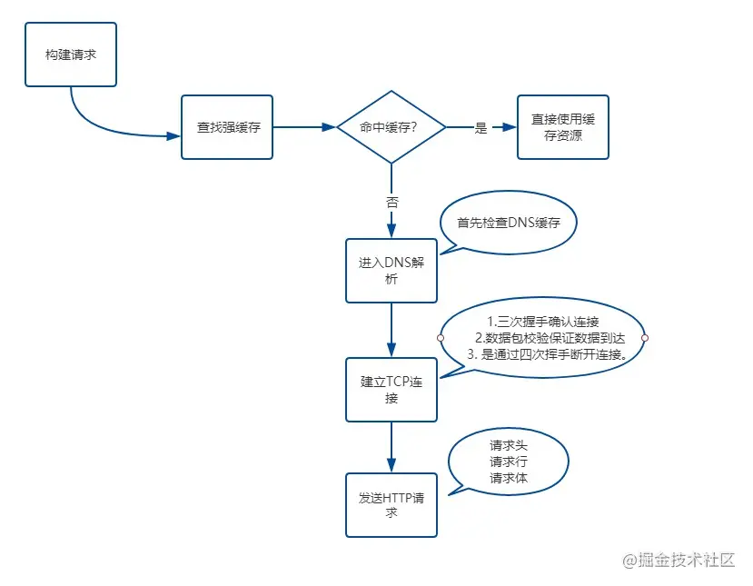
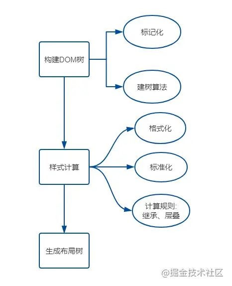
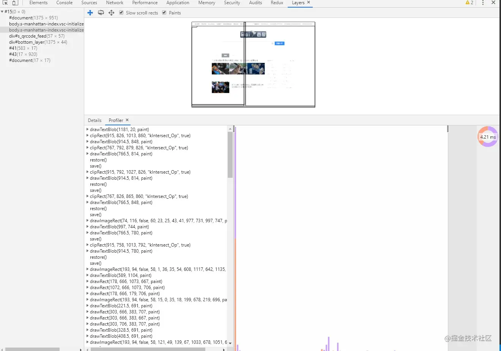
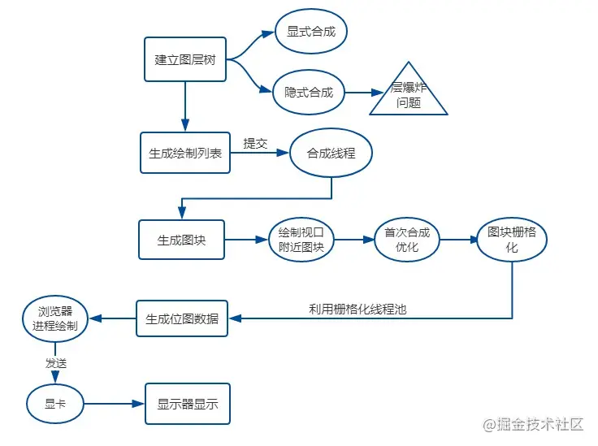

# 从输入URL到页面呈现发生了什么

这是一个可以无限难的问题

此时此刻，假如在浏览器地址栏输入了百度的网址：`https://www.baidu.com/`

## 网络过程

### 网络请求

**1. 构建请求**

浏览器会创建请求行

```js

// 请求方法是GET，路径为根路径，HTTP协议版本为1.1
GET / HTTP/1.1

```

**2. 查找强缓存**

先检查强缓存，如果命中直接使用，否则进入下一步。关于强缓存，[浏览器缓存策略](../cache/index.md)

**3. DNS解析**

由于我们输入的是域名，而数据包是通过IP地址传给对方的。因此我们需要得到域名对应的IP地址。这个过程需要依赖一个服务系统，这个系统将域名和IP一一映射，我们将这个系统就叫做DNS（域名系统）。得到具体IP的过程就是DNS解析。

当然，值得注意的是，浏览器提供了DNS数据缓存功能。即如果一个域名已经解析过，那会把解析的结果缓存下来，下次处理直接走缓存，不需要经过DNS解析。

另外，如果不指定端口的话，默认采用对应的IP的80端口。

**4. 建立TCP连接**

TCP（Transmission Control Protocol，传输控制协议）是一种面向连接的、可靠的、基于字节流的传输层通信协议。

Chrome在同一个域名下要求同时最多只能有6个TCP连接，超过6个的话剩下的请求就得等待。

假设现在不需要等待，我们进入了TCP连接的建立阶段。

建立TCP连接经历了下面三个阶段:

1. 通过三次握手(即总共发送3个数据包确认已经建立连接)建立客户端和服务器之间的连接。
   
2. 进行数据传输。这里有一个重要的机制，就是接收方接收到数据包后必须要向发送方确认, 如果发送方没有接到这个确认的消息，就判定为数据包丢失，并重新发送该数据包。当然，发送的过程中还有一个优化策略，就是把大的数据包拆成一个个小包，依次传输到接收方，接收方按照这个小包的顺序把它们组装成完整数据包。

3. 断开连接的阶段。数据传输完成，现在要断开连接了，通过四次挥手来断开连接。

这里就说明了TCP连接通过什么手段来保证数据传输的*可靠性*，一是**三次握手**确认连接，二是**数据包校验**保证数据到达接收方，三是通过**四次挥手**断开连接。

关于TCP相关的详细介绍：[TCP](/computer/tcp/index.md)

**5. 发送http请求**

现在TCP连接建立完毕，浏览器可以和服务器开始通信，即开始发送HTTP请求。浏览器发HTTP请求要携带三样东西：请求行、请求头和请求体。

首先，浏览器会向服务器发送请求行，关于请求行，我们在这一部分的第一步就构建完了，贴一下内容：

```js
// 请求方法是GET，路径为根路径，HTTP协议版本为1.1
GET / HTTP/1.1
```

结构很简单，由请求方法、请求URI和HTTP版本协议组成。

同时也要带上请求头，比如我们之前说的Cache-Control、If-Modified-Since、If-None-Match都由可能被放入请求头中作为缓存的标识信息。当然了还有一些其他的属性，列举如下:

```bash
Accept: text/html,application/xhtml+xml,application/xml;q=0.9,image/webp,image/apng,*/*;q=0.8,application/signed-exchange;v=b3
Accept-Encoding: gzip, deflate, br
Accept-Language: zh-CN,zh;q=0.9
Cache-Control: no-cache
Connection: keep-alive
Cookie: /* 省略cookie信息 */
Host: www.baidu.com
Pragma: no-cache
Upgrade-Insecure-Requests: 1
User-Agent: Mozilla/5.0 (iPhone; CPU iPhone OS 11_0 like Mac OS X) AppleWebKit/604.1.38 (KHTML, like Gecko) Version/11.0 Mobile/15A372 Safari/604.1
```

最后是请求体，请求体只有在POST方法下存在，常见的场景是表单提交。

### 网络响应

HTTP请求到达服务器，服务器进行对应的处理。最后要把数据传给浏览器，也就是返回网络响应。

跟请求部分类似，网络响应具有三个部分：响应行、响应头和响应体。

响应行类似下面这样：

```js
HTTP/1.1 200 OK
```

由HTTP协议版本、状态码和状态描述组成。

响应头包含了服务器及其返回数据的一些信息，服务器生成数据的时间、返回的数据类型以及对即将写入的Cookie信息。

```
Cache-Control: no-cache
Connection: keep-alive
Content-Encoding: gzip
Content-Type: text/html;charset=utf-8
Date: Wed, 04 Dec 2019 12:29:13 GMT
Server: apache
Set-Cookie: rsv_i=f9a0SIItKqzv7kqgAAgphbGyRts3RwTg%2FLyU3Y5Eh5LwyfOOrAsvdezbay0QqkDqFZ0DfQXby4wXKT8Au8O7ZT9UuMsBq2k; path=/; domain=.baidu.com

```

响应完成之后怎么办？TCP连接就断开了吗？

不一定。这时候要判断Connection字段, 如果请求头或响应头中包含`Connection: Keep-Alive`，表示建立了持久连接，这样TCP连接会一直保持，之后请求统一站点的资源会复用这个连接。

否则断开TCP连接, 请求-响应流程结束。

浏览器端的网络请求过程：



## 解析过程

完成了网络请求和响应，如果响应头中`Content-Type=text/html`，那么接下来就是浏览器的解析和渲染工作了。

**主要分为以下几个步骤：**

- 构建DOM树
- 样式计算
- 生成布局树(Layout Tree)

### 构建DOM树

由于浏览器无法直接理解HTML字符串，因此将这一系列的*字节流*转换为一种有意义并且方便操作的数据结构，这种数据结构就是**DOM树**。

DOM树本质上是一个以document为根节点的多叉树。

解析算法：

HTML5规范详细地介绍了解析算法。这个算法分为两个阶段:

- 标记化
- 建树

对应的两个过程就是*词法分析*和*语法分析*。

**标记化算法**

这个算法输入为HTML文本，输出为HTML标记，也成为标记生成器。其中运用有限自动状态机来完成。即在当前状态下，接收一个或多个字符，就会更新到下一个状态。

```html
<html>
  <body>
    Hello sanyuan
  </body>
</html>
```
通过一个简单的例子来演示一下标记化的过程。

遇到`<`，状态为标记打开。

接收`[a-z]`的字符，会进入标记名称状态。

这个状态一直保持，直到遇到`>`，表示标记名称记录完成，这时候变为数据状态。

接下来遇到body标签做同样的处理。

这个时候html和body的标记都记录好了。

现在来到`<body>`中的`>`，进入数据状态，之后保持这样状态接收后面的字符`hello sanyuan`。

接着接收`</body>`中的`<`，回到标记打开，接收下一个`/`后，这时候会创建一个`end tag`的token。

随后进入标记名称状态, 遇到`>`回到数据状态。

接着以同样的样式处理`</html>`。

**建树算法**

之前提到过，*DOM树*是一个以document为根节点的多叉树。因此解析器首先会创建一个document对象。标记生成器会把每个标记的信息发送给*建树器*。*建树器*接收到相应的标记时，会创建对应的DOM对象。创建这个DOM对象后会做两件事情:

- 将DOM对象加入DOM树中。
- 将对应标记压入存放开放(与闭合标签意思对应)元素的栈中。

还是拿下面这个例子说:

```html
<html>
  <body>
    Hello sanyuan
  </body>
</html>
```
首先，状态为**初始化状态**。

接收到*标记生成器*传来的html标签，这时候状态变为`before html`状态。同时创建一个HTMLHtmlElement的DOM元素，将其加到document根对象上，并进行压栈操作。

接着状态自动变为`before head`，此时从*标记生成器*那边传来body，表示并没有head，这时候建树器会自动创建一个HTMLHeadElement并将其加入到DOM树中。

现在进入到`in head`状态，然后直接跳到`after head`。

现在*标记生成器*传来了body标记，创建HTMLBodyElement，插入到DOM树中，同时压入开放标记栈。

接着状态变为`in body`，然后来接收后面一系列的字符：`Hello sanyuan`。

接收到第一个字符的时候，会创建一个Text节点并把字符插入其中，然后把Text节点插入到 DOM树中body元素的下面。

随着不断接收后面的字符，这些字符会附在Text节点上。

现在，标记生成器传过来一个body的结束标记，进入到`after body`状态。

标记生成器最后传过来一个html的结束标记, 进入到`after html`的状态，表示解析过程到此结束。

**容错机制**

讲到HTML5规范，就不得不说它强大的宽容策略，容错能力非常强，虽然大家褒贬不一，不过我想作为一名资深的前端工程师，有必要知道`HTML Parser`在容错方面做了哪些事情。

WebKit中一些经典的容错示例：

1. 使用`</br>`而不是`<br>`

```js
if (t->isCloseTag(brTag) && m_document->inCompatMode()) {
  reportError(MalformedBRError);
  t->beginTag = true;
}
```
全部换为`<br>`的形式。

2. 表格离散

```html
<table>
  <table>
    <tr><td>inner table</td></tr>
  </table>
  <tr><td>outer table</td></tr>
</table>
```
WebKit会自动转换为:
```html
<table>
    <tr><td>outer table</td></tr>
</table>
<table>
    <tr><td>inner table</td></tr>
</table>
```
3. 表单元素嵌套

这时候直接忽略里面的form，即form里面还有form的话，忽略里面的form。

### 样式计算

关于CSS样式，它的来源一般是三种：

- link标签引用
- style标签中的样式
- 元素的内嵌style属性

**格式化样式表**

首先，浏览器是无法直接识别CSS样式文本的，因此渲染引擎接收到CSS文本之后第一件事情就是将其转化为一个结构化的对象，即styleSheets。

这个格式化的过程过于复杂，而且对于不同的浏览器会有不同的优化策略，这里就不展开了。

在浏览器控制台能够通过`document.styleSheets`来查看这个最终的结构。当然，这个结构包含了以上三种CSS来源，为后面的样式操作提供了基础。

**标准化样式属性**

有一些CSS样式的数值并不容易被渲染引擎所理解，因此需要在计算样式之前将它们标准化，如`em->px,red->#ff0000,bold->700`等等。

**计算每个节点的具体样式**

样式已经被格式化和标准化，接下来就可以计算每个节点的具体样式信息了。

计算的方式主要就是两个规则: **继承和层叠**。

每个子节点都会默认继承父节点的样式属性，如果父节点中没有找到，就会采用浏览器默认样式，也叫UserAgent样式。这就是继承规则。

然后是层叠规则，CSS最大的特点在于它的层叠性，也就是最终的样式取决于各个属性共同作用的效果，甚至有很多诡异的层叠现象，具体的层叠规则属于深入CSS语言的范畴，可以看《CSS世界》了解。

### 生成布局树

现在已经生成了*DOM树*和*DOM样式*，接下来要做的就是通过浏览器的布局系统确定元素的位置，也就是要生成一棵布局树(Layout Tree)。

布局树生成的大致工作如下：

- 遍历生成的DOM树节点，并把他们添加到布局树中。
- 计算布局树节点的坐标位置。

值得注意的是，这棵布局树只包含可见元素，对于head标签和设置了`display: none`的元素，将不会被放入其中。
有人说首先会生成`Render Tree`，也就是渲染树，其实这还是16年之前的事情，现在 Chrome团队已经做了大量的重构，已经没有生成`Render Tree`的过程了。而布局树的信息已经非常完善，完全拥有`Render Tree`的功能。

布局的细节，过于复杂，不过大部分情况下我们只需要知道它所做的工作是什么即可，深入其中的原理可以看[从Chrome源码看浏览器如何layout布局](https://www.rrfed.com/2017/02/26/chrome-layout/)。

**解析算法的脉络**



## 渲染过程

分为以下几个步骤：

- 建立图层树(Layer Tree)
- 生成绘制列表
- 生成图块并栅格化
- 显示器显示内容

### 建图层树

虽然现在DOM节点有了，样式和位置信息也都有了，但是仍然不能开始绘制页面。

因为还需要考虑另外一些复杂的场景，比如3D动画如何呈现出变换效果，当元素含有层叠上下文时如何控制显示和隐藏等等。

为了解决如上所述的问题，浏览器在构建完布局树之后，还会对特定的节点进行分层，构建一棵图层树(Layer Tree)。

一般情况下，节点的图层会默认属于父亲节点的图层(这些图层也称为合成层)。那什么时候会提升为一个单独的合成层呢？

一种是显式合成，一种是隐式合成。

**显式合成**

1. 拥有层叠上下文的节点。
   
  层叠上下文也基本上是有一些特定的CSS属性创建的，一般有以下情况:

  - HTML根元素本身就具有层叠上下文
  - 普通元素设置position不为static并且设置了z-index属性，会产生层叠上下文
  - 元素的opacity值不是 1
  - 元素的transform值不是none
  - 元素的filter值不是none
  - 元素的isolation值是isolate
  - will-change指定的属性值为上面任意一个

2. 需要剪裁的地方。
   
  比如一个div，只给他设置`100 * 100`像素的大小，而在里面放了非常多的文字，那么超出的文字部分就需要被剪裁。当然如果出现了滚动条，那么滚动条会被单独提升为一个图层。

**隐式合成**

简单来说就是层叠等级低的节点被提升为单独的图层之后，那么所有层叠等级比它高的节点都会成为一个单独的图层。

这个隐式合成其实隐藏着巨大的风险，如果在一个大型应用中，当一个`z-index`比较低的元素被提升为单独图层之后，层叠在它上面的的元素统统都会被提升为单独的图层，可能会增加上千个图层，大大增加内存的压力，甚至直接让页面崩溃。这就是**层爆炸**的原理。[详细介绍](https://segmentfault.com/a/1190000014520786)

### 生成绘制列表

接下来*渲染引擎*会将图层的绘制拆分成一个个绘制指令，比如先画背景、再描绘边框......然后将这些指令按顺序组合成一个待绘制列表，相当于给后面的绘制操作做了一波计划。

这里以百度首页为例，在Chrome开发者工具中在设置栏中展开`more tools`, 然后选择Layers面板，就能看到下面的绘制列表:



### 生成图块和生成位图

现在开始绘制操作，实际上在*渲染进程*中绘制操作是由专门的线程来完成的，这个线程叫**合成线程**。

绘制列表准备好了之后，渲染进程的主线程会给合成线程发送commit消息，把绘制列表提交给合成线程。

接下来就是合成线程一展宏图的时候啦：

首先，考虑到视口就这么大，当页面非常大的时候，要滑很长时间才能滑到底，如果要一口气全部绘制出来是相当浪费性能的。因此，合成线程要做的第一件事情就是将*图层分块*。

这些块的大小一般不会特别大，通常是`256*256`或者`512*512`这个规格。这样可以大大加速页面的首屏展示。

因为后面图块数据要进入GPU内存，考虑到浏览器内存上传到GPU内存的操作比较慢，即使是绘制一部分图块，也可能会耗费大量时间。针对这个问题，Chrome采用了一个策略: 在首次合成图块时只采用一个低分辨率的图片，这样首屏展示的时候只是展示出低分辨率的图片，这个时候继续进行合成操作，当正常的图块内容绘制完毕后，会将当前低分辨率的图块内容替换。这也是Chrome底层优化首屏加载速度的一个手段。

渲染进程中专门维护了一个*栅格化线程池*，专门负责把图块转换为位图数据。然后合成线程会选择视口附近的图块，把它交给栅格化线程池生成位图。

生成位图的过程实际上都会使用GPU进行加速，生成的位图最后发送给合成线程。

### 显示器显示内容

栅格化操作完成后，合成线程会生成一个绘制命令，即"DrawQuad"，并发送给浏览器进程。

浏览器进程中的viz组件接收到这个命令，根据这个命令，把页面内容绘制到*内存*，也就是生成了页面，然后把这部分内存发送给*显卡*。

为什么发给显卡呢？应为显示器显示图像的原理。

无论是PC显示器还是手机屏幕，都有一个固定的刷新频率，一般是60HZ，即60帧，也就是一秒更新60张图片，一张图片停留的时间约为16.7ms。

每次更新的图片都来自显卡的前缓冲区。而显卡接收到浏览器进程传来的页面后，会合成相应的图像，并将图像保存到后缓冲区，然后系统自动将前缓冲区和后缓冲区对换位置，如此循环更新。

当某个动画大量占用内存的时候，浏览器生成图像的时候会变慢，图像传送给显卡就会不及时，而显示器还是以不变的频率刷新，因此会出现卡顿，也就是明显的掉帧现象。

**渲染过程图**



