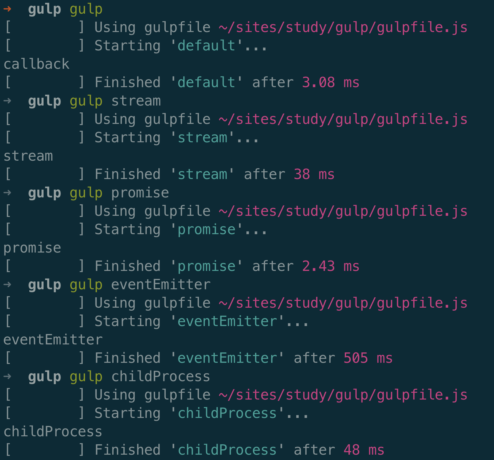
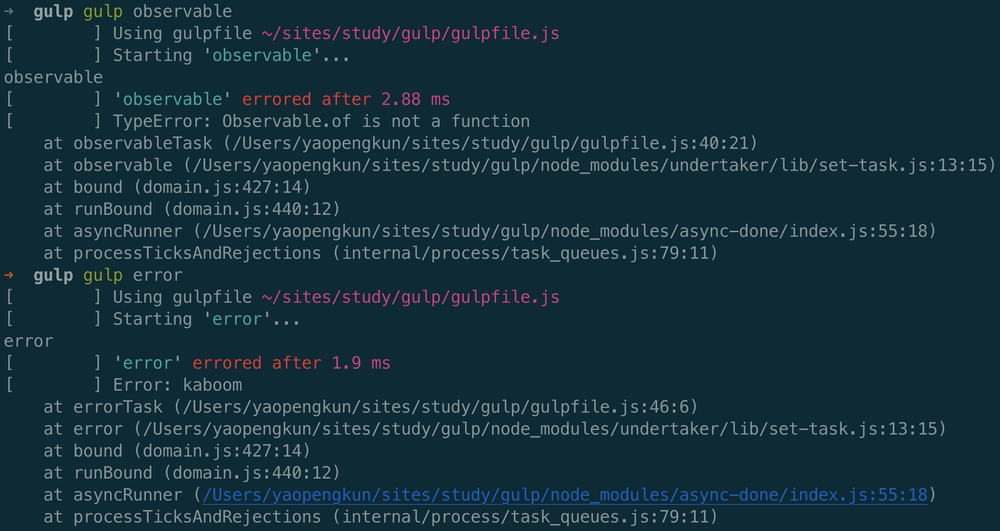
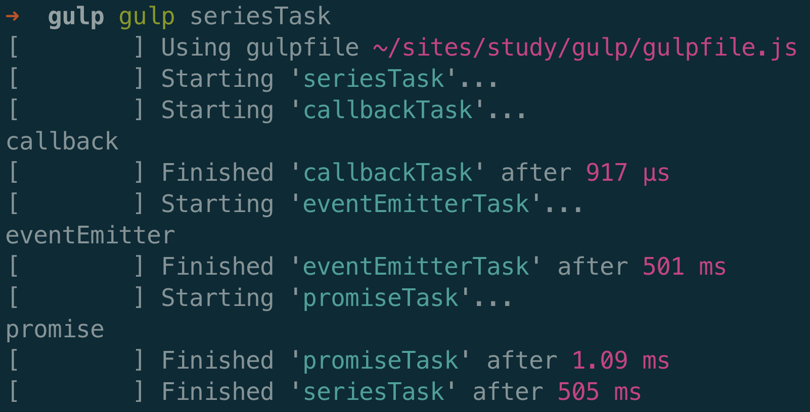
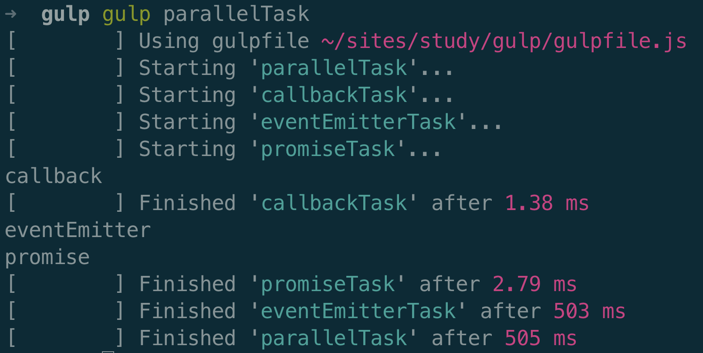
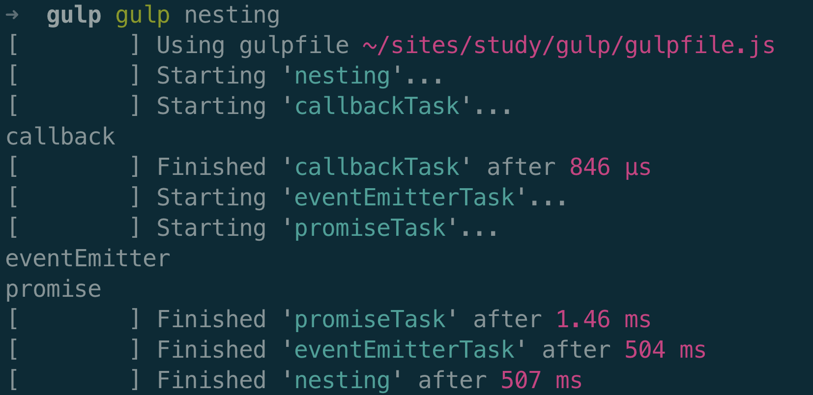

# Gulp基本知识

### gulp是一个自动化构建工具，它基于工作流程进行执行以及构建工作

## 1. 安装

> 参考: [快速入门](https://www.gulpjs.com.cn/docs/getting-started/quick-start/)

## 2. JavaScript和gulpfile的关系

gulpfile是项目目录下名为`gulpfile.js`的文件，在运行Gulp命令时会被自动加载，是Gulp的固定执行文件。

Gulp允许使用现有JavaScript知识来书写gulpfile文件，也就是我们可以使用纯JavaScript代码编写命令和操作。

gulpfile文件中基本包含`Gulp API`、JavaScript代码以及Node模块，然后该文件导出的函数都将被注册到Gulp的任务系统中

也可以使用转义的编程语言来写gulpfile文件，通过修改`gulpfile.js`文件的扩展名来表明所使用的编程语言并安装对应的转译模块。

- 对于TypeScript，重命名为`gulpfile.ts`并安装ts-node模块。
- 对于Babel，重命名为`gulpfile.babel.js`并安装@babel/register模块。

Node的模块解析功能允许将`gulpfile.js`文件夹下的`index.js`识别为`gulpfile.js`文件，然后我们可以将Gulp执行脚本进行分割，然后导入到`index.js`。

## 3. 任务

每个Gulp任务都是一个异步的JavaScript函数，此函数是一个可以接收callback作为参数的函数，或者是一个返回stream、promise、event emitter、child process或observable类型值的函数。

组合方法：`series()`和`parallel()`，这两个方法可以将多个独立的任务组合为一个更大的操作。

- `series()`让任务按顺序执行，其中任何一个任务的错误将导致整个任务组合结束，并且不会进一步执行其他任务
- `parallel()`让任务以最大并发来运行，其中任何一个任务的错误将结束整个任务组合的结束，但是其他并行的任务可能会执行完，也可能没有执行完。

#### `series()`和`parallel()`可以互相嵌套到任务深度。

#### 示例：一个包含任务大多返回值类型，以及书写方式的示例

```javascript

  const { series, parallel, src, dest } = require('gulp');
  const { exec } = require('child_process');
  const { EventEmitter } = require('events');
  const { Observable } = require('rxjs');

  function callbackTask(cb) {
    console.log('callback');
    cb();
  }

  // 返回stream
  function streamTask() {
    console.log('stream');
    return src('test.js').pipe(dest('output'));
  }

  // 返回promise
  function promiseTask() {
    console.log('promise');
    return Promise.resolve('promise');
  }

  // 返回 event emitter
  function eventEmitterTask() {
    console.log('eventEmitter');
    const emitter = new EventEmitter();
    setTimeout(() => emitter.emit('finish'), 500);
    return emitter;
  }

  // 返回child process
  function childProcessTask() {
    console.log('childProcess');
    return exec('date');
  }

  // 返回 observable
  function observableTask() {
    console.log('observable');
    return Observable.of(1, 2, 3);
  }

  // Error
  function errorTask(cb) {
    console.log('error');
    cb(new Error('kaboom'));
  }

  // 单个暴露
  exports.default = callbackTask;
  exports.stream = streamTask;
  exports.promise = promiseTask;
  exports.eventEmitter = eventEmitterTask;
  exports.childProcess = childProcessTask;
  exports.observable = observableTask;
  exports.error = errorTask;
  // 按顺序组合执行
  exports.seriesTask = series(callbackTask, eventEmitterTask, promiseTask);
  // 最大并发运行
  exports.parallelTask = parallel(callbackTask, eventEmitterTask, promiseTask);
  // 嵌套执行
  exports.nesting = series(callbackTask, parallel(eventEmitterTask, promiseTask));

```

#### 执行结果：
#### 正常执行
  
#### 执行报错
  
#### 顺序组合
starting表示开始执行，finished表示执行完成，可以看到一个完成才开始下一个
  
#### 并行组合
可以看到所有任务同时starting，完成时间由任务自身决定
  
#### 组合嵌套
先执行callbackTask，执行完成后，再同时执行eventEmitter和promiseTask
  

## 4. 处理文件

Gulp暴露了`src()`和`dest()`方法用于处理计算机上存放的文件。

`src()`接受glob参数，并从文件系统中读取所有匹配的文件，然后生成一个Node流。

`dest()`接受一个输出目录作为参数，当它接收到通过管道传输的文件时，它会将文件内容及文件属性写入到指定的目录中。同时它会产生一个终止流，即所处理文件的综合流。

流所提供的主要api是`.pipe()`方法，用于链接转换流或可写流，利用该方法将插件放置在`src()`和`dest()`之间，转换流中的文件

#### 示例：

```javascript

  const { src, dest } = require('gulp');
  const babel = require('gulp-babel');
  const uglify = require('gulp-uglify');
  const rename = require('gulp-rename');

  exports.default = function() {
    return src('src/*.js')
    .pipe(babel())
    .pipe(src('vendor/*js'))
    .pipe(dest('output/'))
    .pipe(uglify())
    .pipe(rename({ extname: '.min.js'}))
    .pipe(dest('output/'))
  }

```

上面示例运行后，将src下的js文件进行babel处理后和vendor下的js文件一起导出到output目录下，然后再将这些文件压缩后重命名为`.min.js`文件，这样在output目录下就有了压缩版本和非压缩版本。


#### 什么是glob

glob是由普通字符和/或通配符组成的字符串，用于匹配文件路径。

`src()`方法接收一个glob字符串或由多个glob字符串组成的数组作为参数，用于确定哪些文件需要被操作。

> [glob详细说明](https://www.gulpjs.com.cn/docs/getting-started/explaining-globs/)

#### 总结

最常用的是`series()`和`parallel()`组合各种javascript书写的任务，处理文件这块儿有点类似webpack构建生成dist目录的过程。

> [Gulp官方文档](https://www.gulpjs.com.cn/)