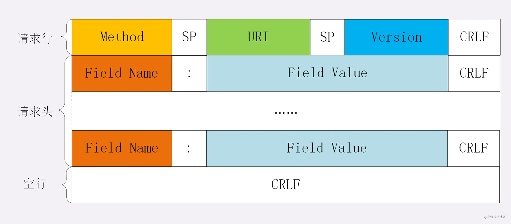
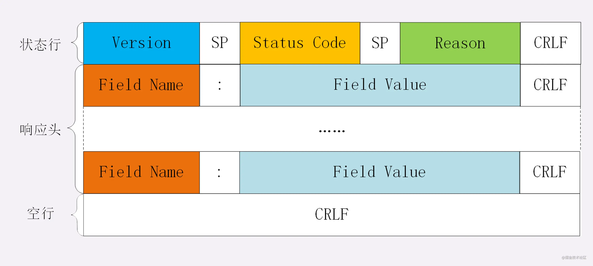
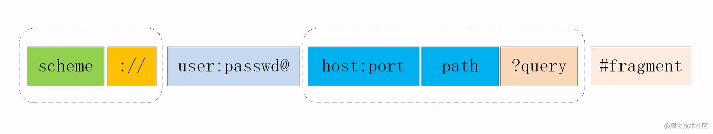
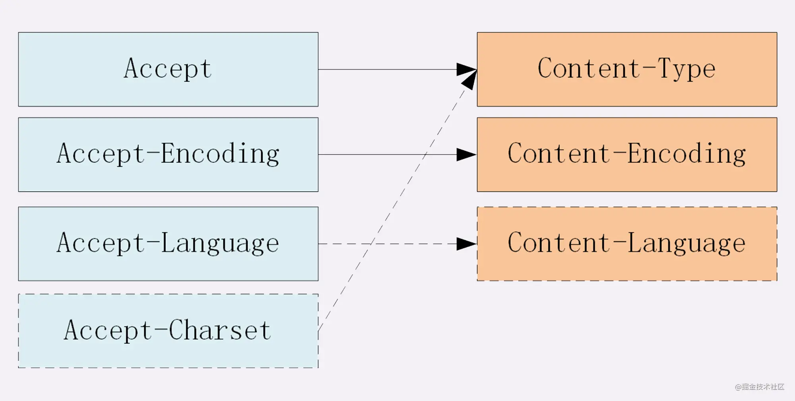
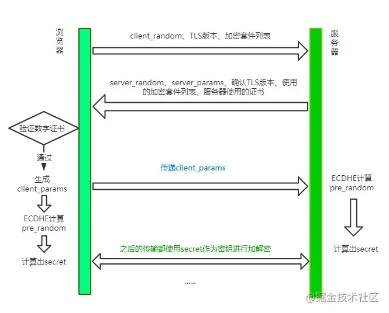
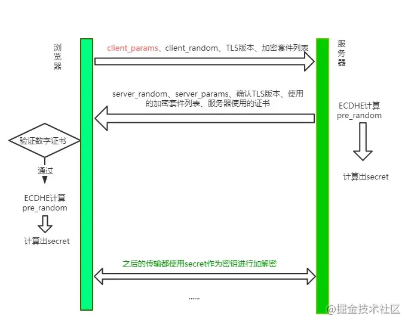
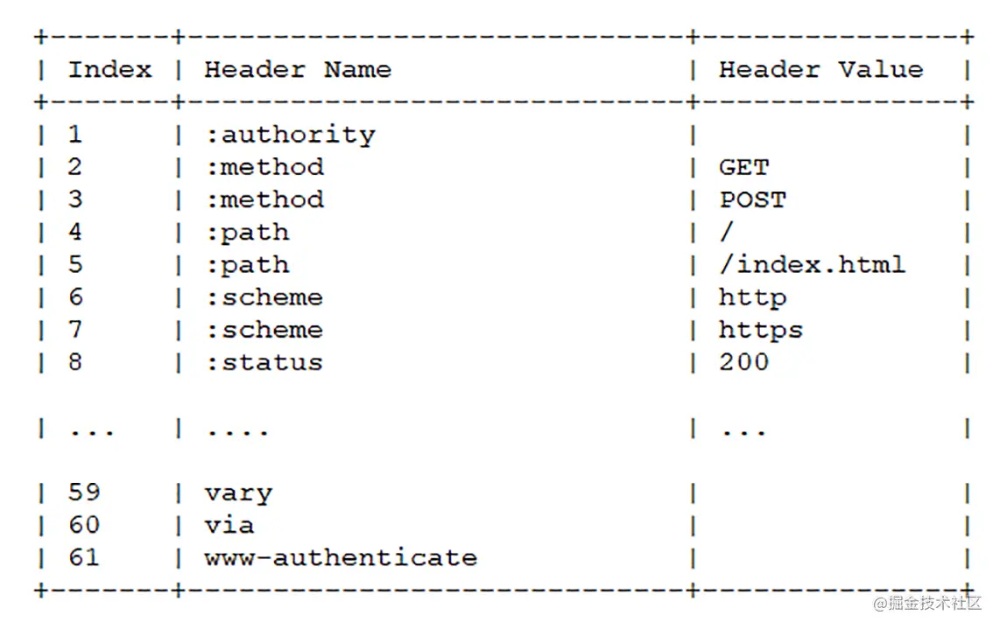
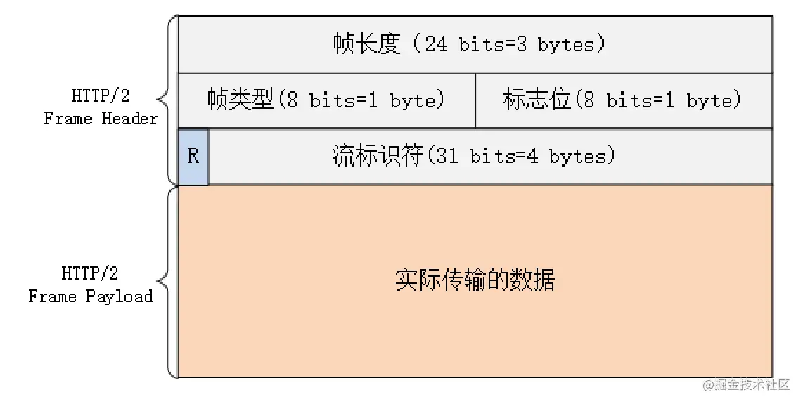
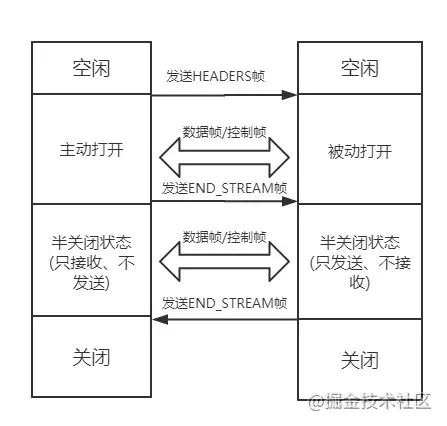
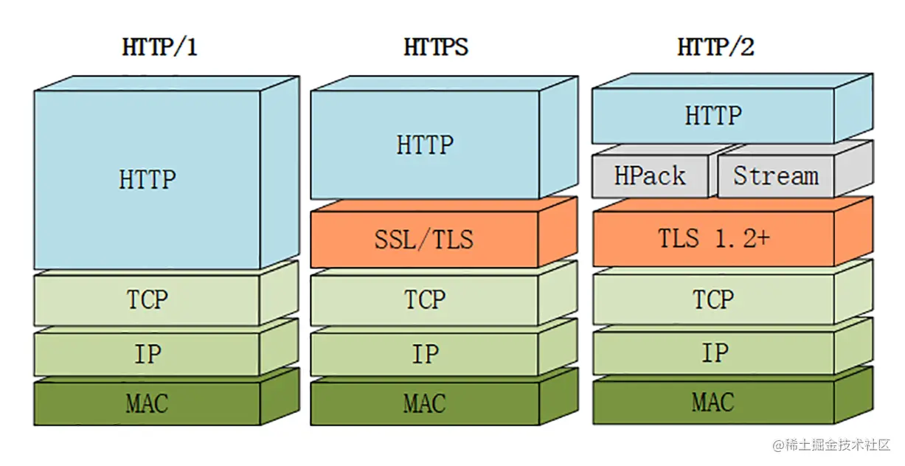

# HTTP

超文本传输协议：*超*是一个形容词，形容这个文本很厉害，这个协议是挂在tcp上实现的，开始设计就是客户端和服务端通信的，它提供了一种标准就是中间可以传文本，因为传二进制太复杂了，传文本大家都看的懂，容易推广就容易普及。

**特点**

HTTP的特点概括如下：

- 灵活可扩展
  主要体现在两个方面。一个是**语义上的自由**，只规定了基本格式，比如空格分隔单词，换行分隔字段，其他的各个部分都没有严格的语法限制。另一个是**传输形式的多样性**，不仅仅可以传输文本，还能传输图片、视频等任意数据，非常方便。

- 可靠传输
  HTTP基于TCP/IP，因此把这一特性继承了下来。这属于TCP的特性，不具体介绍了。

- 请求-应答
  也就是一发一收、有来有回， 当然这个请求方和应答方不单单指客户端和服务器之间，如果某台服务器作为代理来连接后端的服务端，那么这台服务器也会扮演请求方的角色。

- 无状态
  这里的状态是指通信过程的上下文信息，而每次http请求都是独立、无关的，默认不需要保留状态信息。

**缺点**

- 无状态
  所谓的优点和缺点还是要分场景来看的，对于HTTP而言，最具争议的地方在于它的无状态。
  在需要长连接的场景中，需要保存大量的上下文信息，以免传输大量重复的信息，那么这时候无状态就是http的缺点了。
  但与此同时，另外一些应用仅仅只是为了获取一些数据，不需要保存连接上下文信息，无状态反而减少了网络开销，成为了http的优点。

- 明文传输
  即协议里的报文(主要指的是头部)不使用二进制数据，而是文本形式。
  这对于调试提供了便利，但同时也让HTTP的报文信息暴露给了外界，给攻击者也提供了便利。WIFI陷阱就是利用HTTP明文传输的缺点，诱导你连上热点，然后疯狂抓你所有的流量，从而拿到你的敏感信息。

- 队头阻塞问题
  当http开启长连接时，共用一个TCP连接，同一时刻只能处理一个请求，那么当前请求耗时过长的情况下，其它的请求只能处于阻塞状态，也就是著名的队头阻塞问题。

## 报文结构

对于TCP而言，在传输的时候分为两个部分：**TCP头**和**数据部分**。

而HTTP类似，也是`header + body`的结构，具体而言：

```
起始行 + 头部 + 空行 + 实体
```

http请求报文和响应报文是有一定区别的。

### 起始行

对于请求报文来说，起始行类似下面这样：

```
GET /home HTTP/1.1
```

也就是**方法**+**路径**+**http版本**。

对于响应报文来说，起始行一般如下面这样：

```
HTTP/1.1 200 OK
```

响应报文的起始行也叫做**状态行**。由**http版本**、**状态码**和**原因**三部分组成。

::: warning 注意
在起始行中，每两个部分之间用**空格**隔开，最后一个部分后面应该接一个**换行**，严格遵循ABNF语法规范。
:::

### 头部

**请求头**和**响应头**在报文中的位置如下：




不管是请求头还是响应头，其中的字段是相当多的，而且牵扯到http非常多的特性，这里就不一一列举的，重点看看这些头部字段的格式：

- 字段名不区分大小写
- 字段名不允许出现空格，不可以出现下划线`_`
- 字段名后面必须紧接着`:`

### 空行

很重要，用来区分开头部和实体。

::: warning 注意
问: 如果说在头部中间故意加一个空行会怎么样？

那么空行后的内容全部被视为实体。
:::

### 实体

就是具体的数据了，也就是body部分。请求报文对应**请求体**，响应报文对应**响应体**。

## 请求方法

http/1.1规定了以下请求方法(注意，都是大写)：

- GET: 通常用来获取资源
- HEAD: 获取资源的元信息
- POST: 提交数据，即上传数据
- PUT: 修改数据
- DELETE: 删除资源(几乎用不到)
- CONNECT: 建立连接隧道，用于代理服务器
- OPTIONS: 列出可对资源实行的请求方法，用来跨域请求
- TRACE: 追踪请求-响应的传输路径

**GET 和 POST 有什么区别？**

首先最直观的是语义上的区别，然后还有一些具体的差别：

- 从缓存的角度，GET请求会被浏览器主动缓存下来，留下历史记录，而POST默认不会。
- 从编码的角度，GET只能进行URL编码，只能接收ASCII字符，而POST没有限制。
- 从参数的角度，GET一般放在URL中，因此不安全，POST放在请求体中，更适合传输敏感信息。
- 从幂等性的角度，GET是幂等的，而POST不是。(幂等表示执行相同的操作，结果也是相同的)
- 从TCP的角度，GET请求会把请求报文一次性发出去，而POST会分为两个TCP数据包，首先发header部分，如果服务器响应100(continue)，然后发body部分。(火狐浏览器除外，它的POST请求只发一个TCP包)

## URI

URI，全称为(Uniform Resource Identifier), 也就是**统一资源标识符**，它的作用很简单，就是区分互联网上不同的资源。
但是，它并不是我们常说的*网址*，*网址*指的是`URL`，实际上URI包含了`URN`和`URL`两个部分。

### URI的结构

URI真正最完整的结构如下：



- `scheme`：表示协议名，比如http，https，file等等。后面必须和`://`连在一起。
- `user:passwd@`：表示登录主机时的用户信息，不过很不安全，不推荐使用，也不常用。
- `host:port`：表示主机名和端口。
- `path`：表示请求路径，标记资源所在位置。
- `query`：表示查询参数，为`key=val`这种形式，多个键值对之间用`&`隔开。
- `fragment`：表示URI所定位的资源内的一个锚点，浏览器可以根据这个锚点跳转到对应的位置。

举个例子：

```
https://www.baidu.com/s?wd=HTTP&rsv_spt=1
```

这个URI中，`https`即`scheme`部分，`www.baidu.com`为`host:port`部分（注意，http和https的默认端口分别为80、443），`/s`为`path`部分，而`wd=HTTP&rsv_spt=1`就是`query`部分。

### URI编码

URI只能使用ASCII，ASCII之外的字符是不支持显示的，而且还有一部分符号是界定符，如果不加以处理就会导致解析出错。

因此，URI引入了编码机制，将所有非ASCII码字符和界定符转为十六进制字节值，然后在前面加个%。
如，**空格**被转义成了`%20`，**三元**被转义成了`%E4%B8%89%E5%85%83`。

## 状态码

RFC规定HTTP的状态码为三位数，被分为五类：

### 1xx

表示目前是协议处理的中间状态，还需要后续操作。

`101 Switching Protocols`：在HTTP升级为WebSocket的时候，如果服务器同意变更，就会发送状态码 101。

### 2xx

表示成功状态。

- `200 OK`：是见得最多的成功状态码。通常在响应体中放有数据。
- `204 No Content`：含义与200相同，但响应头后没有body数据。
- `206 Partial Content`：顾名思义，表示部分内容，它的使用场景为**HTTP分块下载**和**断点续传**，当然也会带上相应的响应头字段`Content-Range`。

### 3xx

重定向状态，资源位置发生变动，需要重新请求。

- `301 Moved Permanently`：即永久重定向，对应着`302 Found`，即临时重定向。

::: details 示例
比如网站从HTTP升级到了HTTPS了，以前的站点再也不用了，应当返回301，这个时候浏览器默认会做缓存优化，在第二次访问的时候自动访问重定向的那个地址。

而如果只是暂时不可用，那么直接返回302即可，和301不同的是，浏览器并不会做缓存优化。
:::

- `304 Not Modified`: 当协商缓存命中时会返回这个状态码。详见浏览器缓存。

### 4xx

请求报文有误

- `400 Bad Request`：只是笼统地提示了一下错误，并不知道哪里出错了。
- `403 Forbidden`：这实际上并不是请求报文出错，而是服务器禁止访问，原因有很多，比如法律禁止、信息敏感。
- `404 Not Found`： 资源未找到，表示没在服务器上找到相应的资源。
- `405 Method Not Allowed`：请求方法不被服务器端允许。
- `406 Not Acceptable`： 资源无法满足客户端的条件。
- `408 Request Timeout`：服务器等待了太长时间。
- `409 Conflict`：多个请求发生了冲突。
- `413 Request Entity Too Large`：请求体的数据过大。
- `414 Request-URI Too Long`：请求行里的URI太大。
- `429 Too Many Request`：客户端发送的请求过多。
- `431 Request Header Fields Too Large`：请求头的字段内容太大。

### 5xx

服务器端发生错误。

- `500 Internal Server Error`：仅仅告诉你服务器出错了，出了啥错咱也不知道。
- `501 Not Implemented`：表示客户端请求的功能还不支持。
- `502 Bad Gateway`：服务器自身是正常的，但访问的时候出错了，啥错误咱也不知道。
- `503 Service Unavailable`：表示服务器当前很忙，暂时无法响应服务

## Accept系列字段

对于Accept系列字段的介绍分为四个部分：**数据格式**、**压缩方式**、**支持语言**和**字符集**。

### 数据格式

HTTP灵活的特性，它支持非常多的数据格式，那么这么多格式的数据一起到达客户端，客户端怎么知道它的格式呢？

当然，最低效的方式是直接猜，有没有更好的方式呢？直接指定可以吗？答案是肯定的。

不过首先需要介绍一个标准——MIME(Multipurpose Internet Mail Extensions，多用途互联网邮件扩展)。它首先用在电子邮件系统中，让邮件可以发任意类型的数据，这对于HTTP来说也是通用的。
因此，HTTP从MIME type取了一部分来标记报文body部分的数据类型，这些类型体现在`Content-Type`这个字段，当然这是针对于发送端而言，接收端想要收到特定类型的数据，也可以用`Accept`字段。

具体而言，这两个字段的取值可以分为下面几类:

- text：`text/html,text/plain,text/css`等
- image：`image/gif,image/jpeg,image/png`等
- audio/video：`audio/mpeg,video/mp4`等
- application：`application/json,application/javascript,application/pdf, application/octet-stream`

### 压缩方式

当然一般这些数据都是会进行编码压缩的，采取什么样的压缩方式就体现在了发送方的`Content-Encoding`字段上，同样的，接收什么样的压缩方式体现在了接受方的`Accept-Encoding`字段上。这个字段的取值有下面几种：

- gzip：当今最流行的压缩格式
- deflate：另外一种著名的压缩格式
- br：一种专门为HTTP发明的压缩算法

```http
// 发送端
Content-Encoding: gzip
// 接收端
Accept-Encoding: gzip
```

### 支持语言

对于发送方而言，还有一个`Content-Language`字段，在需要实现国际化的方案当中，可以用来指定支持的语言，在接受方对应的字段为`Accept-Language`。如:

```http
// 发送端
Content-Language: zh-CN, zh, en
// 接收端
Accept-Language: zh-CN, zh, en
```

### 字符集

最后是一个比较特殊的字段，在接收端对应为`Accept-Charset`，指定可以接受的字符集，而在发送端并没有对应的`Content-Charset`, 而是直接放在了`Content-Type`中，以`charset`属性指定。如：

```http
// 发送端
Content-Type: text/html; charset=utf-8
// 接收端
Accept-Charset: charset=utf-8
```

以一张图来总结：



## 数据传输

### 定长
### 不定长
### 大文件
### 表单

## 队头阻塞

**什么是 HTTP 队头阻塞？**

HTTP传输是基于*请求-应答*的模式进行的，报文必须是一发一收，但值得注意的是，里面的任务被放在一个任务队列中*串行*执行，一旦队首的请求处理太慢，就会阻塞后面请求的处理。这就是著名的**TTP队头阻塞问题**。

**并发连接**

对于一个域名允许分配多个长连接，那么相当于增加了任务队列，不至于一个队伍的任务阻塞其它所有任务。在RFC2616规定过客户端最多并发2个连接，不过事实上在现在的浏览器标准中，这个上限要多很多，Chrome中是6 个。
但其实，即使是提高了并发连接，还是不能满足人们对性能的需求。

**域名分片**

一个域名不是可以并发6个长连接吗？那我就多分几个域名。

比如`content1.sanyuan.com`、`content2.sanyuan.com`。

这样一个`sanyuan.com`域名下可以分出非常多的二级域名，而它们都指向同样的一台服务器，能够并发的长连接数更多了，事实上也更好地解决了队头阻塞的问题。

## 代理

## 缓存

## HTTPS

HTTP是明文传输的协议，传输保文对外完全透明，非常不安全，那如何进一步保证安全性呢？

由此产生了HTTPS，其实它并不是一个新的协议，而是在HTTP下面增加了一层SSL/TLS协议，简单的讲，`HTTPS = HTTP + SSL/TLS`。

**那什么是SSL/TLS呢？**

SSL即安全套接层（Secure Sockets Layer），在OSI七层模型中处于会话层(第5层)。

之前SSL出过三个大版本，当它发展到第三个大版本的时候才被标准化，成为TLS（传输层安全，Transport Layer Security），并被当做TLS1.0的版本，准确地说，**TLS1.0 = SSL3.1**。

现在主流的版本是TLS/1.2，之前的TLS1.0、TLS1.1都被认为是不安全的，在不久的将来会被完全淘汰。因此我们接下来主要讨论的是 TLS1.2，当然在2018年推出了更加优秀的 TLS1.3，大大优化了TLS握手过程。

### 传统RSA

### TLS1.2



**step 1: Client Hello**

首先，浏览器发送client_random、TLS版本、加密套件列表。

client_random：用来最终secret的一个参数。

加密套件列表是什么？举个例子，加密套件列表一般张这样:

```
TLS_ECDHE_WITH_AES_128_GCM_SHA256
```

意思是TLS握手过程中，使用ECDHE算法生成pre_random(这个数后面会介绍)，128位的AES算法进行对称加密，在对称加密的过程中使用主流的GCM分组模式，因为对称加密中很重要的一个问题就是如何分组。最后一个是哈希摘要算法，采用SHA256算法。

::: details 哈希摘要算法
试想一个这样的场景，服务端现在给客户端发消息来了，客户端并不知道此时的消息到底是服务端发的，还是中间人伪造的消息呢？现在引入这个**哈希摘要算法**，将服务端的证书信息通过这个算法生成一个摘要(可以理解为比较短的字符串)，用来标识这个服务端的身份，用私钥加密后把加密后的标识和自己的公钥传给客户端。客户端拿到这个公钥来解密，生成另外一份摘要。两个摘要进行对比，如果相同则能确认服务端的身份。这也就是所谓数字签名的原理。其中除了哈希算法，最重要的过程是私钥加密，公钥解密。
:::

**step 2: Server Hello**

可以看到服务器一口气给客户端回复了非常多的内容。

server_random也是最后生成secret的一个参数，同时确认TLS版本、需要使用的加密套件和自己的证书，这都不难理解。那剩下的server_params是干嘛的呢？
我们先埋个伏笔，现在你只需要知道，server_random到达了客户端。

**step 3: Client 验证证书，生成secret**

客户端验证服务端传来的证书和签名是否通过，如果验证通过，则传递client_params这个参数给服务器。

接着客户端通过ECDHE算法计算出pre_random，其中传入两个参数：server_params和client_params。现在你应该清楚这个两个参数的作用了吧，由于ECDHE基于椭圆曲线离散对数，这两个参数也称作椭圆曲线的公钥。

客户端现在拥有了client_random、server_random和pre_random，接下来将这三个数通过一个伪随机数函数来计算出最终的secret。

**step4: Server 生成 secret**

刚刚客户端不是传了client_params过来了吗？

现在服务端开始用ECDHE算法生成pre_random，接着用和客户端同样的伪随机数函数生成最后的secret。

::: warning 注意事项
- 第一、实际上 TLS 握手是一个双向认证的过程，从step1中可以看到，客户端有能力验证服务器的身份，那服务器能不能验证客户端的身份呢？当然是可以的。具体来说，在step3中，客户端传送client_params，实际上给服务器传一个验证消息，让服务器将相同的验证流程(哈希摘要 + 私钥加密 + 公钥解密)走一遍，确认客户端的身份。

- 第二、当客户端生成secret后，会给服务端发送一个收尾的消息，告诉服务器之后的都用对称加密，对称加密的算法就用第一次约定的。服务器生成完secret也会向客户端发送一个收尾的消息，告诉客户端以后就直接用对称加密来通信。这个收尾的消息包括两部分，一部分是Change Cipher Spec，意味着后面加密传输了，另一个是Finished消息，这个消息是对之前所有发送的数据做的摘要，对摘要进行加密，让对方验证一下。当双方都验证通过之后，握手才正式结束。后面的HTTP正式开始传输加密报文。
:::

**RSA 和 ECDHE 握手过程的区别**

ECDHE握手，也就是主流的TLS1.2握手中，使用ECDHE实现pre_random的加密解密，没有用到 RSA。

使用 ECDHE 还有一个特点，就是客户端发送完收尾消息后可以提前抢跑，直接发送 HTTP 报文，节省了一个 RTT，不必等到收尾消息到达服务器，然后等服务器返回收尾消息给自己，直接开始发请求。这也叫TLS False Start。

### TLS 1.3

TLS 1.2 虽然存在了10多年，经历了无数的考验，但历史的车轮总是不断向前的，为了获得更强的安全、更优秀的性能，在2018年就推出了TLS1.3，对于TLS1.2做了一系列的改进，主要分为这几个部分：**强化安全、提高性能**。

**强化安全**

在 TLS1.3 中废除了非常多的加密算法，最后只保留五个加密套件:

```
TLS_AES_128_GCM_SHA256
TLS_AES_256_GCM_SHA384
TLS_CHACHA20_POLY1305_SHA256
TLS_AES_128_GCM_SHA256
TLS_AES_128_GCM_8_SHA256
```

可以看到，最后剩下的对称加密算法只有AES和CHACHA20，之前主流的也会这两种。

分组模式也只剩下GCM和POLY1305

哈希摘要算法只剩下了SHA256和SHA384了。

::: details 之前RSA这么重要的非对称加密算法怎么不在了？

两方面的原因:

- 第一、2015年发现了FREAK攻击，即已经有人发现了RSA的漏洞，能够进行破解了。
- 第二、一旦私钥泄露，那么中间人可以通过私钥计算出之前所有报文的secret，破解之前所有的密文。

  为什么？回到RSA握手的过程中，客户端拿到服务器的证书后，提取出服务器的公钥，然后生成pre_random并用公钥加密传给服务器，服务器通过私钥解密，从而拿到真实的pre_random。当中间人拿到了服务器私钥，并且截获之前所有报文的时候，那么就能拿到pre_random、server_random和client_random并根据对应的随机数函数生成secret，也就是拿到了 TLS 最终的会话密钥，每一个历史报文都能通过这样的方式进行破解。

  但ECDHE在每次握手时都会生成临时的密钥对，即使私钥被破解，之前的历史消息并不会收到影响。这种一次破解并不影响历史信息的性质也叫前向安全性。

  RSA算法不具备前向安全性，而ECDHE具备，因此在TLS1.3中彻底取代了RSA。
:::

**提升性能**

::: details 握手改进



大体的方式和TLS1.2差不多，不过和TLS 1.2相比少了一个RTT，服务端不必等待对方验证证书之后才拿到client_params，而是直接在第一次握手的时候就能够拿到，拿到之后立即计算secret，节省了之前不必要的等待时间。同时，这也意味着在第一次握手的时候客户端需要传送更多的信息，一口气给传完。

这种TLS 1.3握手方式也被叫做1-RTT握手。但其实这种1-RTT的握手方式还是有一些优化的空间的，接下来我们来一一介绍这些优化方式。
:::

::: details 会话复用

会话复用有两种方式：Session ID和Session Ticket。

先说说最早出现的Session ID，具体做法是客户端和服务器首次连接后各自保存会话的ID，并存储会话密钥，当再次连接时，客户端发送ID过来，服务器查找这个ID是否存在，如果找到了就直接复用之前的会话状态，会话密钥不用重新生成，直接用原来的那份。

但这种方式也存在一个弊端，就是当客户端数量庞大的时候，对服务端的存储压力非常大。

因而出现了第二种方式——Session Ticket。它的思路就是：服务端的压力大，那就把压力分摊给客户端呗。具体来说，双方连接成功后，服务器加密会话信息，用Session Ticket消息发给客户端，让客户端保存下来。下次重连的时候，就把这个Ticket进行解密，验证它过没过期，如果没过期那就直接恢复之前的会话状态。

这种方式虽然减小了服务端的存储压力，但与带来了安全问题，即每次用一个固定的密钥来解密Ticket数据，一旦黑客拿到这个密钥，之前所有的历史记录也被破解了。因此为了尽量避免这样的问题，密钥需要定期进行更换。

总的来说，这些会话复用的技术在保证1-RTT的同时，也节省了生成会话密钥这些算法所消耗的时间，是一笔可观的性能提升。
:::

::: details PSK
刚刚说的都是1-RTT情况下的优化，那能不能优化到0-RTT呢？
答案是可以的。做法其实也很简单，在发送Session Ticket的同时带上应用数据，不用等到服务端确认，这种方式被称为Pre-Shared Key，即PSK。
这种方式虽然方便，但也带来了安全问题。中间人截获PSK的数据，不断向服务器重复发，类似于TCP第一次握手携带数据，增加了服务器被攻击的风险。
:::

::: tip 总结
TLS1.3在TLS1.2 的基础上废除了大量的算法，提升了安全性。同时利用会话复用节省了重新生成密钥的时间，利用PSK做到了0-RTT连接。
:::

## HTTP/2

由于HTTPS在安全方面已经做的非常好了，HTTP改进的关注点放在了性能方面。对于HTTP/2而言，它对于性能的提升主要在于两点：

- 头部压缩
- 多路复用

当然还有一些颠覆性的功能实现：

- 设置请求优先级
- 服务器推送

这些重大的提升本质上也是为了解决 HTTP 本身的问题而产生的。

### 头部压缩

在HTTP/1.1及之前的时代，请求体一般会有响应的压缩编码过程，通过Content-Encoding头部字段来指定，但头部字段本身的压缩是怎么处理的呢？当请求字段非常复杂的时候，尤其对于GET请求，请求报文几乎全是请求头，这个时候还是存在非常大的优化空间的。HTTP/2针对头部字段，也采用了对应的压缩算法——HPACK，对请求头进行压缩。

HPACK 算法是专门为HTTP/2服务的，它主要的亮点有两个：

- 首先是在服务器和客户端之间建立哈希表，将用到的字段存放在这张表中，那么在传输的时候对于之前出现过的值，只需要把索引(比如0，1，2，...)传给对方即可，对方拿到索引查表就行了。这种传索引的方式，可以说让请求头字段得到极大程度的精简和复用。



::: warning 注意
HTTP/2废除了*起始行*的概念，将起始行中的请求方法、URI、状态码转换成了*头字段*，不过这些字段都有一个":"前缀，用来和其它请求头区分开。
:::

- 其次是对于整数和字符串进行**哈夫曼编码**，哈夫曼编码的原理就是先将所有出现的字符建立一张*索引表*，然后让出现**次数多**的字符对应的索引尽可能**短**，传输的时候也是传输这样的索引序列，可以达到非常高的压缩率。

### 多路复用

**HTTP队头阻塞**

HTTP队头阻塞的问题，其根本原因在于HTTP基于*请求-响应*的模型，在同一个TCP长连接中，前面的请求没有得到响应，后面的请求就会被阻塞。

在http/1经常用*并发连接*和*域名分片*的方式来解决这个问题，但这并没有真正从HTTP本身的层面解决问题，只是增加了TCP连接，分摊风险而已。而且这么做也有弊端，多条TCP连接会竞争有限的带宽，让真正优先级高的请求不能优先处理。

而HTTP/2便从HTTP协议本身解决了队头阻塞问题。

::: warning 注意：
这里并不是指的TCP队头阻塞，而是HTTP队头阻塞，两者并不是一回事。TCP的队头阻塞是在数据包层面，单位是数据包，前一个报文没有收到便不会将后面收到的报文上传给HTTP，而HTTP的队头阻塞是在HTTP请求-响应层面，前一个请求没处理完，后面的请求就要阻塞住。两者所在的层次不一样。
:::

HTTP/2如何来解决所谓的队头阻塞呢？

**二进制分帧**

首先，HTTP/2认为明文传输对机器而言太麻烦了，不方便计算机的解析，因为对于文本而言会有多义性的字符，比如回车换行到底是内容还是分隔符，在内部需要用到状态机去识别，效率比较低。于是HTTP/2干脆把报文全部换成二进制格式，全部传输`01`串，方便了机器的解析。

原来`Headers + Body`的报文格式如今被拆分成了一个个二进制的帧，用Headers帧存放头部字段，Data帧存放请求体数据。分帧之后，服务器看到的不再是一个个完整的HTTP请求报文，而是一堆乱序的二进制帧。这些二进制帧不存在先后关系，因此也就不会排队等待，也就没有了HTTP的队头阻塞问题。

通信双方都可以给对方发送二进制帧，这种二进制帧的双向传输的序列，也叫做流(Stream)。HTTP/2用*流*来在一个TCP连接上来进行多个数据帧的通信，这就是**多路复用**的概念。

既然是乱序首发，那最后如何来处理这些乱序的数据帧呢？

首先要声明的是，所谓的乱序，指的是不同ID的Stream是乱序的，但同一个`Stream ID`的帧一定是按顺序传输的。二进制帧到达后对方会将`Stream ID`相同的二进制帧组装成完整的请求报文和响应报文。当然，在二进制帧当中还有其他的一些字段，实现了优先级和流量控制等功能。

::: details 二进制帧是如何设计的？
**帧结构**

HTTP/2中传输的帧结构如下图所示：



每个帧分为**帧头**和**帧体**。

先是三个字节的**帧长度**，这个长度表示的是*帧体的长度*。

然后是帧类型，大概可以分为**数据帧**和**控制帧**两种。数据帧用来存放HTTP报文，控制帧用来管理流的传输。

接下来的一个字节是**帧标志**，里面一共有8个标志位，常用的有END_HEADERS表示头数据结束，END_STREAM表示单方向数据发送结束。

后4个字节是**Stream ID**，也就是流标识符，有了它，接收方就能从乱序的二进制帧中选择出ID相同的帧，按顺序组装成请求/响应报文。

**流的状态变化**

在HTTP/2中，所谓的 *流* ，其实就是二进制帧的双向传输的序列。那么在HTTP/2请求和响应的过程中，流的状态是如何变化的呢？

HTTP/2其实也是借鉴了TCP状态变化的思想，根据帧的标志位来实现具体的状态改变。这里我们以一个普通的*请求-响应*过程为例来说明：



最开始两者都是空闲状态，当客户端发送Headers帧后，开始分配Stream ID，此时客户端的流打开，服务端接收之后服务端的流也打开，两端的流都打开之后，就可以互相传递数据帧和控制帧了。

当客户端要关闭时，向服务端发送END_STREAM帧，进入半关闭状态，这个时候客户端只能接收数据，而不能发送数据。

服务端收到这个END_STREAM帧后也进入半关闭状态，不过此时服务端的情况是只能发送数据，而不能接收数据。

随后服务端也向客户端发送END_STREAM帧，表示数据发送完毕，双方进入关闭状态。

如果下次要开启新的流，流ID需要自增，直到上限为止，到达上限后开一个新的TCP连接重头开始计数。由于流ID字段长度为4个字节，最高位又被保留，因此范围是`0~2^31`，大约21亿个。

**流的特性**

流传输的特性:

- 并发性。一个HTTP/2连接上可以同时发多个帧，这一点和HTTP/1不同。这也是实现多路复用的基础。
- 自增性。流ID是不可重用的，而是会按顺序递增，达到上限之后又新开TCP连接从头开始。
- 双向性。客户端和服务端都可以创建流，互不干扰，双方都可以作为发送方或者接收方。
- 可设置优先级。可以设置数据帧的优先级，让服务端先处理重要资源，优化用户体验。

:::

**服务器推送**

另外值得一说的是HTTP/2的服务器推送(Server Push)。在HTTP/2当中，服务器已经不再是完全被动地接收请求，响应请求，它也能新建stream来给客户端发送消息，当TCP连接建立之后，比如浏览器请求一个HTML文件，服务器就可以在返回HTML的基础上，将HTML中引用到的其他资源文件一起返回给客户端，减少客户端的等待。

### 总结

当然，HTTP/2新增那么多的特性，是不是HTTP的语法要重新学呢？

不需要，HTTP/2完全兼容之前HTTP的语法和语义，如请求头、URI、状态码、头部字段都没有改变，完全不用担心。同时，在安全方面，HTTP也支持TLS，并且现在主流的浏览器都公开只支持加密的HTTP/2，因此现在能看到的HTTP/2也基本上都是跑在TLS上面的了。

最后放一张分层图：




> 参考文档： [HTTP灵魂之问，巩固你的 HTTP 知识体系](https://juejin.cn/post/6844904100035821575)