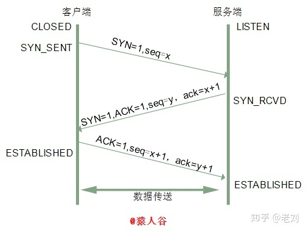

# TCP

## 报文头部字段

报文头部结构如下(单位为字节):


**源端口、目标端口**

如何唯一标识一个连接？答案是TCP连接的四元组——源IP、源端口、目标IP和目标端口。

那TCP报文怎么没有源IP和目标IP呢？这是因为在IP层就已经处理了IP。TCP只需要记录两者的端口即可。

**序列号**

即`Sequence number`，指的是本报文段第一个字节的序列号。

从图中可以看出，序列号是一个长为4个字节，也就是32位的无符号整数，表示范围为`0 ~ 2^32 - 1`。如果到达最大值了后就循环到0。

序列号在 TCP 通信的过程中有两个作用：
  - 在SYN报文中交换彼此的初始序列号。
  - 保证数据包按正确的顺序组装。

**ISN**

即Initial Sequence Number（初始序列号）

在三次握手的过程当中，双方会用过SYN报文来交换彼此的ISN。ISN并不是一个固定的值，而是每4ms加一，溢出则回到0，这个算法使得猜测ISN变得很困难。

那为什么要这么做？
如果ISN被攻击者预测到，要知道源IP和源端口号都是很容易伪造的，当攻击者猜测ISN之后，直接伪造一个RST后，就可以强制连接关闭的，这是非常危险的。
而动态增长的ISN大大提高了猜测ISN的难度。

**确认号**

即ACK(Acknowledgment number)。用来告知对方下一个期望接收的序列号，小于ACK的所有字节已经全部收到。

**标记位**

常见的标记位有`SYN,ACK,FIN,RST,PSH`。

SYN和ACK会在下文详细说明，后三个解释如下:
FIN：即Finish，表示发送方准备断开连接。
RST：即 Reset，用来强制断开连接。
PSH：即 Push, 告知对方这些数据包收到后应该马上交给上层的应用，不能缓存。

**窗口大小**

占用两个字节，也就是16位，但实际上是不够用的。

因此TCP引入了窗口缩放的选项，作为窗口缩放的比例因子，这个比例因子的范围在`0 ~ 14`，比例因子可以将窗口的值扩大为原来的`2 ^ n`次方。

**校验和**

占用两个字节，防止传输过程中数据包有损坏，如果遇到校验和有差错的报文，TCP直接丢弃之，等待重传。

**可选项**

可选项的格式如下：


- TimeStamp: TCP时间戳，后面详细介绍。
- MSS: 指的是TCP允许的从对方接收的最大报文段。
- SACK: 选择确认选项。
- Window Scale： 窗口缩放选项。

## TCP和UDP的区别

- TCP是一个面向**连接的**、**可靠的**、基于**字节流**的传输层协议
- UDP是一个面向**无连接**的传输层协议

具体来说，和UDP相比，TCP有三大核心特性：

1. **面向链接**
   
  所谓的连接，指的是客户端和服务器的连接，在双方互相通信之前，TCP需要三次握手建立连接，而UDP没有相应建立连接的过程。

2. **可靠性**

TCP花了非常多的功夫保证连接的可靠，这个可靠性体现在哪些方面呢？一个是**有状态**，另一个是**可控制**。

TCP会精准记录哪些数据发送了，哪些数据被对方接收了，哪些没有被接收到，而且保证数据包按序到达，不允许半点差错。这是**有状态**。

当意识到丢包了或者网络环境不佳，TCP会根据具体情况调整自己的行为，控制自己的发送速度或者重发。这是**可控制**。

相应的，UDP就是**无状态**，**不可控**的。

3. **面向字节流**

UDP的数据传输是基于数据报的，这是因为仅仅只是继承了IP层的特性，而TCP为了维护状态，将一个个IP包变成了字节流。

## 三次握手

三次握手（Three-way Handshake）其实就是指建立一个TCP连接时，需要客户端和服务器总共发送3个包。进行三次握手的主要作用就是为了确认双方的*接收能力*和*发送能力*是否正常、指定自己的初始化序列号为后面的可靠性传送做准备。实质上其实就是连接服务器指定端口，建立TCP连接，并同步连接双方的序列号和确认号，交换TCP窗口大小信息。

刚开始客户端处于Closed的状态，服务端处于Listen状态。

进行三次握手：

**第一次握手：**

客户端给服务端发一个SYN报文，并指明客户端的初始化序列号ISN©。此时客户端处于SYN_SEND状态。

首部的同步位SYN=1，初始序号seq=x，SYN=1的报文段不能携带数据，但要消耗掉一个序号。

**第二次握手：**

服务器收到客户端的SYN报文之后，会以自己的SYN报文作为应答，并且也是指定了自己的初始化序列号ISN(s)。同时会把客户端的`ISN+1`作为ACK的值，表示自己已经收到了客户端的SYN，此时服务器处于SYN_REVD的状态。

在确认报文段中SYN=1，ACK=1，确认号ack=x+1，初始序号seq=y。

**第三次握手：**

客户端收到SYN报文之后，会发送一个ACK报文，当然，也是一样把服务器的`ISN+1`作为ACK的值，表示已经收到了服务端的SYN报文，此时客户端处于ESTABLISHED状态。服务器收到ACK报文之后，也处于ESTABLISHED状态，此时，双方已建立起了连接。

确认报文段ACK=1，确认号ack=y+1，序号seq=x+1（初始为seq=x，第二个报文段所以要+1），ACK报文段可以携带数据，不携带数据则不消耗序号。

发送第一个SYN的一端将执行主动打开（active open），接收这个SYN并发回下一个SYN的另一端执行被动打开（passive open）。

在socket编程中，客户端执行`connect()`时，将触发三次握手。



---

::: details 1. 为什么需要三次握手，两次不行吗？

弄清这个问题，我们需要先弄明白三次握手的目的是什么，能不能只用两次握手来达到同样的目的。

第一次握手：客户端发送网络包，服务端收到了。

这样服务端就能得出结论：客户端的发送能力、服务端的接收能力是正常的。

第二次握手：服务端发包，客户端收到了。

这样客户端就能得出结论：服务端的接收、发送能力，客户端的接收、发送能力是正常的。不过此时服务器并不能确认客户端的接收能力是否正常。

第三次握手：客户端发包，服务端收到了。

这样服务端就能得出结论：客户端的接收、发送能力正常，服务器自己的发送、接收能力也正常。

因此，需要三次握手才能确认双方的接收与发送能力是否正常。

::: tip 试想如果是用两次握手，则会出现下面这种情况：
如客户端发出连接请求，但因连接请求报文丢失而未收到确认，于是客户端再重传一次连接请求，后来收到了确认，建立了连接。

数据传输完毕后，就释放了连接，客户端共发出了两个连接请求报文段，其中第一个丢失，第二个到达了服务端，但是第一个丢失的报文段只是在某些网络结点长时间滞留了，延误到连接释放以后的某个时间才到达服务端，此时服务端误认为客户端又发出一次新的连接请求，于是就向客户端发出确认报文段，同意建立连接。

不采用三次握手，只要服务端发出确认，就建立新的连接了，此时客户端忽略服务端发来的确认，也不发送数据，则服务端一致等待客户端发送数据，浪费资源。
:::

::: details 2. 什么是半连接队列？

服务器第一次收到客户端的SYN之后，就会处于SYN_RCVD状态，此时双方还没有完全建立其连接，服务器会把此种状态下请求连接放在一个队列里，我们把这种队列称之为半连接队列。

当然还有一个全连接队列，就是已经完成三次握手，建立起连接的就会放在全连接队列中。如果队列满了就有可能会出现丢包现象。

这里在补充一点关于SYN-ACK重传次数的问题：

服务器发送完SYN-ACK包，如果未收到客户确认包，服务器进行首次重传，等待一段时间仍未收到客户确认包，进行第二次重传。如果重传次数超过系统规定的最大重传次数，系统将该连接信息从半连接队列中删除。

::: warning 注意
每次重传等待的时间不一定相同，一般会是指数增长，例如间隔时间为 1s，2s，4s，8s…

:::

::: details 3. ISN是固定的吗？

ISN：Initial Sequence Number，初始序号。

当一端为建立连接而发送它的SYN时，它为连接选择一个初始序号。ISN随时间而变化，因此每个连接都将具有不同的ISN。

ISN可以看作是一个32比特的计数器，每4ms加1。

这样选择序号的目的在于防止在网络中被延迟的分组在以后又被传送，而导致某个连接的一方对它做错误的解释。

三次握手的其中一个重要功能是客户端和服务端交换ISN，以便让对方知道接下来接收数据的时候如何按序列号组装数据。如果ISN是固定的，攻击者很容易猜出后续的确认号，因此ISN是**动态生成**的。
:::

::: details 4. 三次握手过程中可以携带数据吗？

其实第三次握手的时候，是可以携带数据的。但是，第一次、第二次握手不可以携带数据

为什么这样呢?

假如第一次握手可以携带数据的话，如果有人要恶意攻击服务器，那他每次都在第一次握手中的SYN报文中放入大量的数据。因为攻击者根本就不理服务器的接收、发送能力是否正常，然后疯狂着重复发SYN报文的话，这会让服务器花费很多时间、内存空间来接收这些报文。

也就是说，第一次握手不可以放数据，其中一个简单的原因就是会让服务器更加容易受到攻击了。而对于第三次的话，此时客户端已经处于ESTABLISHED状态。对于客户端来说，他已经建立起连接了，并且也已经知道服务器的接收、发送能力是正常的了，所以能携带数据也没啥毛病。

:::

::: details 5. SYN攻击是什么？

服务器端的资源分配是在二次握手时分配的，而客户端的资源是在完成三次握手时分配的，所以服务器容易受到SYN洪泛攻击。

SYN攻击就是Client在短时间内伪造大量不存在的IP地址，并向Server不断地发送SYN包，Server则回复确认包，并等待Client确认。

由于源地址不存在，因此Server需要不断重发直至超时，这些伪造的SYN包将长时间占用未连接队列，导致正常的SYN请求因为队列满而被丢弃，从而引起网络拥塞甚至系统瘫痪。

SYN攻击是一种典型的`DoS/DDoS`攻击。

检测SYN攻击非常的方便，当你在服务器上看到大量的半连接状态时，特别是源IP地址是随机的，基本上可以断定这是一次SYN攻击。在Linux/Unix上可以使用系统自带的`netstats`命令来检测 SYN 攻击。

```bash

netstat -n -p TCP | grep SYN_RECV

```

常见的防御SYN攻击的方法有如下几种：

- 缩短超时（SYN Timeout）时间，减少SYN+ACK重试次数，避免大量的超时重发
- 增加SYN连接，也就是增加最大半连接数
- 过滤网关防护
- SYN cookies技术，在服务端接收到SYN后不立即分配连接资源，而是根据这个SYN计算出一个Cookie，连同第二次握手回复给客户端，在客户端回复ACK的时候带上这个Cookie值，服务端验证 Cookie 合法之后才分配连接资源。

:::

::: details 6. 同时打开会怎么样？

如果双方同时发 SYN报文，状态变化会是怎样的呢？

这是一个可能会发生的情况。

状态变迁如下:


在发送方给接收方发SYN报文的同时，接收方也给发送方发SYN报文，两个人碰上了!

发完SYN，两者的状态都变为SYN-SENT。

在各自收到对方的SYN后，两者状态都变为SYN-REVD。

接着会回复对应的ACK + SYN，这个报文在对方接收之后，两者状态一起变为ESTABLISHED。

这就是同时打开情况下的状态变迁。

:::

## 四次挥手

建立一个连接需要三次握手，而终止一个连接要经过四次挥手（也有将四次挥手叫做四次握手的）。

这由TCP的半关闭（half-close）造成的。所谓的半关闭，其实就是TCP提供了连接的一端在结束它的发送后还能接收来自另一端数据的能力。

TCP的连接的拆除需要发送四个包，因此称为四次挥手(Four-way handshake)，客户端或服务器均可主动发起挥手动作。

刚开始双方都处于ESTABLISHED状态，假如是客户端先发起关闭请求。四次挥手的过程如下：

**第一次挥手：**

客户端发送一个FIN报文，报文中会指定一个序列号。此时客户端处于FIN_WAIT1状态。

即发出连接释放报文段（FIN=1，序号seq=u），并停止再发送数据，主动关闭TCP连接，进入FIN_WAIT1（终止等待1）状态，等待服务端的确认。

**第二次挥手：**

服务端收到FIN之后，会发送ACK报文，且把客户端的序列号值+1作为ACK报文的序列号值，表明已经收到客户端的报文了，此时服务端处于CLOSE_WAIT状态。

即服务端收到连接释放报文段后即发出确认报文段（ACK=1，确认号ack=u+1，序号seq=v），服务端进入CLOSE_WAIT（关闭等待）状态，此时的TCP处于半关闭状态，客户端到服务端的连接释放。客户端收到服务端的确认后，进入FIN_WAIT2（终止等待2）状态，等待服务端发出的连接释放报文段。

**第三次挥手：**

如果服务端也想断开连接了，和客户端的第一次挥手一样，发给FIN报文，且指定一个序列号。此时服务端处于LAST_ACK的状态。

即服务端没有要向客户端发出的数据，服务端发出连接释放报文段（FIN=1，ACK=1，序号seq=w，确认号ack=u+1），服务端进入LAST_ACK（最后确认）状态，等待客户端的确认。

**第四次挥手：**

客户端收到FIN之后，一样发送一个ACK报文作为应答，且把服务端的序列号值+1作为自己ACK报文的序列号值，此时客户端处于TIME_WAIT状态。需要过一阵子以确保服务端收到自己的ACK报文之后才会进入CLOSED状态，服务端收到ACK报文之后，就处于关闭连接了，处于CLOSED状态。

即客户端收到服务端的连接释放报文段后，对此发出确认报文段（ACK=1，seq=u+1，ack=w+1），客户端进入TIME_WAIT（时间等待）状态。此时TCP未释放掉，需要经过时间等待计时器设置的时间**2MSL**后，客户端才进入CLOSED状态。

收到一个FIN只意味着在这一方向上没有数据流动。客户端执行主动关闭并进入TIME_WAIT是正常的，服务端通常执行被动关闭，不会进入TIME_WAIT状态。

在socket编程中，任何一方执行`close()`操作即可产生挥手操作。


---

::: details 1. 为什么需要四次挥手才能释放？

因为当服务端收到客户端的SYN连接请求报文后，可以直接发送SYN+ACK报文。其中ACK报文是用来应答的，SYN报文是用来同步的。

但是关闭连接时，当服务端收到FIN报文时，很可能并不会立即关闭SOCKET，所以只能先回复一个ACK报文，告诉客户端，“你发的FIN报文我收到了”。

只有等到我服务端所有的报文都发送完了，我才能发送FIN报文，因此不能一起发送。

故需要四次挥手。

:::

::: details 2. 为什么需要2MSL等待状态？

TIME_WAIT状态也称为2MSL等待状态，一般为4分钟。

MSL是Maximum Segment Lifetime的英文缩写，可译为“最长报文段寿命”，它是任何报文在网络上存在的最长时间，超过这个时间报文将被丢弃。

每个具体TCP实现必须选择一个报文段最大生存时间MSL（Maximum Segment Lifetime），它是任何报文段被丢弃前在网络内的最长时间。这个时间是有限的，因为TCP报文段以IP数据报在网络内传输，而IP数据报则有限制其生存时间的TTL字段。

对一个具体实现所给定的MSL值，处理的原则是：当TCP执行一个主动关闭，并发回最后一个ACK，该连接必须在TIME_WAIT状态停留的时间为2倍的MSL。这样可让TCP再次发送最后的ACK以防这个ACK丢失（另一端超时并重发最后的FIN）。

这种2MSL等待的另一个结果是这个TCP连接在2MSL等待期间，定义这个连接的插口（客户的IP地址和端口号，服务器的IP地址和端口号）不能再被使用。这个连接只能在2MSL结束后才能再被使用。

两个理由：

- 保证客户端发送的最后一个ACK报文段能够到达服务端。

这个ACK报文段有可能丢失，使得处于LAST-ACK状态的B收不到对已发送的FIN+ACK报文段的确认，服务端超时重传FIN+ACK报文段，而客户端能在2MSL时间内收到这个重传的FIN+ACK报文段，接着客户端重传一次确认，重新启动2MSL计时器，最后客户端和服务端都进入到CLOSED状态，若客户端在TIME-WAIT状态不等待一段时间，而是发送完ACK报文段后立即释放连接，则无法收到服务端重传的FIN+ACK报文段，所以不会再发送一次确认报文段，则服务端无法正常进入到CLOSED状态。

- 防止“已失效的连接请求报文段”出现在本连接中。
  
客户端在发送完最后一个ACK报文段后，再经过2MSL，就可以使本连接持续的时间内所产生的所有报文段都从网络中消失，使下一个新的连接中不会出现这种旧的连接请求报文段。

:::

::: details 4. 同时关闭会怎样？

如果客户端和服务端同时发送 FIN ，状态会如何变化？如图所示:


:::

《TCP/IP详解 卷1:协议》有一张TCP状态变迁图，很具有代表性，有助于理解三次握手和四次挥手的状态变化。如下图所示，粗的实线箭头表示正常的客户端状态变迁，粗的虚线箭头表示正常的服务器状态变迁。


## 快速打开原理

TFO: 优化后的TCP握手流程，也就是TCP快速打开(TCP Fast Open, 即TFO)

TFO流程：

**首轮三次握手**

首先客户端发送SYN给服务端，服务端接收到。

注意哦！现在服务端不是立刻回复`SYN + ACK`，而是通过计算得到一个SYN Cookie, 将这个Cookie放到TCP报文的 `Fast Open`选项中，然后才给客户端返回。

客户端拿到这个Cookie的值缓存下来。后面正常完成三次握手。

首轮三次握手就是这样的流程。

而后面的三次握手就不一样啦！

在后面的三次握手中，客户端会将之前缓存的Cookie、SYN和**HTTP请求**发送给服务端，服务端验证了Cookie的合法性，如果不合法直接丢弃；如果是合法的，那么就正常返回`SYN + ACK`。

重点来了，现在服务端能向客户端发HTTP响应了！这是最显著的改变，三次握手还没建立，仅仅验证了Cookie的合法性，就可以返回HTTP响应了。

当然，客户端的ACK还得正常传过来，不然怎么叫三次握手嘛。

流程如下:


**TFO的优势**

TFO的优势并不在与首轮三次握手，而在于后面的握手，在拿到客户端的Cookie并验证通过以后，可以直接返回HTTP响应，充分利用了1个RTT(Round-Trip Time，往返时延)的时间提前进行数据传输，积累起来还是一个比较大的优势。

## 报文中时间戳的作用

timestamp是TCP报文首部的一个可选项，一共占10个字节，格式如下:

```bash
kind(1 字节) + length(1 字节) + info(8 个字节)
```

其中`kind = 8`，`length = 10`，info有两部分构成: `timestamp`和`timestamp echo`，各占4个字节。

TCP 的时间戳主要解决两大问题:

- 计算往返时延 RTT(Round-Trip Time)
- 防止序列号的回绕问题

**计算往返时延 RTT**

RTT: Round-Trip Time

在没有时间戳的时候，计算RTT会遇到的问题如下图所示:


如果以第一次发包为开始时间的话，就会出现左图的问题，RTT明显偏大，开始时间应该采用第二次的；

如果以第二次发包为开始时间的话，就会导致右图的问题，RTT明显偏小，开始时间应该采用第一次发包的。

实际上无论开始时间以第一次发包还是第二次发包为准，都是不准确的。

那这个时候引入时间戳就很好的解决了这个问题。

比如现在a向b发送一个报文s1，b向a回复一个含ACK的报文s2那么：

- step1: a向b发送的时候，timestamp中存放的内容就是a主机发送时的内核时刻ta1。

- step2: b向a回复s2报文的时候，timestamp中存放的是b主机的时刻tb，`timestamp echo`字段为从s1报文中解析出来的ta1。

- step3: a收到b的s2报文之后，此时a主机的内核时刻是ta2，而在s2报文中的`timestamp echo`选项中可以得到 ta1，也就是s2对应的报文最初的发送时刻。然后直接采用`ta2 - ta1`就得到了RTT的值。

**防止序列号回绕问题**

现在模拟一下这个问题

序列号的范围其实是在`0~2^32-1`，为了方便演示，我们缩小一下这个区间，假设范围是`0 ~ 4`，那么到达4的时候会回到0。

|第几次发包|发送字节|对应序列号|状态|
|:-:|:-:|:-:|:-:|
|1|0~1|0~1|成功接收|
|2|1~2|1~2|滞留在网络中|
|3|2~3|2~3|成功接收|
|4|3~4|3~4|成功接收|
|5|4~5|0~1|成功接收|
|6|5~6|1~2|???|

假设在第6次的时候，之前还滞留在网路中的包回来了，那么就有两个序列号为`1~2`的数据包了，怎么区分谁是谁呢？这个时候就产生了序列号回绕的问题。
那么用timestamp就能很好地解决这个问题，因为每次发包的时候都是将发包机器当时的内核时间记录在报文中，那么两次发包序列号即使相同，时间戳也不可能相同，这样就能够区分开两个数据包了。

## 超时重传

TCP具有超时重传机制，即间隔一段时间没有等到数据包的回复时，重传这个数据包。

这个重传间隔也叫做超时重传时间(Retransmission TimeOut, 简称RTO)，它的计算跟上一节提到的RTT(往返时延)密切相关。主要有两种方法，一个是经典方法，一个是标准方法。

**经典方法**

经典方法引入了一个新的概念——SRTT(Smoothed round trip time，即平滑往返时间)，每产生一次新的RTT，就根据一定的算法对SRTT进行更新，具体而言，计算方式如下(SRTT初始值为0):

```js
SRTT =  (α * SRTT) + ((1 - α) * RTT)
```

其中，α是平滑因子，建议值是0.8，范围是`0.8 ~ 0.9`。

拿到SRTT，我们就可以计算RTO的值了:

```js
RTO = min(ubound, max(lbound, β * SRTT))
```
β是加权因子，一般为`1.3~2.0`，lbound是下界，ubound是上界。

其实这个算法过程还是很简单的，但是也存在一定的局限，就是在RTT稳定的地方表现还可以，而在RTT变化较大的地方就不行了，因为平滑因子α的范围是0.8 ~ 0.9，RTT 对于RTO的影响太小。

**标准方法**

为了解决经典方法对于RTT变化不敏感的问题，后面又引出了标准方法，也叫`Jacobson/Karels` 算法。

一共有三步。

第一步: 计算SRTT，公式如下:

```js
SRTT = (1 - α) * SRTT + α * RTT
```
注意这个时候的α跟经典方法中的α取值不一样了，建议值是1/8，也就是0.125。

第二步: 计算RTTVAR(round-trip time variation)这个中间变量。

```js
RTTVAR = (1 - β) * RTTVAR + β * (|RTT - SRTT|)
```

β 建议值为0.25。这个值是这个算法中出彩的地方，也就是说，它记录了最新的RTT与当前SRTT之间的差值，给我们在后续感知到RTT的变化提供了抓手。

第三步: 计算最终的RTO

```js
RTO = µ * SRTT + ∂ * RTTVAR 
```

µ建议值取1, ∂建议值取4。

这个公式在SRTT的基础上加上了最新RTT与它的偏移，从而很好的感知了RTT的变化，这种算法下，RTO与RTT变化的差值关系更加密切。

## 流量控制

对于发送端和接收端而言，TCP需要把发送的数据放到发送缓存区，将接收的数据放到接收缓存区。

而流量控制所要做的事情，就是在通过接收缓存区的大小，控制发送端的发送。如果对方的接收缓存区满了，就不能再继续发送了。

要具体理解流量控制，首先需要了解滑动窗口的概念。

TCP 滑动窗口分为两种: 发送窗口和接收窗口。

**发送窗口**

发送端的滑动窗口结构如下:


其中包含四大部分:

- 已发送且已确认
- 已发送但未确认
- 未发送但可以发送
- 未发送也不可以发送

其中有一些重要的概念:


发送窗口就是图中被框住的范围。SND即send, WND即window, UNA即unacknowledged, 表示未被确认，NXT即next，表示下一个发送的位置。

**接受窗口**

接收端的窗口结构如下:


REV即receive，NXT表示下一个接收的位置，WND表示接收窗口大小。

**流量控制过程**

一个最简单的来回来模拟一下流量控制的过程

首先双方三次握手，初始化各自的窗口大小，均为200个字节。

假如当前发送端给接收端发送100个字节，那么此时对于发送端而言，SND.NXT当然要右移100个字节，也就是说当前的可用窗口减少了100个字节

现在这100个到达了接收端，被放到接收端的缓冲队列中。不过此时由于大量负载的原因，接收端处理不了这么多字节，只能处理40个字节，剩下的60个字节被留在了缓冲队列中。

此时接收端的情况是处理能力不够用啦，你发送端给我少发点，所以此时接收端的接收窗口应该缩小，具体来说，缩小60个字节，由200个字节变成了140字节，因为缓冲队列还有60个字节没被应用拿走。

因此，接收端会在ACK的报文首部带上缩小后的滑动窗口140字节，发送端对应地调整发送窗口的大小为140个字节。

此时对于发送端而言，已经发送且确认的部分增加40字节，也就是SND.UNA右移40个字节，同时发送窗口缩小为140个字节。

这也就是流量控制的过程。尽管回合再多，整个控制的过程和原理是一样的。

## 拥塞机制

上面的**流量控制**发生在发送端跟接收端之间，并没有考虑到整个网络环境的影响，如果说当前网络特别差，特别容易丢包，那么*发送端*就应该注意一些了。而这，也正是拥塞控制需要处理的问题。

对于拥塞控制来说，TCP每条连接都需要维护两个核心状态:

- 拥塞窗口（Congestion Window，cwnd）
- 慢启动阈值（Slow Start Threshold，ssthresh）

涉及到的算法有这几个:

- 慢启动
- 拥塞避免
- 快速重传和快速恢复

**拥塞窗口**

拥塞窗口（Congestion Window，cwnd）是指目前自己还能传输的数据量大小。

与之前介绍的接收窗口的概念有什么区别呢？

- 接收窗口(rwnd)是*接收端*给的限制
- 拥塞窗口(cwnd)是*发送端*的限制

限制的是*发送窗口*的大小。

```js
发送窗口大小 = min(rwnd, cwnd)
```

取两者的较小值。而拥塞控制，就是来控制cwnd的变化。

**慢启动**

刚开始进入传输数据的时候，不知道现在的网路到底是稳定还是拥堵的，如果做的太激进，发包太急，那么疯狂丢包，造成雪崩式的网络灾难。

因此，拥塞控制首先就是要采用一种保守的算法来慢慢地适应整个网路，这种算法叫慢启动。运作过程如下:

- 首先，三次握手，双方宣告自己的接收窗口大小
- 双方初始化自己的拥塞窗口(cwnd)大小
- 在开始传输的一段时间，发送端每收到一个ACK，拥塞窗口大小加1，也就是说，每经过一个RTT，cwnd翻倍。如果说初始窗口为10，那么第一轮10个报文传完且发送端收到ACK后，cwnd变为20，第二轮变为40，第三轮变为80，依次类推。

难道就这么无止境地翻倍下去？当然不可能。

它的阈值叫做慢启动阈值，当 cwnd 到达这个阈值之后，好比踩了下刹车，别涨了那么快了，老铁，先hold住！
在到达阈值后，如何来控制cwnd的大小呢？

这就是拥塞避免做的事情了。

**拥塞避免**

原来每收到一个ACK，cwnd加1，现在到达阈值了，cwnd只能加这么一点: `1 / cwnd`。

一轮RTT下来，收到cwnd个ACK，那最后拥塞窗口的大小cwnd总共才增加1。

也就是说，以前一个RTT下来，cwnd翻倍，现在cwnd只是增加1而已。

当然，慢启动和拥塞避免是一起作用的，是一体的。

**快速重传和快速恢复**

**快速重传**

在TCP传输的过程中，如果发生了丢包，即接收端发现数据段不是按序到达的时候，接收端的处理是重复发送之前的 ACK。

比如第5个包丢了，即使第6、7个包到达的接收端，接收端也一律返回第4个包的ACK。当发送端收到3个重复的ACK时，意识到丢包了，于是马上进行重传，不用等到一个RTO的时间到了才重传。

这就是快速重传，它解决的是是否需要重传的问题。

**选择性重传**

既然要重传，那么只重传第5个包还是第5、6、7个包都重传呢？

当然第6、7个都已经到达了，TCP的设计者也不傻，已经传过去干嘛还要传？干脆记录一下哪些包到了，哪些没到，针对性地重传。

在收到发送端的报文后，接收端回复一个ACK报文，那么在这个报文首部的可选项中，就可以加上SACK这个属性，通过`left edge`和`right edge`告知发送端已经收到了哪些区间的数据报。

因此，即使第5个包丢包了，当收到第6、7个包之后，接收端依然会告诉发送端，这两个包到了。剩下第5个包没到，就重传这个包。

这个过程也叫做选择性重传(SACK，Selective Acknowledgment)，它解决的是如何重传的问题。

**快速恢复**

当然，发送端收到三次重复ACK之后，发现丢包，觉得现在的网络已经有些拥塞了，自己会进入快速恢复阶段。

在这个阶段，发送端如下改变：

- 拥塞阈值降低为 cwnd 的一半
- cwnd的大小变为拥塞阈值
- cwnd线性增加

以上就是TCP拥塞控制的经典算法: **慢启动、拥塞避免、快速重传和快速恢复**。

## keep-alive

它的作用就是探测对端的连接有没有失效。

一个场景，当有一方因为网络故障或者宕机导致连接失效，由于TCP并不是一个轮询的协议，在下一个数据包到达之前，对端对连接失效的情况是一无所知的，所以就有了keep-alive。

在Linux下，可以这样查看相关的配置:

```linux
sudo sysctl -a | grep keepalive

// 每隔 7200 s 检测一次
net.ipv4.tcp_keepalive_time = 7200
// 一次最多重传 9 个包
net.ipv4.tcp_keepalive_probes = 9
// 每个包的间隔重传间隔 75 s
net.ipv4.tcp_keepalive_intvl = 75
```

不过，现状是大部分的应用并没有默认开启TCP的keep-alive选项，为什么？

站在应用的角度:

- 7200s 也就是两个小时检测一次，时间太长
- 时间再短一些，也难以体现其设计的初衷, 即检测*长时间*的死连接

因此是一个比较尴尬的设计。

> 参考文档：<br/>
> [TCP协议灵魂之问，巩固你的网路底层基础](https://juejin.cn/post/6844904070889603085)<br/>
> [面试官，不要再问我三次握手和四次挥手](https://zhuanlan.zhihu.com/p/86426969)
