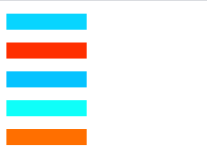
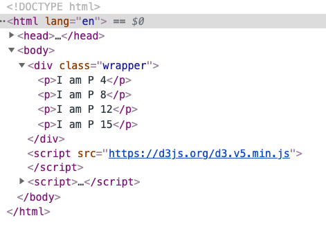
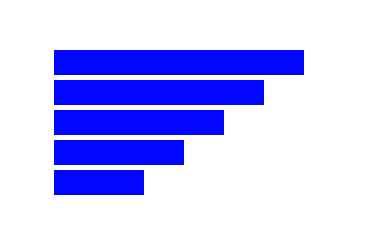
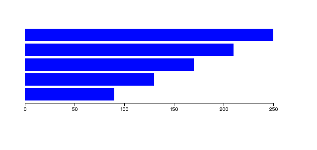
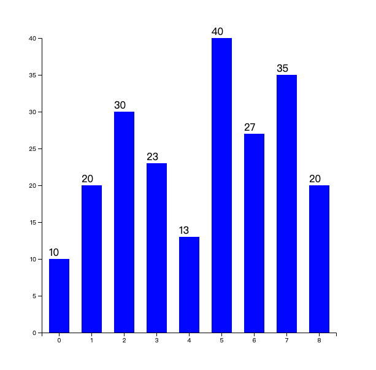

# D3js(Data-Driven Documents)入门

### 什么是D3js

- D3js 是一个可以基于**数据来操作文档**的 JavaScript 库。
  
- 不引入新的视觉表示方法，而是借助于现有的 Web 元素: HTML, CSS, SVG 等

- D3 遵循现有的 Web 标准，可以不需要其他任何框架独立运行在现代浏览器中，它结合强大的可视化组件来驱动 DOM 操作。

- D3 可以将数据绑定到 DOM 上，然后根据数据来计算对应 DOM 的属性值。

### 选择集

D3的选择集合类似JQuery，通过D3封装的方法来访问各个元素，以及设置样式属性。

另外D3有个强大的功能，它可以支持动态设置属性、样式等值。

#### 示例，动态设置多个p标签的背景色

```html

  <body>
    <p></p>
    <p></p>
    <p></p>
    <p></p>
    <p></p>
    <script src="https://d3js.org/d3.v5.min.js"></script>
    <script>
      d3.selectAll('p').style('background-color', function() {
          return `hsl(${Math.random() * 360}, 100%, 50%)`;
        });
    </script>
  </body>

```
#### 结果



### 核心操作 (enter和exit)

前面有说先将数据绑定到DOM上，然后再根据数据来计算对应的DOM需要进行什么操作。

数据绑定的时候可能出现DOM元素与数据元素个数不匹配的问题。

`enter`用来操作添加新的DOM元素，`exit`操作用来移除多余的DOM元素。即如果元素多于DOM个数时用`enter`，如果数据元素少于DOM元素，则用`exit`。

#### 情形一：数据元素个数多于DOM元素个数

```html

  <body>
    <div class="wrapper">
      <p></p>
      <p></p>
    </div>
    <script src="https://d3js.org/d3.v5.min.js"></script>
    <script>
      const dataset = [4, 8, 12, 15, 31, 3, 32];
      d3.select('.wrapper')
        .selectAll('p')
        .data(dataset)
        .enter()
        .append('p');
      
      d3.select('.wrapper')
        .selectAll('p')
        .text(d => `I am P ${d}`);

    </script>
  </body>

```

#### 结果


#### 情形二：数据元素与DOM元素个数一样

不需要添加也不需要删除，直接绑定数据操作即可

#### 情形三：数据元素个数少于DOM元素个数

```html

  <body>
    <div class="wrapper">
      <p></p>
      <p></p>
      <p></p>
      <p></p>
      <p></p>
      <p></p>
      <p></p>
    </div>
    <script src="https://d3js.org/d3.v5.min.js"></script>
    <script>
      const dataset = [4, 8, 12, 15];
      const p = d3.select('.wrapper')
        .selectAll('p')
        .data(dataset)
        .text(d => `I am P ${d}`);
      p.exit().remove();
    </script>
  </body>

```

#### 结果：



#### 实际应用中可能无法统计或者不想统计谁多谁少，便可以三种一起使用：

```javascript

  const p = d3.select('.wrapper')
              .selectAll('p')
              .data(dataset)
              .text(d => `I am P ${d}`);
  p.enter().append('p').text(d => `I am P ${d}`);
  p.exit().remove();

```

### 绘制简单图表

::: tip 注意
需要有基本的svg知识，[参考文档](https://d3js.org.cn/svg/)
:::

#### 要实现的效果图：



#### 实现代码：

<<< @/test/d3js/rect.js

### 绘制坐标轴

#### 期望效果：



#### 实现代码：

定义一个比例尺

<<< @/test/d3js/rect_axis.js#scale

绘制坐标轴

<<< @/test/d3js/rect_axis.js#axis

### 绘制直方图

#### 预期效果：



#### 实现代码

<<< @/test/d3js/histogram.js
### 绘制饼图

#### 预期效果


#### 实现代码

<<< @/test/d3js/pie.js

### 与echarts对比

- 体积更小
- 操作更灵活，echarts是通过配置生成，d3js类似赋予了一个绘制的能力
- 上手成本较高，比较echarts只需要了解配置项，而d3js需要熟悉api，并灵活组合api绘制自己想要的效果

> 知乎上一篇比较全的入门下面的回复：[D3.js 学习之路](https://zhuanlan.zhihu.com/p/38001672)


> [优秀作品欣赏](http://www.a4z.cn/pui/ant-admin.html#/vertical-bp-chart)


> 参考文档： [D3js官网](https://d3js.org.cn/)、[D3.js的v5版本入门教程](https://blog.csdn.net/qq_34414916/category_7608878.html)