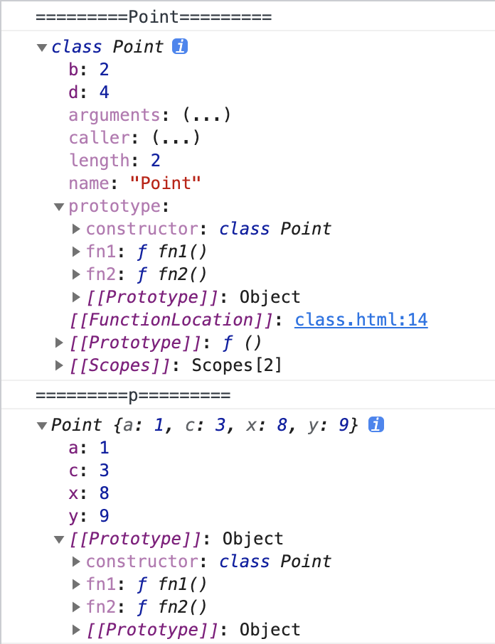
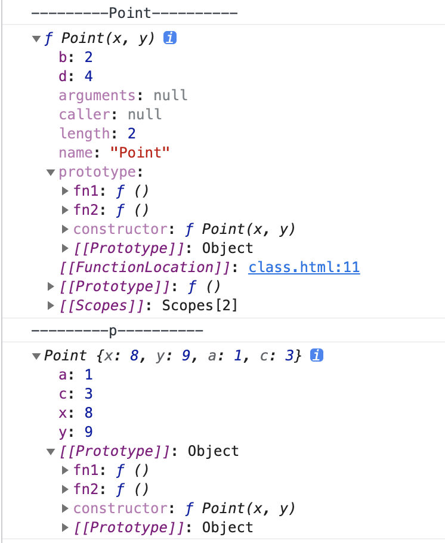

# 类 - class

`class`声明创建一个基于原型继承的具有给定名称的新类。

基本上，ES6的`class`可以看作只是一个语法糖，它的绝大部分功能，ES5都可以做到，新的class写法只是让对象原型的写法更加清晰、更像面向对象编程的语法而已。

```js

 class name [extends] {
   // class body
 }

```

## 声明一个类

```js

  class Point {
    a = 1;
    static b = 2;
    constructor(x, y) {
      this.x = x;
      this.y = y;
    }
    c = 3;
    fn1() {
      console.log('fn1')
    }
    fn2() {
      console.log('fn2');
    }
  }
  Point.d = 4;
  console.log('=========Point=========');
  console.dir(Point);
  const p = new Point(8, 9);
  console.log('=========p=========');
  console.log(p);

```

上面代码声明了一个类`Point`，定义了3个属性`a/b/c`，以及三个方法`constructor/fn1/fn2`，在控制台打印如下：



可以看出一下信息：

- 代码块里定义的方法，都被绑定在了`prototype`上
- 直接赋值的变量，最终是绑定到了实例上，等价于在`constructor`方法里使用this进行赋值
- 使用static定义的变量，也就是静态变量，是直接绑定在了类上面

**使用es5实现一个上面的类**

```js

  function Point (x, y) {
    this.x = x;
    this.y = y;
    this.a = 1;
    this.c = 3;
  }
  Point.b = 2;
  Point.d = 4;
  Point.prototype.fn1 = function() {
    console.log('fn1');
  }
  Point.prototype.fn2 = function() {
    console.log('fn2');
  }
  console.log('---------Point----------')
  console.dir(Point);
  const p = new Point(8, 9);
  console.log('---------p----------')
  console.log(p);

```



可以看到输出与上面类基本一致

## constructor方法

`constructor()`方法是类的默认方法，通过new命令生成对象实例时，自动调用该方法。一个类必须有constructor()方法，如果没有显式定义，一个空的constructor()方法会被默认添加。

`constructor()`方法默认返回实例对象（即this），它完全可以指定返回另一个对象，但是这样的话结果会导致实例对象不是*构造函数或者类*的实例

```js

  class Point {
    constructor(x, y) {
      this.x = x;
      this.y = y;
      return {
        a: 1
      }
    }
  }
  const p1 = new Point(1, 2);
  const p2 = new Point(4, 3);
  console.log('=======p1=======');
  console.log(p1);
  console.log('=======p2=======');
  console.log(p2);

```


从上面的例子可以看出p1、p2最终都是构造函数里返回的对象，原型也没有指向Point，证明它们都不是Point的实例。

从这里可以看出new执行的过程就是，执行类的构造函数，并将构造函数执行的返回给到变量，默认构造函数返回的实例对象。