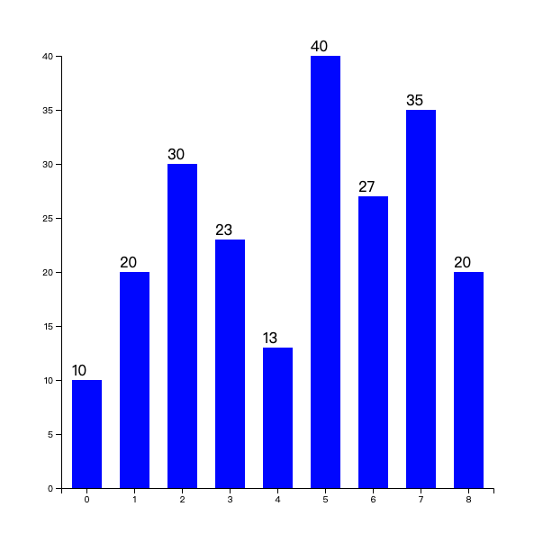

# D3js入门

## 什么是D3js

- D3js (Data-Driven Documents) 是一个可以基于**数据来操作文档**的 JavaScript 库。
  
- 不引入新的视觉表示方法，而是借助于现有的 Web 元素: HTML, CSS, SVG 等

- D3 遵循现有的 Web 标准，可以不需要其他任何框架独立运行在现代浏览器中，它结合强大的可视化组件来驱动 DOM 操作。

- D3 可以将数据绑定到 DOM 上，然后根据数据来计算对应 DOM 的属性值。

## 选择集

D3的选择集合类似JQuery，通过D3封装的方法来访问各个元素，以及设置样式属性。

另外D3有个强大的功能，它可以支持动态设置属性、样式等值。

**示例，动态设置多个p标签的背景色**

```html
<body>
  <p></p>
  <p></p>
  <p></p>
  <p></p>
  <p></p>
  <script src="https://d3js.org/d3.v5.min.js"></script>
  <script>
    d3.selectAll('p').style('background-color', function() {
        return `hsl(${Math.random() * 360}, 100%, 50%)`;
      });
  </script>
</body>
```
**结果**


## 核心操作

- enter和exit

前面有说先将数据绑定到DOM上，然后再根据数据来计算对应的DOM需要进行什么操作。

数据绑定的时候可能出现DOM元素与数据元素个数不匹配的问题。

`enter`用来操作添加新的DOM元素，`exit`操作用来移除多余的DOM元素。即如果元素多于DOM个数时用`enter`，如果数据元素少于DOM元素，则用`exit`。

**情形一：数据元素个数多于DOM元素个数**

```html
<body>
  <div class="wrapper">
    <p></p>
    <p></p>
  </div>
  <script src="https://d3js.org/d3.v5.min.js"></script>
  <script>
    const dataset = [4, 8, 12, 15, 31, 3, 32];
    d3.select('.wrapper')
      .selectAll('p')
      .data(dataset)
      .enter()
      .append('p');
    
    d3.select('.wrapper')
      .selectAll('p')
      .text(d => `I am P ${d}`);

  </script>
</body>
```

**结果**


**情形二：数据元素与DOM元素个数一样**

不需要添加也不需要删除，直接绑定数据操作即可

**情形三：数据元素个数少于DOM元素个数**

```html
<body>
  <div class="wrapper">
    <p></p>
    <p></p>
    <p></p>
    <p></p>
    <p></p>
    <p></p>
    <p></p>
  </div>
  <script src="https://d3js.org/d3.v5.min.js"></script>
  <script>
    const dataset = [4, 8, 12, 15];
    const p = d3.select('.wrapper')
      .selectAll('p')
      .data(dataset)
      .text(d => `I am P ${d}`);
    p.exit().remove();
  </script>
</body>
```

**结果：**


**实际应用中可能无法统计或者不想统计谁多谁少，便可以三种一起使用：**

```javascript
const p = d3.select('.wrapper')
            .selectAll('p')
            .data(dataset)
            .text(d => `I am P ${d}`);
p.enter().append('p').text(d => `I am P ${d}`);
p.exit().remove();
```

## 绘制简单图表

::: tip 注意
需要有基本的svg知识，[参考文档](https://d3js.org.cn/svg/)
:::

**要实现的效果图：**


**实现代码：**

```js
  const svgW = 600;
  const svgH = 600;

  const svg = d3.select('body')
                .append('svg')
                .attr('width', svgW)
                .attr('height', svgH);


  const margin = 10 // 设置边距
  const dataset = [ 250 , 210 , 170 , 130 , 90 ];  // 数据（表示矩形的宽度）

  const g = svg.append('g')
                .attr('transform', `translate(${margin}, ${margin})`);

  const rectHeight = 30; // 矩形的高度

  g.selectAll('rect')
    .data(dataset)
    .enter()
    .append('rect')
    .attr('x', 20)
    .attr('y', (d, i) => {
      return i * rectHeight;
    })
    .attr('width', d => d)
    .attr('height', rectHeight - 5)
    .attr('fill', 'blue');
```

## 绘制坐标轴

**期望效果：**


**实现代码：**

定义一个比例尺

```js
  // 定义一个线性比例尺
  const xScale = d3.scaleLinear()
                  .domain([0,d3.max(dataset)])
                  .range([0,500]);
  console.log('xScale(0)::', xScale(0)); // xScale(0):: 0
  console.log('xScale(100)::', xScale(100)); // xScale(100):: 200
  console.log('xScale(250)::', xScale(250)); // xScale(250):: 500
```

绘制坐标轴

```js
  //绘制坐标轴
  const xAxis = d3.axisBottom(xScale) // 定义一个axis，由bottom可知，是朝下的
                .ticks(5); // 设置刻度数目

  const temp = g.append('g')
  .attr('transform', `translate(20, ${dataset.length * rectHeight})`)
  .call(xAxis);

  // xAxis(temp);
```

## 绘制直方图

**预期效果：**



**实现代码**

```js
  const svgH = 600;
  const svgW = 600;
  const margin = 60;

  const svg = d3.select('body')
                .append('svg')
                .attr('width', svgW)
                .attr('height', svgH);

  const g = svg.append('g')
                .attr('transform', `translate(${margin}, ${margin})`);
  // 数据
  const dataset = [10, 20, 30, 23, 13, 40, 27, 35, 20];
  // x坐标轴
  const xScale = d3.scaleBand()
                    .domain(d3.range(dataset.length))
                    .rangeRound([0, svgW - (margin * 2)]);
  const xAxis = d3.axisBottom(xScale);
  g.append('g')
    .attr('transform', `translate(0, ${svgH - (margin * 2) })`)
    .call(xAxis);
  // y坐标轴
  const yScale = d3.scaleLinear()
                    .domain([0, d3.max(dataset)])
                    .range([svgH - (margin * 2), 0]);
  const yAxis = d3.axisLeft(yScale);
  g.append('g').call(yAxis);
  // 数据分组
  const dgs = g.selectAll('.rect')
                .data(dataset)
                .enter()
                .append('g')
                .attr('class', 'rect');

  const rectPadding = 20; // 矩形之间的间隔

  // 画柱子
  dgs.append('rect')
      .attr('x', function(d, i) {
        return xScale(i) + rectPadding/2;
      })
      .attr('width', function() {
        return xScale.step() - rectPadding;
      })
      .attr('y', function(d, i){
        const min = yScale.domain()[0];
        return yScale(min);
      })
      .attr('height', 0)
      .on('mouseover', function() {
        d3.select(this)
          // .transition()
          // .duration(1500)
          .attr('fill', 'yellow');
        })
      .on('mouseout', function() {
        d3.select(this)
          // .transition()
          // .duration(1500)
          .attr('fill', 'blue');
        })
      .transition()
      .duration(2000)
      .delay((d, i) => i*200)
      .attr('y', function(d, i){
        return yScale(d);
      })
      .attr('height', function(d) {
        return svgH - (margin * 2) - yScale(d)
      })
      .attr('fill', 'blue');
    //  transition后面写on存在一个bug：https://www.coder.work/article/1191655
  // 绘制文字
  dgs.append('text')
      .attr('x', (d, i) => {
        return xScale(i) + rectPadding/2;
      })
      .attr('y', function(d, i){
        const min = yScale.domain()[0];
        return yScale(min);
      })
      .attr('dx', 0)
      .attr('dy', -5)
      .text(d => d)
      .transition()
      .duration(2000)
      .delay((d, i) => i*200)
      .attr('y', d => yScale(d));
```

## 绘制饼图

**预期效果**


**实现代码**

```js
  const svgH = 600;
  const svgW = 600;
  const margin = 60;

  const svg = d3.select('body')
    .append('svg')
    .attr('width', svgW)
    .attr('height', svgH);

  const g = svg.append('g')
    .attr('transform', `translate(${svgW/2}, ${svgH/2})`);

  const dataset = [30, 10, 43, 55, 13]; // 需要将这些数据变成饼状图的数据

  // 颜色比例尺
  const colorScale = d3.scaleOrdinal()
    .domain(d3.range(dataset.length))
    .range(d3.schemeCategory10);

  const pie = d3.pie();

  const innerRadius = 0; // 内半径
  const outerRadius = 100; // 外半径
  const arc_generator = d3.arc().innerRadius(innerRadius).outerRadius(outerRadius);

  const pieData = pie(dataset);
  console.log(pieData);

  const pgs = g.selectAll('g')
    .data(pieData)
    .enter()
    .append('g');
  pgs.append('path')
    .attr('d', d => arc_generator(d))
    .attr('fill', (d, i) => colorScale(i));
  pgs.append('text')
    .attr('transform', function (d) { //位置设在中心处
      return `translate(${arc_generator.centroid(d)})`;
    })
    .attr('text-anchor', 'middle')
    .text(d => d.data);
```

## 与echarts对比

- 体积更小
- 操作更灵活，echarts是通过配置生成，d3js类似赋予了一个绘制的能力
- 上手成本较高，比较echarts只需要了解配置项，而d3js需要熟悉api，并灵活组合api绘制自己想要的效果

> 知乎上一篇比较全的入门下面的回复：[D3.js 学习之路](https://zhuanlan.zhihu.com/p/38001672)


> [优秀作品欣赏](http://www.a4z.cn/pui/ant-admin.html#/vertical-bp-chart)


> 参考文档： [D3js官网](https://d3js.org.cn/)、[D3.js的v5版本入门教程](https://blog.csdn.net/qq_34414916/category_7608878.html)