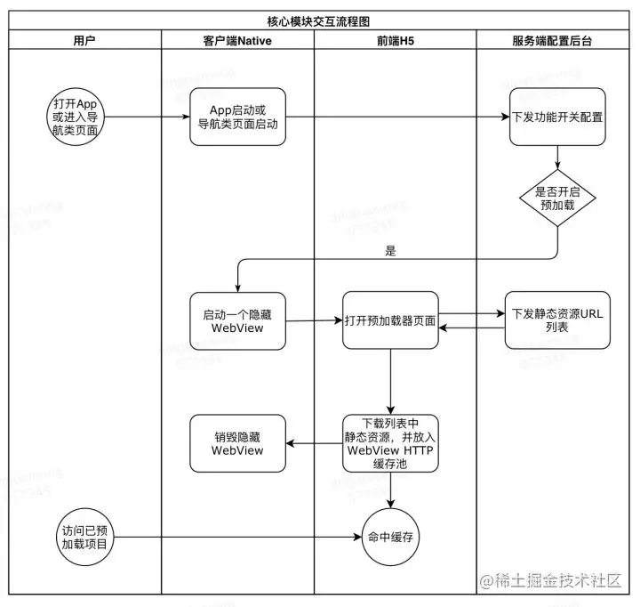
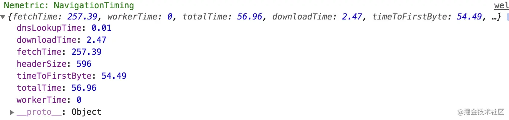
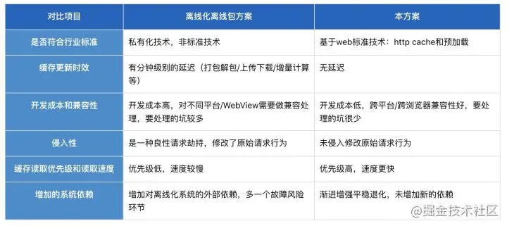

# 静态化方案

App内网页静态资源预加载，提高h5转化率

**具体方案**



## 1. 隐藏Webview启动模块

此模块由客户端实现，主要功能：

- 在App启动或进入导航类Native页面时，初始化一个隐藏不可见的WebView组件，打开预加载器模块H5页面
- 一般仅在 *网络空闲*、*使用WIFI* 情况下执行，以避免占用用户正常访问带宽，节省用户流量成本

## 2. 预加载器模块

此模块由Web前端实现，类似pwa的`service worker`主要功能：

- 请求服务端接口，获取需要预加载的静态资源URL列表
- 调用浏览器Fetch方法，下载列表中的静态资源，存储到WebView HTTP缓存区
- 静态资源下载完毕后，通知Native销毁隐藏WebView

```js
// 预加载器核心代码示例
function prefetch(url) {
 return self.fetch == null
 ? xhrPrefetchStrategy(url)
    : fetch(url, { credentials: `omit` });
}
​
function xhrPrefetchStrategy(url) {
 return new Promise((resolve: () => {}, reject: () => {}) => {
 const req = new XMLHttpRequest();
 req.open(`GET`, url, (req.withCredentials = false));
 req.onload = () => {
 req.status === 200 ? resolve() : reject();
    };
 req.send();
  });
}
```
客户端打开APP空闲时下载白名单列表，下载成功后缓存，白名单可在CMS配置；前期考虑快速迭代，白名单可先不配置，直接客户端固定白名单；白名单列表：

```js
const h5_white_list = [
  "https://a.com", 
  "https://b.mobi",
  "https://c.app"
];
```

## 3. 静态资源URL列表配置模块

此模块由服务端实现，通常以管理配置平台的形式，开放给所有业务线接入，主要功能：

- 配置和管理需要被预加载的各网页应用的URL列表
- 组合所有接入方的URL列表，形成统一列表，提供给预加载器模块调用

```js
// URL列表配置接口示意

// 资源列表接口URL：https://www.company.com/prefetch-platform/config.json
// 资源列表接口响应体示例
// 实际返回给预加载器页面的结果，需要对此配置中的assetsURL进行请求后，返回实际要加载的URL地址
{
 "prefetch": true, // 全局预加载开关
 "end":"appName"    //对应哪个端
 "assets": [       // 资源URL列表
    {
      "name": "projectA", // 接入项目名称
       "assetsURL": "https://www.company.com/projectA/prefetch-assets.json", // 接入项目资源列表接口地址
       "prefetch": true // demo项目预加载开关
    },
    {
      "name": "projectA",
      "assetsURL": "https://www.company.com/projectB/prefetch-assets.json",
      "prefetch": true
    }
  ]
}
```

接入方要接入App预加载功能，需要：

- 项目上线时，构建生成自己项目的静态资源URL列表
- 设置静态资源响应头，允许预加载器跨域下载列表中的资源

```js
// 接入方式示例

// 1、构建URL列表
// 资源列表接口URL：https://www.company.com/projectA/prefetch-assets.json
// 资源列表接口响应体：
{
 "prefetch": true, // 是否开启预加载
 "end":"appA"  
 "assets": [    // 资源URL列表
    "https://www.company.com/projectA/js/index.abcd1234.js",
    "https://www.company.com/projectA/css/index.abcd1234.css",
    "https://www.company.com/projectA/img/index.abcd1234.png"
  ]
}

// 2、资源跨域头设置
location ~* \.(html|js|css|png)$ {
 add_header Access-Control-Allow-Origin *;            
}
```

## 4. 针对HTML主文档的预加载

上面我们已经对网页中的JavaScript/CSS等资源进行了预加载，我们还需要对html进行预先加载

入口HTML通常设置为不缓存，每次请求都会从服务端获取最新内容。这就导致HTML无法进行预加载，进而导致整个网页应用无法实现离线化（断网可用）。

要解决这一问题，我们需要给HTML文档增加版本号，并应用新的缓存策略。主要实现思路如下

（1）在项目上线构建时，对 *HTML主文档/Node入口链接* 增加版本号，并将带版本号的入口地址URL，传给服务端入口配置系统更新

例如： 服务器增加一个额外的接口

```js
{
   currentVersion:1.0,
   project:'projectA',
   link:'https://gamewhateverstuff.app'
}
```

（2）通过服务端接口，下发带版本号的入口URL

（3）客户端对比版本号，确定是否预加载所有静态资源（包括HTML）项目URL配置列表示例

```js
// 配置URL示例
{
 "prefetch": true,
 "assets": [
   "https://www.company.com/projectA/index.20190501124536.html",
   "https://www.company.com/projectA/index.20190501124536.html?from=test",
   "https://www.company.com/projectA/js/index.abcd1234.js",
   "https://www.company.com/projectA/css/index.abcd1234.css"
  ]
}
```

对这些资源进行预加载后，便可以实现在用户首次访问页面时，所有的静态资源都从本地缓存读取。主要收益：

- 消除静态资源下载带来的网络连接建立、数据传输等时间消耗，提高网页应用启动速度和点击转化率

- 实现网站首页完全离线化，很大程度上解除应用对静态资源服务器的核心依赖，提高系统可用性

（4）服务端API接口数据也可以离线。

对于页面使用前端渲染的项目，除HTML/JS/CSS等静态数据外，应用首次启动一般还会有服务端API数据请求，此请求的离线化思路是：

- 先尝试网络请求，失败后走下一步
  
- 从本地LocalStorage读取（数据为上一次正常网络请求时存储），如果读取成功，则用上次的API数据渲染，并在页面上展示网络异常通知文案；如果读取失败，则走下一步；

- 展示JavaScript代码中内置的默认兜底数据，以及网络异常通知文案

## 5. 成本分析

由于用户浏览行为的难以预测性，静态资源预加载会带来一定的流量浪费，需要对这部分成本进行核算。

（1）企业下行带宽成本

以预加载一个H5项目（资源大小100KB）1000万次为例，增加流量 = 1000万 * 100KB ≈ 1TB。

（2）用户手机流量成本

以预加载50个网页项目为例，增加的手机流量 = 50 * 100KB ≈ 5MB，仅在WIFI下载则用户成本更低。
这里需要指出的是，并非每次App启动都会下载5MB。在一个项目上线周期内，缓存资源失效前，仅会下载1次，后续资源预加载请求也会命中缓存。
预加载并非适合所有的项目场景，不同项目的投入产出比是不同的，需要具体项目具体分析，以上给出的是成本分析的计算方法。

下面给出一些适用的项目场景：

- 高点击率、大流量网页项目。高点击率、大流量意味着高缓存命中、低流量浪费，如：点击App首页banner打开的热点活动网页

- 对启动速度和转化率有极致要求的网页项目。如：游戏项目、其他一些抽奖项目。

- 不适合的项目。流量小、转化收益低的项目


## 6. 预加载策略

如果上述成本还无法接受，我们可以通过静态化和动态化策略，进一步降成本。

（1）静态化预加载策略

- 仅下载大流量/重点项目

- 仅WIFI环境和浏览器网络空闲时下载

- 在网页启动前，最近的 *上一步或上两步Native页面* 预加载，而不是都放到App启动时下载

- 仅预加载网站 *首页* 需要的静态资源，首页之外后续其他页面的静态资源，由网站首页进行预加载

- 按照项目配置的优先级顺序分批下载，控制每次并发的下载连接数，响应缓慢时及时终止下载

上述部分策略，需通过服务端管理平台落地，实现在合适的时机下载合适的项目。

（2）动态化智能预加载策略

- **基于用户画像**（包括基础画像、长期画像、用户行为轨迹、实时数据、历史数据等），预测一个用户未来会点击哪些页面，计算出未来访问概率
  
- 基于投放的面向用户，只投放给有门槛的用户

- 仅仅下载访问概率高于特定阈值项目的静态资源

动态策略举例：仅针对未登录用户，预加载登陆网页的静态资源。这里需要指出的是，部分动态化策略的实现，需要大量研发资源和计算资源的投入，这部分投入可能已经远远超过了流量成本，因此在实施动态化策略时，需要综合评估考虑。

## 7. 缓存命中率统计/复盘

通过前端的性能监控系统`Nemo Metric`来得知请求的静态资源是fromLocalCache还是fromRemoteServer。

具体思路：performance.getEntries() ，可以获取每一个静态资源的请求信息，其返回如下图：



- fetchTime等于0：说明从缓存读取，即fromLocalCache

- fetchTime不等于0 说明从网络读取，即fromRemoteServer

- 缓存命中率 = fromLocalCache/(fromRemoteServer + fromLocalCache) 

这里需要指出的是，缓存命中率只是一个过程指标，在项目初期，建议将更多精力关注到 *完全加载时间* 和 *页面加载成功率* 等结果指标上。

## 8. App启动时WebView内置公共基础库

在组件化、服务化盛行的今天，各个前端项目之间，共用了大量的基础库、组件库、业务框架，对于这些共用的部分，可以独立成一组公共静态资源，在App启动时预加载，直接内置到WebView缓存中。 比如下面这些资源：

```bash
# 13kb
https://unpkg.com/react@16/umd/react.production.min.js
# 103kb
https://unpkg.com/react-dom@16/umd/react-dom.production.min.js
# 13.4kb
https://unpkg.com/axios/dist/axios.min.js
```

业务项目只需要引用这些地址，便可以直接从WebView缓存中读取公共库。

## 9. 与离线化/离线包方案的对比

在解决静态资源下载慢这一问题上，业界还有一种广为应用的技术方案，既：离线化/离线包方案。其主要思路是：

- 将包括HTML/JS/CSS等静态资源打包到一个压缩包内，在用户访问项目前，预先下载该离线包到本地并解压
- 当用户访问页面发出资源请求时，WebView容器会对请求进行拦截，如果已经在离线包内，会使用离线包中的本地资源响应给用户



如果在App启动时进行预加载且App DAU很高，容易导致静态资源服务器QPS激增，形成流量突刺造成宕机，需要做好流量预估，逐步放量。针对于我们目前这么大的量，该方案成本高，不合适

## 10. 总结与期望收益

App应用的功能代码，通常在用户访问之前，就已经以安装包的形式，通过应用市场下载安装好了。而网页应用的功能代码（静态资源），则是在用户实际点击访问时，才实时下载运行。

这一『用时下载』的特点是一把双刃剑，既带来了实时更新的灵活性，也造成了应用启动的延迟，导致网页应用启动速度远远落后于App应用，造成交互体验和用户转化短板。

本文提出的基于静态资源预加载技术，提升App内网页启动速度的新方案。根据目前加载过程的耗时与流失高，此方案估计可显著提升网页启动速度（缩短页面加载时间30%-50%以上）、提高网页加载成功率。

> 参考文档：[App内网页静态资源预加载 提高H5转化率](https://juejin.cn/post/6844904048257138695)